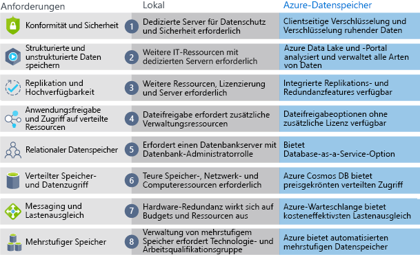

Now that you know about the benefits and features of Azure Storage, let's see how Azure Storage differs from on-premises storage.

## Azure Storage versus on-premises storage

The term "on-premises" refers to the storage and maintenance of data on local hardware and servers. There are several factors, which should be considered in the comparison of on-premises vs Azure Storage.

### Cost effectiveness
An on-premises storage solution requires dedicated hardware that needs to be purchased, installed, configured and maintained. This can be a significant up front expense (or capital cost). Change in requirements down the road often requires investment in new hardware. And if demand spikes, you'll need to invest in hardare that can handle peak demand but it may sit idle or be under-utilized in off-peak times.

Azure Storage provides a pay-as-you-go pricing model which is often appealing to businesses as an operating expense instead of an upfront capitcal cost. It's also scalable, allowing you to scale up or scale out as demand dictates and scale back when demand is low. Only charging you for the data services as you need them.

### Reliability 
On-premises storage requires data backup, load balancing, and disaster recovery strategies. These can be challenging and expensive as they often each need dedicated servers requiring a significant investment in both hardware and IT resources.

Azure Storage provides data backup, load balancing, disaster recovery, and data replication as services to ensure data safety and high availability.

### Storage types
Sometimes multiple different storage types are required for a solution, such as file and database storage. An on-premises approach often requires numerous servers and administrative tools for each storage type.

Azure Storage provides a variety of different storage options including distributed access and tiered storage. This makes it possible to integrate a combination of storage technologies providing the best storage choice for each part of your solution.

### Agility
Requirements and technologies change. For an on-premises deployment this may mean provisioning and deploying new servers and infrastructure pieces, which is a time consuming and expensive activity.

Azure Storage gives you the flexibility to create new services in minutes. This flexibility allows you to change storage back-ends quickly without needing a significant hardware investment.

The following illustration shows differences between on-premise storage and Azure data storage.

