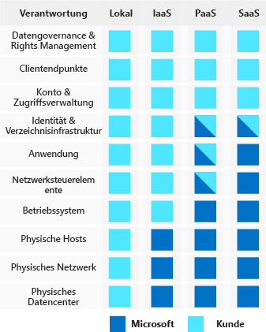

Mit dem Wandel der Computingumgebungen von vom Kunden gesteuerten Datencentern hin zu Clouddatencentern verschiebt sich auch die Verantwortung für die Sicherheit.As computing environments move from customer-controlled data centers to cloud data centers, the responsibility of security also shifts. Sicherheit ist nun ein gemeinsames Anliegen von Cloudanbietern und Kunden.Security is now a concern shared both by cloud providers and customers. Für jede Anwendung und Lösung ist es wichtig zu verstehen, was Ihre Verantwortung ist und was in der Verantwortung von Azure liegt.For every application and solution, it's important to understand what's your responsibility and what's Azure's responsibility.

#### Verstehen der SicherheitsrisikenUnderstand security threats

> [!VIDEO https://www.microsoft.com/videoplayer/embed/RWkotg]

#### Azure-Sicherheit: Ihre Verantwortung im Vergleich zur Verantwortung der CloudAzure security: you versus the cloud

> [!VIDEO https://www.microsoft.com/videoplayer/embed/RE2yEvj]

## Gemeinsame Verantwortung für die Sicherheit mit AzureShare security responsibility with Azure

Die erste vorgenommene Verschiebung erfolgt von lokalen Datencentern zu Infrastructure-as-a-Service (IaaS).The first shift you’ll make is from on-premises data centers to infrastructure as a service (IaaS). Mit IaaS nutzen Sie den Dienst der niedrigsten Ebene und fordern von Azure die Erstellung von virtuellen Computern (VMs) und virtuellen Netzwerken an.With IaaS, you are leveraging the lowest-level service and asking Azure to create virtual machines (VMs) and virtual networks. Auf dieser Ebene sind Sie weiterhin dafür verantwortlich, Ihre Betriebssysteme und Software zu patchen und zu schützen sowie Ihr Netzwerk so zu konfigurieren, dass es sicher ist.At this level, it's still your responsibility to patch and secure your operating systems and software, as well as configure your network to be secure. Bei Contoso Shipping nutzen Sie IaaS, wenn Sie damit beginnen, anstelle der lokalen physischen Server die virtuellen Azure-Computer zu verwenden.At Contoso Shipping, you are taking advantage of IaaS when you start using Azure VMs instead of your on-premises physical servers. Zusätzlich zu den betriebsbezogenen Vorteilen kommen Sie in den Genuss des sicherheitsbezogenen Vorteils, dass Sie sich nicht mehr um den Schutz der physischen Komponenten des Netzwerks kümmern müssen.In addition to the operational advantages, you receive the security advantage of having outsourced concern over protecting the physical parts of the network.

Mit der Umstellung auf Platform-as-a-Service (PaaS) wird ein Großteil der Sicherheitsrisiken outgesourct.Moving to platform as a service (PaaS) outsources a lot of security concerns. Auf dieser Ebene kümmert sich Azure um das Betriebssystem und die meisten grundlegenden Softwarekomponenten, z.B. Datenbankverwaltungssysteme.At this level, Azure is taking care of the operating system and of most foundational software like database management systems. Alle Updates mit den aktuellen Sicherheitspatches werden durchgeführt und können für die Zugriffssteuerung in Azure Active Directory integriert werden.Everything is updated with the latest security patches and can be integrated with Azure Active Directory for access controls. Bei PaaS ergeben sich außerdem viele betriebsbezogene Vorteile.PaaS also comes with a lot of operational advantages. Anstatt für Ihre Umgebungen gesamte Infrastrukturen und Subnetze manuell zu erstellen, können Sie im Azure-Portal „Point-and-Click“ verwenden oder automatisierte Skripts ausführen, um komplexe geschützte Systeme hoch- und herunterzufahren und wie gewünscht zu skalieren.Rather than building whole infrastructures and subnets for your environments by hand, you can "point and click" within the Azure portal or run automated scripts to bring complex, secured systems up and down, and scale them as needed. Contoso Shipping verwendet Azure Event Hubs für die Erfassung von Telemetriedaten von Drohnen und LKWs (sowie eine Web-App mit einem Azure Cosmos DB-Back-End mit den mobilen Apps des Unternehmens), die alle Beispiele für PaaS sind.Contoso Shipping uses Azure Event Hubs for ingesting telemetry data from drones and trucks &mdash; as well as a web app with an Azure Cosmos DB back end with their mobile apps &mdash; which are all examples of PaaS.

Bei Software-as-a-Service (SaaS) wird nahezu alles outgesourct.With software as a service (SaaS), you outsource almost everything. Bei SaaS handelt es sich um Software, die mit einer Internetinfrastruktur ausgeführt wird.SaaS is software that runs with an internet infrastructure. Der Code wird vom Anbieter gesteuert, jedoch für die Verwendung durch den Kunden konfiguriert.The code is controlled by the vendor but configured to be used by the customer. Wie so viele Unternehmen verwendet auch Contoso Shipping Office 365. Dies ist ein gutes Beispiel für SaaS.Like so many companies, Contoso Shipping uses Office 365, which is a great example of SaaS!

## Mehrstufiger SicherheitsansatzA layered approach to security

Die *tiefgehende Verteidigung* ist eine Strategie, bei der mithilfe zahlreicher Mechanismen das Ausmaß eines Angriffs gedämpft wird, der darauf abzielt, unberechtigten Zugriff auf Informationen zu erlangen.*Defense in depth* is a strategy that employs a series of mechanisms to slow the advance of an attack aimed at acquiring unauthorized access to information. Jede Ebene bietet Schutz, sodass bei einer Sicherheitsverletzung auf einer Ebene die nachfolgende Ebene eine weitere Bedrohung verhindert.Each layer provides protection so that if one layer is breached, a subsequent layer is already in place to prevent further exposure. Microsoft verfolgt einen mehrstufigen Sicherheitsansatz – sowohl in den physischen Datencentern als auch für Azure-Dienste.Microsoft applies a layered approach to security, both in physical data centers and across Azure services. Im Rahmen der tiefgehenden Verteidigung sollen Informationen geschützt und ihr Diebstahl durch Personen verhindert werden, die keine Zugriffsberechtigung besitzen.The objective of defense in depth is to protect and prevent information from being stolen by individuals who are not authorized to access it.

Sie können sich die tiefgehende Verteidigung wie einen Satz mit konzentrischen Ringen vorstellen, wobei die Daten im Zentrum geschützt werden müssen.Defense in depth can be visualized as a set of concentric rings, with the data to be secured at the center. Jeder Ring stellt eine zusätzliche Sicherheitsebene für die Daten dar.Each ring adds an additional layer of security around the data. Dieser Ansatz macht die Abhängigkeit von einer einzelnen Schutzebene überflüssig, verlangsamt einen Angriff und bietet Alarmtelemetrie, auf die automatisch oder manuell reagiert werden kann.This approach removes reliance on any single layer of protection and acts to slow down an attack and provide alert telemetry that can be acted upon, either automatically or manually. Sehen wir uns jede Ebene genauer an.Let's take a look at each of the layers.

:::row:::
  :::column:::
    
  :::column-end:::
    :::column span="3"::: **Daten**:::column span="3"::: **Data**

In der Regel zielen Angriffe auf folgende Daten ab:In almost all cases, attackers are after data:

- Daten, die in einer Datenbank gespeichert sindData stored in a database
- Daten, die auf einem Datenträger einer VM gespeichert sindData stored on disk inside virtual machines
- Daten, die in einer SaaS-Anwendung wie Office 365 gespeichert sindData stored on a SaaS application such as Office 365
- Daten, die im Cloudspeicher gespeichert sindData stored in cloud storage

Es liegt in der Verantwortung derjenigen, die den Zugriff auf Daten steuern und Daten speichern, sicherzustellen, dass die Daten ordnungsgemäß geschützt sind.It's the responsibility of those storing and controlling access to data to ensure that it's properly secured. Häufig schreiben gesetzliche Vorgaben die Steuerung und die Prozesse vor, die zur Gewährleistung von Vertraulichkeit, Integrität und Verfügbarkeit von Daten erforderlich sind.Often, there are regulatory requirements that dictate the controls and processes that must be in place to ensure the confidentiality, integrity, and availability of the data.
  :::column-end:::
:::row-end:::

:::row:::
  :::column:::
    
  :::column-end:::
    :::column span="3"::: **Anwendung**:::column span="3"::: **Application**

- Stellen Sie sicher, dass Anwendungen sicher vor und frei von Sicherheitsrisiken sind.Ensure applications are secure and free of vulnerabilities.
- Speichern Sie vertrauliche Anwendungsgeheimnisse auf einem sicheren Speichermedium.Store sensitive application secrets in a secure storage medium.
- Erklären Sie Sicherheit zu einer Entwurfsanforderung für alle Anwendungsentwicklungen.Make security a design requirement for all application development.

Integrieren Sie Sicherheit in den Anwendungsentwicklungszyklus, um die Anzahl der im Code eingeführten Sicherheitsrisiken zu verringern.Integrating security into the application development life cycle will help reduce the number of vulnerabilities introduced in code. Bestärken Sie alle Entwicklungsteams darin, dafür zu sorgen, dass ihre Anwendungen standardmäßig sicher sind, und dass Sicherheitsanforderungen nicht verhandelbar sind.We encourage all development teams to ensure their applications are secure by default, and that they're making security requirements non-negotiable.
  :::column-end:::
:::row-end:::

:::row:::
  :::column:::
    
  :::column-end:::
    :::column span="3"::: **Compute**:::column span="3"::: **Compute**

- Schützen Sie den Zugriff auf virtuelle Computer.Secure access to virtual machines.
- Implementieren Sie Endpoint Protection, und halten Sie alle Systeme immer auf dem neuesten Stand.Implement endpoint protection and keep systems patched and current.

Durch Malware, nicht gepatchte und nicht ordnungsgemäß geschützte Systeme ist Ihre Umgebung offen für Angriffe.Malware, unpatched systems, and improperly secured systems open your environment to attacks. Der Fokus dieser Ebene liegt darin, dafür zu sorgen, dass Ihre Computeressourcen sicher und die notwendigen Kontrollen eingerichtet sind, um Sicherheitsprobleme zu minimieren.The focus in this layer is on making sure your compute resources are secure, and that you have the proper controls in place to minimize security issues.
  :::column-end:::
:::row-end:::

:::row:::
  :::column:::
    
  :::column-end:::
    :::column span="3"::: **Netzwerk**:::column span="3"::: **Networking**

- Schränken Sie die Kommunikation zwischen Ressourcen ein.Limit communication between resources.
- Verweigern Sie Aktionen standardmäßig.Deny by default.
- Schränken Sie eingehenden und ggf. ausgehenden Zugriff auf das Internet ein.Restrict inbound internet access and limit outbound, where appropriate.
- Implementieren Sie eine sichere Verbindung mit lokalen Netzwerken.Implement secure connectivity to on-premises networks.

Der Schwerpunkt dieser Ebene liegt darauf, die Netzwerkkonnektivität für alle Ressourcen einzuschränken, um nur das zu ermöglichen, was erforderlich ist.At this layer, the focus is on limiting the network connectivity across all your resources to allow only what is required. Durch die Einschränkung dieser Kommunikation verringern Sie das Lateral Movement-Risiko in Ihrem Netzwerk.By limiting this communication, you reduce the risk of lateral movement throughout your network.
  :::column-end:::
:::row-end:::

:::row:::
  :::column:::
    
  :::column-end:::
    :::column span="3"::: **Umkreis**:::column span="3"::: **Perimeter**

- Aktivieren Sie einen Schutz vor verteilten Denial-of-Service-Angriffen (DDoS), um umfangreiche Angriffe zu filtern, bevor es zu einem Denial-of-Service bei Endbenutzern kommt.Use distributed denial of service (DDoS) protection to filter large-scale attacks before they can cause a denial of service for end users.
- Verwenden Sie Umkreisfirewalls, um böswillige Angriffe auf Ihr Netzwerk zu erkennen und zu melden.Use perimeter firewalls to identify and alert on malicious attacks against your network.

Beim Netzwerkumkreis geht es um den Schutz vor Angriffen auf das Netzwerk und somit auf Ihre Ressourcen.At the network perimeter, it's about protecting from network-based attacks against your resources. Die Identifizierung dieser Angriffe, die Beseitigung ihrer Auswirkungen und die Warnung, wenn sie auftreten, sind wichtige Möglichkeiten, um Ihr Netzwerk sicher zu halten.Identifying these attacks, eliminating their impact, and alerting you when they happen are important ways to keep your network secure.
  :::column-end:::
:::row-end:::

:::row:::
  :::column:::
    
  :::column-end:::
    :::column span="3"::: **Richtlinien und Zugriff**:::column span="3"::: **Policies and access**

- Steuern Sie den Zugriff auf die Infrastruktur und die Änderungssteuerung.Control access to infrastructure and change control.
- Verwenden Sie SSO (Single Sign-On, einmaliges Anmelden) und Multi-Factor Authentication.Use single sign-on and multi-factor authentication.
- Überwachen Sie Ereignisse und Änderungen.Audit events and changes.

Bei der Ebene „Richtlinien und Zugriff“ geht es darum, die Sicherheit von Identitäten zu gewährleisten, nur erforderlichen Zugriff zu gewähren und Änderungen zu protokollieren.The policy and access layer is all about ensuring identities are secure, access granted is only what is needed, and changes are logged.
  :::column-end:::
:::row-end:::

:::row:::
  :::column:::
    
  :::column-end:::
    :::column span="3"::: **Physische Sicherheit**:::column span="3"::: **Physical security**

- Die physische Gebäudesicherheit und die Steuerung des Zugriffs auf Computerhardware im Datencenter ist die erste Verteidigungslinie.Physical building security and controlling access to computing hardware within the data center is the first line of defense.

Bei der physischen Sicherheit geht es darum, physische Schutzmaßnahmen gegen den Zugriff auf Ressourcen zu treffen.With physical security, the intent is to provide physical safeguards against access to assets. Dadurch wird sichergestellt, dass andere Ebenen nicht umgangen werden und angemessen auf Verlust oder Diebstahl reagiert wird.This ensures that other layers can't be bypassed, and loss or theft is handled appropriately.
  :::column-end:::
:::row-end:::

## ZusammenfassungSummary

Wir haben gesehen, dass Azure eine Hilfe für viele Ihrer Sicherheitsprobleme darstellt.We've seen here that Azure helps a lot with your security concerns. Die Sicherheit ist aber weiterhin eine **gemeinsame Aufgabe**, für die beide Seiten verantwortlich sind.But security is still a **shared responsibility**. Wie hoch hierbei unser Anteil an der Verantwortung ist, hängt davon ab, welches Modell wir in Bezug auf Azure verwenden.How much of that responsibility falls on us depends on which model we use with Azure.

Wir nutzen die Ringe der *tiefgehenden Verteidigung* als Richtlinie, um zu ermitteln, welche Schutzmaßnahmen für unsere Daten und Umgebungen geeignet sind.We use the *defense in depth* rings as a guideline for considering what protections are adequate for our data and environments.