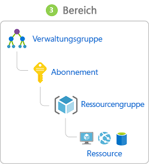

Früher wurden Unternehmensdaten in erster Linie durch Netzwerkgrenzen, die dazugehörigen Firewalls und physische Zugriffssteuerungen geschützt.Network perimeters, their firewalls, and physical access controls used to be the primary protection for corporate data. Aufgrund der stark zunehmenden Verbreitung von BYOD (Bring Your Own Device), mobilen Apps und Cloudanwendungen werden Netzwerkgrenzen jedoch immer durchlässiger.But network perimeters have become increasingly porous with the explosion of bring your own device (BYOD), mobile apps, and cloud applications. 

Die neue primäre Sicherheitsgrenze heißt deshalb „Identität“.Identity has become the new primary security boundary. Daher sind ordnungsgemäße Authentifizierung und eine sorgfältige Zuweisung von Berechtigungen unverzichtbar, um die Kontrolle über die eigenen Daten nicht zu verlieren.Therefore, proper authentication and assignment of privileges is critical to maintaining control of your data.

Ihr Unternehmen, Contoso Shipping, konzentriert sich darauf, diese Probleme sofort zu lösen.Your company, Contoso Shipping, is focused on addressing these concerns right away. Die neue Hybrid Cloud-Lösung Ihres Teams muss einerseits mobile Apps berücksichtigen, die Zugriff auf geheime Daten haben, sobald ein autorisierter Benutzer angemeldet ist. Andererseits muss aber auch dem Telemetriedatenstrom Rechnung getragen werden, der ständig von Transportfahrzeugen gesendet wird und für die Optimierung ihrer Geschäftsabläufe entscheidend ist.Your team's new hybrid cloud solution needs to account for mobile apps that have access to secret data when an authorized user is signed in &mdash; in addition to having shipping vehicles constantly send a stream of telemetry data that is critical to optimizing their business.

## Einmaliges AnmeldenSingle sign-on

Je mehr Identitäten ein Benutzer verwalten muss, desto größer ist das Risiko eines Sicherheitsincidents in Zusammenhang mit Anmeldeinformationen.The more identities a user has to manage, the greater the risk of a credential-related security incident. Mehrere Identitäten implizieren mehrere Kennwörter, die verwaltet und geändert werden müssen.More identities mean more passwords to remember and change. Kennwortrichtlinien können zwischen den Anwendungen variieren, und da die erforderliche Kennwortkomplexität zunimmt, wird es für Benutzer immer schwieriger, sich an diese zu erinnern.Password policies can vary between applications and, as complexity requirements increase, it becomes increasingly difficult for users to remember them.

Denken Sie nun an den logistischen Aufwand für die Verwaltung all dieser Identitäten.Now, consider the logistics of managing all those identities. Helpdesks werden beim Bearbeiten von Kontosperrungen und Kennwortzurücksetzungen zusätzlich belastet.Additional strain is placed on help desks as they deal with account lockouts and password reset requests. Wenn ein Benutzer ein Unternehmen verlässt, kann es zudem schwierig sein, alle seine Identitäten zu finden und zu deaktivieren.If a user leaves an organization, tracking down all those identities and ensuring they are disabled can be challenging. Falls eine Identität übersehen wird, könnte der Benutzer weiterhin unerwünschten Zugriff erhalten.If an identity is overlooked, this could allow access when it should have been eliminated.

Das einmalige Anmelden (SSO) erfordert nur eine Identität und nur ein Kennwort.With single sign-on (SSO), users need to remember only one ID and one password. Der anwendungsübergreifende Zugriff wird einer einzigen, benutzerspezifischen Identität gewährt, wodurch das Sicherheitsmodell vereinfacht wird.Access across applications is granted to a single identity tied to a user, simplifying the security model. Wenn Benutzer die Rolle wechseln oder ein Unternehmen verlassen, sind Zugriffsänderungen an die einzelne Identität gebunden. So wird der Aufwand für das Ändern oder Deaktivieren von Konten erheblich reduziert.As users change roles or leave an organization, access modifications are tied to the single identity, greatly reducing the effort needed to change or disable accounts. Das einmalige Anmelden für Konten erleichtert Benutzern die Verwaltung ihrer Identitäten und erhöht die Sicherheitsfunktionen in Ihrer Umgebung.Using single sign-on for accounts will make it easier for users to manage their identities and will increase the security capabilities in your environment.

:::row:::
  :::column:::
    
  :::column-end:::
    :::column span="3"::: **Einmaliges Anmelden mit Azure Active Directory**:::column span="3"::: **SSO with Azure Active Directory**

Azure Active Directory (AAD) ist ein cloudbasierter Identitätsdienst.Azure Active Directory (AD) is a cloud-based identity service. Er hat eine integrierte Unterstützung für die Synchronisierung mit Ihrem vorhandenen lokalen Active Directory-Verzeichnis oder kann einzeln verwendet werden.It has built in support for synchronizing with your existing on-premises Active Directory or can be used stand-alone. Das bedeutet, dass alle Ihre Anwendungen – ob lokal, in der Cloud (einschließlich Office 365) oder mobil – dieselben Anmeldeinformationen verwenden können.This means that all your applications, whether on-premises, in the cloud (including Office 365), or even mobile can share the same credentials. Administratoren und Entwickler können den Zugriff auf Daten und Anwendungen mithilfe zentralisierter Regeln und Richtlinien steuern, die in Azure AD konfiguriert sind.Administrators and developers can control access to data and applications using centralized rules and policies configured in Azure AD.

Durch die Nutzung von Azure AD für das einmalige Anmelden können Sie auch mehrere Datenquellen in Intelligent Security Graph kombinieren.By leveraging Azure AD for SSO you'll also have the ability to combine multiple data sources into an intelligent security graph. Intelligent Security Graph ermöglicht es, Bedrohungsanalysen und Echtzeit-Identitätsschutz für alle Konten in Azure AD bereitzustellen, einschließlich der mit der lokalen AD-Instanz synchronisierten Konten.This security graph enables the ability to provide threat analysis and real-time identity protection to all accounts in Azure AD, including accounts that are synchronized from your on-premises AD. Durch die Verwendung eines zentralen Identitätsanbieters können Sie die Sicherheitskontrollen, die Berichterstellung, die Benachrichtigungen und die Verwaltung Ihrer Identitätsinfrastruktur zentralisieren.By using a centralized identity provider, you'll have centralized the security controls, reporting, alerting, and administration of your identity infrastructure.

Contoso Shipping integriert die bereits vorhandene Active Directory-Instanz des Unternehmens in Azure AD, um innerhalb der Organisation eine einheitliche Zugriffssteuerung zu implementieren.As Contoso Shipping integrates their existing Active Directory instance with Azure AD, you will make controlling access consistent across the organization. Auf diese Weise wird auch die Anmeldung bei E-Mail-Programmen und Office 365-Dokumenten erheblich vereinfacht, da dabei eine erneute Authentifizierung nicht erforderlich ist.Doing so will also greatly simplify the ability to sign into email and Office 365 documents without having to reauthenticate.
  :::column-end:::
:::row-end:::

## Multi-Factor AuthenticationMulti-factor authentication

Multi-Factor Authentication (MFA) bietet zusätzliche Sicherheit für Identitäten, indem mindestens zwei Methoden für eine vollständige Authentifizierung benötigt werden.Multi-factor authentication (MFA) provides additional security for your identities by requiring two or more elements for full authentication. Diese Methoden umfassen drei Kategorien:These elements fall into three categories:

- *Authentifizierung mit einem Kennwort**Something you know*
- *Authentifizierung mit einem Gerät**Something you possess*
- *Authentifizierung mit persönlichen Merkmalen**Something you are*

Für die **Authentifizierung mit einem Kennwort** können Sie ein Kennwort oder die Antwort auf eine Sicherheitsfrage verwenden.**Something you know** would be a password or the answer to a security question. Für die **Authentifizierung mit einem Gerät** können Sie eine mobile App verwenden, die eine Benachrichtigung empfängt, oder ein Gerät, das Token generiert.**Something you possess** could be a mobile app that receives a notification or a token-generating device. Die **Authentifizierung mit persönlichen Merkmalen** erfolgt in der Regel anhand biometrischer Eigenschaften, z.B. über einen Fingerabdruck oder einen Gesichtsscan auf vielen mobilen Geräten.**Something you are** is typically some sort of biometric property, such as a fingerprint or face scan used on many mobile devices.

Die mehrstufige Authentifizierung erhöht die Sicherheit Ihrer Identität, indem sie die Auswirkungen der Offenlegung von Anmeldeinformationen einschränkt.Using MFA increases security of your identity by limiting the impact of credential exposure. Ein Angreifer, der das Kennwort eines Benutzers besitzt, benötigt ebenfalls sein Telefon oder einen Scan von seinem Gesicht, um sich vollständig zu authentifizieren.An attacker who has a user's password would also need to have possession of their phone or their face in order to fully authenticate. Die Authentifizierung mit einer einzigen Methode ist nicht möglich, und der Angreifer kann diese Anmeldeinformationen nicht zum Authentifizieren verwenden.Authentication with only a single factor verified is insufficient, and the attacker would be unable to use those credentials to authenticate. Die daraus gewonnen Sicherheitsvorteile sind enorm, daher ist es besonders wichtig, die mehrstufige Authentifizierung immer zu nutzen, wo dies möglich ist.The benefits this brings to security are huge, and we can't emphasize enough the importance of enabling MFA wherever possible.

Azure AD verfügt über integrierte MFA-Funktionen und lässt sich in andere Drittanbieter-MFA integrieren.Azure AD has MFA capabilities built in and will integrate with other third-party MFA providers. Die Verwendung steht jedem Benutzer mit der Rolle „Globaler Administrator“ in Azure AD kostenlos zur Verfügung, da es sich um sehr sensible Konten handelt.It's provided free of charge to any user who has the Global Administrators role in Azure AD, because these are highly sensitive accounts. Für alle anderen Konten können Sie MFA aktivieren, indem Sie spezielle Lizenzen erwerben und diese dem Konto zuweisen.All other accounts can have MFA enabled by purchasing licenses with this capability &mdash; as well as assigning a license to the account.

Für Contoso Shipping soll MFA immer dann aktiviert werden, wenn sich ein Benutzer über einen Computer anmeldet, der nicht mit der Domäne verbunden ist. Dies schließt ebenfalls die mobilen Apps der Fahrer ein.For Contoso Shipping, you decide to enable MFA any time a user is signing in from a non-domain-connected computer &mdash; which includes the mobile apps your drivers use.

## Bereitstellen von Identitäten für DiensteProviding identities to services

Für Dienste ist es in der Regel nützlich, eine Identität zu besitzen.It's usually valuable for services to have identities. Anmeldeinformationen sind entgegen allen bewährten Methoden häufig in Konfigurationsdateien enthalten.Often, and against best practices, credential information is embedded in configuration files. Wenn für diese Konfigurationsdateien keine Sicherheitsrichtlinien gelten, kann jeder Benutzer mit Zugriff auf die Systeme oder Repositorys auf diese Anmeldeinformationen zugreifen und stellt somit ein potenzielles Risiko dar.With no security around these configuration files, anyone with access to the systems or repositories can access these credentials and risk exposure.

Bei Azure AD wurde dieses Problem auf zwei Arten gelöst: mit Dienstprinzipalen und verwalteten Identitäten für Azure-Dienste.Azure AD addresses this problem through two methods: service principals and managed identities for Azure services.

:::row:::
  :::column:::
    
  :::column-end:::
    :::column span="3"::: **Dienstprinzipale**:::column span="3"::: **Service principals**

Zum Verständnis des Konzepts von Dienstprinzipalen müssen zunächst die Begriffe **Identität** und **Prinzipal** erläutert werden und wie diese in der Welt der Identitätsverwaltung verwendet werden.To understand service principals, it's useful to first understand the words **identity** and **principal**, because of how they are used in the identity management world.

Eine **Identität** ist lediglich etwas, das authentifiziert werden kann.An **identity** is just a thing that can be authenticated. Hierzu gehören natürlich Benutzer mit Benutzername und Kennwort, aber auch Anwendungen und andere Server, die möglicherweise mit geheimen Schlüsseln oder Zertifikaten authentifiziert werden.Obviously, this includes users with a user name and password, but it can also include applications or other servers, which might authenticate with secret keys or certificates. Zusätzliche Definition: Bei einem **Konto** handelt es sich um Daten, die einer Identität zugeordnet sind.As a bonus definition, an **account** is data associated with an identity.

Ein **Prinzipal** ist eine Identität mit bestimmten Rollen oder Ansprüchen.A **principal** is an identity acting with certain roles or claims. In der Regel ist es nicht sinnvoll, sich Identität und Prinzipal getrennt vorzustellen. Aber denken Sie an die Verwendung von „`sudo`“ an einer Bash-Eingabeaufforderung unter Linux oder an „Als Administrator ausführen“ unter Windows.Usually, it is not useful to consider identity and principal separately, but think of using `sudo` on a Bash prompt in Linux or on Windows using "run as Administrator." In beiden Fällen bleiben Sie mit derselben Identität wie bisher angemeldet, führen Aktionen jedoch mit einer anderen Rolle aus.In both those cases, you are still logged in as the same identity as before, but you've changed the role under which you are executing. Gruppen werden häufig auch als Prinzipale betrachtet, da ihnen Rechte zugewiesen werden können.Groups are often also considered principals because they can have rights assigned.

Ein **Dienstprinzipal** trägt somit seinen Namen zurecht.So, a **service principal** is literally named. Er stellt eine Identität dar, die von einem Dienst oder einer Anwendung verwendet wird.It is an identity that is used by a service or application. Und genau wie anderen Identitäten können auch ihm verschiedene Rollen zugewiesen werden.And like other identities, it can be assigned roles.
  :::column-end:::
:::row-end:::

:::row:::
  :::column:::
    
  :::column-end:::
    :::column span="3"::: **Verwaltete Identitäten für Azure-Dienste**:::column span="3"::: **Managed identities for Azure services**

Die Erstellung von Dienstprinzipalen kann sehr aufwendig sein, und es gibt jede Menge Berührungspunkte, die die Verwaltung erschweren.The creation of service principals can be a tedious process, and there are a lot of touch points that can make maintaining them difficult. Verwaltete Identitäten für Azure-Dienste sind viel einfacher und nehmen Ihnen einen Großteil der Arbeit ab.Managed identities for Azure services are much easier and will do most of the work for you. 

Eine verwaltete Identität kann sofort für jeden Azure-Dienst erstellt werden, der diese Funktionalität unterstützt – und die Liste wird immer länger.A managed identity can be instantly created for any Azure service that supports it&mdash;and the list is constantly growing. Wenn Sie eine verwaltete Identität für einen Dienst erstellen, erstellen Sie ein Konto für den Azure AD-Mandanten.When you create a managed identity for a service, you are creating an account on the Azure AD tenant. Die Azure-Infrastruktur übernimmt automatisch die Authentifizierung des Diensts und die Verwaltung des Kontos.The Azure infrastructure will automatically take care of authenticating the service and managing the account. Danach können Sie dieses Konto wie jedes andere Azure AD-Konto verwenden und beispielsweise dafür sorgen, dass der authentifizierte Dienst sicher auf andere Azure-Ressourcen zugreift.You can then use that account like any other Azure AD account, including securely letting the authenticated service access other Azure resources.
  :::column-end:::
:::row-end:::

## Rollenbasierte ZugriffssteuerungRole-based access control

Rollen sind bestimmte Berechtigungen (etwa „Schreibgeschützt“ oder „Mitwirkender“), die Benutzern für den Zugriff auf eine Azure-Dienstinstanz zugewiesen werden können.Roles are sets of permissions, like "Read-only" or "Contributor", that users can be granted to access an Azure service instance. 

Identitäten werden Rollen direkt oder über eine Gruppenmitgliedschaft zugeordnet.Identities are mapped to roles directly or through group membership. Die Trennung von Sicherheitsprinzipalen, Zugriffsberechtigungen und Ressourcen ermöglicht eine einfache Verwaltung und eine differenzierte Steuerung.Separating security principals, access permissions, and resources provides simple access management and fine-grained control. Administratoren können sicherstellen, dass nur die erforderlichen Mindestberechtigungen gewährt werden.Administrators are able to ensure the minimum necessary permissions are granted.

Rollen können auf der jeweiligen Dienstinstanzebene zugewiesen werden, werden jedoch auch in der Azure Resource Manager-Hierarchie nach unten weitergegeben.Roles can be granted at the individual service instance level, but they also flow down the Azure Resource Manager hierarchy. Rollen, die auf einer höheren Ebene zugewiesen werden (etwa auf Abonnementebene), werden an untergeordnete Ebenen (etwa Dienstinstanzen) vererbt.Roles assigned at a higher scope, like an entire subscription, are inherited by child scopes, like service instances. 

:::row:::
  :::column:::
    
  :::column-end:::
    :::column span="3"::: **Privileged Identity Management**:::column span="3"::: **Privileged Identity Management**

Bei einem umfassenden Konzept zum Schutz der Infrastruktur sollte neben der Verwaltung des Zugriffs auf Azure-Ressourcen mittels rollenbasierter Zugriffssteuerung bei Änderungen in der Organisation und bei der Weiterentwicklung der Organisation die Einbindung einer laufenden Überwachung von Rollenmitgliedern in Betracht gezogen werden.In addition to managing Azure resource access with role-based access control (RBAC), a comprehensive approach to infrastructure protection should consider including the ongoing auditing of role members as their organization changes and evolves. Azure AD Privileged Identity Management (PIM) ist ein zusätzliches kostenpflichtiges Angebot, das einen Überblick über Rollenzuweisungen, die Aktivierung von Self-Service- und Just-In-Time-Rollen sowie die Überprüfung des Zugriffs auf Azure AD- und Azure-Ressourcen bietet.Azure AD Privileged Identity Management (PIM) is an additional, paid-for offering that provides oversight of role assignments, self-service, and just-in-time role activation and Azure AD and Azure resource access reviews.

  :::column-end:::
:::row-end:::

## ZusammenfassungSummary

Identitäten ermöglichen die Implementierung eines Sicherheitsbereichs, der über die physische Kontrolle hinausgeht.Identity allows us to maintain a security perimeter, even outside our physical control. Mit dem einmaligen Anmelden und einer entsprechenden Konfiguration der rollenbasierten Zugriffssteuerung wissen Sie immer genau, wer auf Ihre Daten und Infrastruktur zugreifen kann.With single sign-on and appropriate role-based access configuration, we can always be sure who has the ability to see and manipulate our data and infrastructure.