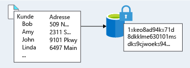

Für die meisten Organisationen sind Daten die wichtigste und wertvollste Ressource.For most organizations, data is the most valuable and irreplaceable asset. Die Verschlüsselung ist die letzte und stärkste Verteidigungslinie einer mehrschichtigen Sicherheitsstrategie.Encryption serves as the last and strongest line of defense in a layered security strategy. 

Contoso Shipping weiß, dass Verschlüsselung der einzige Schutz für die Daten ist, sobald diese das Datencenter verlassen und an die mobilen Apps übermittelt werden.Contoso Shipping knows that encryption is the only protection their data has once it leaves the data center as it heads to those mobile apps.

## Was ist Verschlüsselung?What is encryption?

Verschlüsselung ist der Vorgang, bei dem Daten für unberechtigte Betrachter nicht lesbar und nicht verwendbar gemacht werden.Encryption is the process of making data unreadable and unusable to unauthorized viewers. Um verschlüsselte Daten verwenden oder lesen zu können, müssen sie *entschlüsselt* werden. Hierfür ist ein geheimer Schlüssel erforderlich.To use or read the encrypted data, it must be *decrypted*, which requires the use of a secret key. Es gibt zwei Arten von Verschlüsselungen auf oberster Ebene: **symmetrisch** und **asymmetrisch**.There are two top-level types of encryption: **symmetric** and **asymmetric**.

Bei der symmetrischen Verschlüsselung wird zum Verschlüsseln und Entschlüsseln der Daten jeweils der gleiche Schlüssel verwendet.Symmetric encryption uses the same key to encrypt and decrypt the data. Ziehen Sie eine Kennwort-Manager-Desktopanwendung in Betracht.Consider a desktop password manager application. Sie geben Ihre Passwörter ein, und diese werden mit Ihrem persönlichen Schlüssel verschlüsselt (Ihr Schlüssel wird oft von Ihrem Masterkennwort abgeleitet).You enter your passwords and they are encrypted with your own personal key (your key is often derived from your master password). Wenn die Daten abgerufen werden müssen, wird der gleiche Schlüssel verwendet, und die Daten werden entschlüsselt.When the data needs to be retrieved, the same key is used, and the data is decrypted.

Bei der asymmetrischen Verschlüsselung wird ein Schlüsselpaar mit einem öffentlichen und einem privaten Schlüssel verwendet.Asymmetric encryption uses a public key and private key pair. Beide Schlüssel können für das Verschlüsseln genutzt werden, aber mit nur einem Schlüssel können die eigenen verschlüsselten Daten nicht entschlüsselt werden.Either key can encrypt but a single key can't decrypt its own encrypted data. Zum Entschlüsseln benötigen Sie jeweils den anderen Schlüssel des Paars.To decrypt, you need the paired key. Die asymmetrische Verschlüsselung wird beispielsweise für Transport Layer Security (TLS) (für HTTPS) und Datensignaturen verwendet.Asymmetric encryption is used for things like Transport Layer Security (TLS) (used in HTTPS) and data signing.

Sowohl die symmetrische als auch die asymmetrische Verschlüsselung spielen eine Rolle bei der korrekten Sicherung von Daten.Both symmetric and asymmetric encryption play a role in properly securing your data. 

Bei der Verschlüsselung wird in der Regel zwischen zwei Optionen unterschieden: Verschlüsselung ruhender Daten und Verschlüsselung während der Übertragung.Encryption is typically approached in two ways: encryption at rest and encryption in transit.

## Verschlüsselung während der ÜbertragungEncryption in transit

Daten während der Übertragung sind Daten, die aktiv zwischen zwei Orten übermittelt werden – etwa über das Internet oder über ein privates Netzwerk.Data in transit is the data actively moving from one location to another, such as across the internet or through a private network. Die sichere Übertragung kann von mehreren verschiedenen Ebenen übernommen werden.Secure transfer can be handled by several different layers. Die Daten können vor dem Senden über ein Netzwerk beispielsweise auf der Anwendungsebene verschlüsselt werden.It could be done by encrypting the data at the application layer prior to sending it over a network. HTTPS ist ein Beispiel für eine Verschlüsselung auf Anwendungsebene bei der Übertragung.HTTPS is an example of application layer in transit encryption. 

Sie können auch einen sicheren Kanal (z.B. ein virtuelles privates Netzwerk (VPN)) auf Netzwerkebene einrichten, um Daten zwischen zwei Systemen zu übertragen.You can also set up a secure channel, like a virtual private network (VPN), at a network layer, to transmit data between two systems. 

Das Verschlüsseln von Daten während der Übertragung schützt die Daten vor externen Beobachtern und bietet einen Mechanismus zur Datenübertragung bei gleichzeitiger Einschränkung des Offenlegungsrisikos.Encrypting data in transit protects the data from outside observers and provides a mechanism to transmit data while limiting risk of exposure. 

<!--TODO: replace with final media which was submitted for Design-for-security-in-azure -->
<!--TODO: replace with final media which was submitted for Design-for-security-in-azure -->

## Verschlüsselung ruhender DatenEncryption at rest

Ruhende Daten sind Daten, die auf einem physischen Medium gespeichert sind.Data at rest is the data that has been stored on a physical medium. Das sind beispielsweise Daten, die auf dem Datenträger eines Servers, in einer Datenbank oder in einem Speicherkonto gespeichert sind.This could be data stored on the disk of a server, data stored in a database, or data stored in a storage account. Unabhängig vom Speichermechanismus stellt die Verschlüsselung ruhender Daten sicher, dass die gespeicherten Daten ohne die zum Entschlüsseln erforderlichen Schlüssel und Geheimnisse nicht lesbar sind.Regardless of the storage mechanism, encryption of data at rest ensures that the stored data is unreadable without the keys and secrets needed to decrypt it. Wenn ein Angreifer eine Festplatte mit verschlüsselten Daten erhält, aber keinen Zugriff auf die Verschlüsselungsschlüssel hat, kann der Angreifer die Daten nicht ohne Weiteres kompromittieren.If an attacker was to obtain a hard drive with encrypted data and did not have access to the encryption keys, the attacker would not compromise the data without great difficulty.

Die tatsächlichen verschlüsselten Daten können im Hinblick auf Inhalt, Verwendung und Bedeutung für das Unternehmen variieren.The actual data that is encrypted could vary in its content, usage, and importance to the organization. Dies können geschäftskritische Finanzinformationen, geistiges Eigentum des Unternehmens, persönliche Kunden- oder Mitarbeiterdaten in Speichern des Unternehmens und auch die Schlüssel und Geheimnisse sein, die für die Datenverschlüsselung verwendet werden.This could be financial information critical to the business, intellectual property that has been developed by the business, personal data about customers or employees that the business stores, and even the keys and secrets used for the encryption of the data itself.

<!--TODO: replace with final media which was submitted for Design-for-security-in-azure -->
<!--TODO: replace with final media which was submitted for Design-for-security-in-azure -->

## Verschlüsselung in AzureEncryption on Azure

Betrachten wir einige Möglichkeiten, wie Sie mit Azure Daten dienstübergreifend verschlüsseln können.Let's take a look at some ways that Azure enables you to encrypt data across services.

:::row:::
  :::column:::
    
  :::column-end:::
    :::column span="3"::: **Verschlüsseln von unformatiertem Speicher**:::column span="3"::: **Encrypt raw storage**

Die Azure-Speicherdienstverschlüsselung für ruhende Daten unterstützt Sie dabei, Ihre Daten zu schützen, um die Sicherheits- und Complianceanforderungen Ihrer Organisation zu erfüllen.Azure Storage Service Encryption for data at rest helps you protect your data to meet your organizational security and compliance commitments. Mit dieser Funktion verschlüsselt die Azure-Speicherplattform Ihre Daten automatisch vor dem Ablegen in Azure Managed Disks, Azure Blob Storage, Azure Files oder Azure Queue Storage und entschlüsselt sie vor dem Abrufen.With this feature, the Azure storage platform automatically encrypts your data before persisting it to Azure Managed Disks, Azure Blob storage, Azure Files, or Azure Queue storage, and decrypts the data before retrieval. Die Verarbeitung der Ver- und Entschlüsselung, der Verschlüsselung ruhender Daten und der Speicherdienstverschlüsselung ist für Anwendungen, die die Dienste verwenden, transparent.The handling of encryption, encryption at rest, decryption, and key management in Storage Service Encryption is transparent to applications using the services.
  :::column-end:::
:::row-end:::

:::row:::
  :::column:::
    
  :::column-end:::
    :::column span="3"::: **Verschlüsseln virtueller Computer**:::column span="3"::: **Encrypt virtual machines**

Die Speicherdienstverschlüsselung bietet für Daten, die auf einen physischen Datenträger geschrieben werden, einen Verschlüsselungsschutz auf niedriger Ebene. Wie aber schützen Sie die virtuellen Festplatten (VHDs) von virtuellen Computern (VMs)?Storage Service Encryption provides low-level encryption protection for data written to physical disk, but how do you protect the virtual hard disks (VHDs) of virtual machines? Angenommen, ein Angreifer erhält Zugriff auf Ihr Azure-Abonnement und entwendet die VHDs Ihrer virtuellen Computer: Wie stellen Sie dann sicher, dass er nicht auf die VHD-Daten zugreifen kann?If a malicious attacker gained access to your Azure subscription and exfiltrated the VHDs of your virtual machines, how would you ensure they would be unable to access data stored on the VHD?

Azure Disk Encryption ist eine Funktion, mit der Sie die Datenträger von virtuellen Windows- und Linux-IaaS-Computern verschlüsseln können.Azure Disk Encryption is a capability that helps you encrypt your Windows and Linux IaaS virtual machine disks. Azure Disk Encryption nutzt das Branchenstandardfeature BitLocker von Windows und das Feature dm-crypt von Linux, um Volumeverschlüsselung für das Betriebssystem und die Datenträger bereitzustellen.Azure Disk Encryption leverages the industry-standard BitLocker feature of Windows and the dm-crypt feature of Linux to provide volume encryption for the OS and data disks. Die Lösung ist in Azure Key Vault integriert, damit Sie die Verschlüsselungsschlüssel und Geheimnisse für die Datenträgerverschlüsselung steuern und verwalten können. Sie können mit verwalteten Dienstidentitäten auf Key Vault zugreifen.The solution is integrated with Azure Key Vault to help you control and manage the disk encryption keys and secrets (and you can use managed service identities for accessing Key Vault).

Für Contoso Shipping war die Verwendung virtueller Computer einer der ersten Schritte auf dem Weg in die Cloud.For Contoso Shipping, using VMs was one of the first moves toward the cloud. Die Verschlüsselung aller VHDs ist eine sehr einfache Methode mit geringem Aufwand, mit der Sie sicherstellen können, dass Sie alles für den Schutz Ihrer Unternehmensdaten tun.Having all the VHDs encrypted is a very easy, low-impact way to ensure that you are doing all you can to secure your company's data.
  :::column-end:::
:::row-end:::

:::row:::
  :::column:::
    
  :::column-end:::
    :::column span="3"::: **Verschlüsseln von Datenbanken**:::column span="3"::: **Encrypt databases**

Transparent Data Encryption (TDE) trägt dazu bei, Azure SQL-Datenbank und Azure Data Warehouse vor Bedrohungen durch schädliche Aktivitäten zu schützen.Transparent data encryption (TDE) helps protect Azure SQL Database and Azure Data Warehouse against the threat of malicious activity. TDE ver- und entschlüsselt die Datenbank, die zugehörigen Sicherungen und die Transaktionsprotokolldateien im Ruhezustand in Echtzeit, ohne dass Änderungen an der Anwendung erforderlich sind.It performs real-time encryption and decryption of the database, associated backups, and transaction log files at rest without requiring changes to the application. Standardmäßig ist TDE für alle neu bereitgestellten Azure SQL-Datenbank-Instanzen aktiviert.By default, TDE is enabled for all newly deployed Azure SQL Database instances.

TDE verschlüsselt die Speicherung einer gesamten Datenbank, indem ein symmetrischer Schlüssel verwendet wird, der als Datenbankverschlüsselungsschlüssel bezeichnet wird.TDE encrypts the storage of an entire database by using a symmetric key called the database encryption key. Azure stellt standardmäßig einen eindeutigen Verschlüsselungsschlüssel pro logischer SQL Server-Instanz zur Verfügung und verarbeitet alle Details.By default, Azure provides a unique encryption key per logical SQL Server instance and handles all the details. Bring Your Own Key (BYOK) wird ebenfalls mit Schlüsseln unterstützt, die in Azure Key Vault gespeichert sind.Bring your own key (BYOK) is also supported with keys stored in Azure Key Vault.

Da TDE standardmäßig aktiviert ist, können Sie sicher sein, dass Contoso Shipping angemessene Schutzmaßnahmen für die in seinen Datenbanken gespeicherten Daten ergriffen hat.Because TDE is enabled by default, you are confident that Contoso Shipping has the proper protections in place for data stored in their databases.
  :::column-end:::
:::row-end:::

:::row:::
  :::column:::
    
  :::column-end:::
    :::column span="3"::: **Verschlüsseln von Geheimnissen**:::column span="3"::: **Encrypt secrets**

Wie bereits erwähnt, verwenden Verschlüsselungsdienste Schlüssel zum Verschlüsseln und Entschlüsseln von Daten. Wie können Sie also sicherstellen, dass die Schlüssel selbst sicher sind?We've seen that the encryption services all use keys to encrypt and decrypt data, so how do we ensure that the keys themselves are secure? Konzerne verfügen möglicherweise auch über Kennwörter, Verbindungszeichenfolgen und andere vertrauliche Informationen, die sicher gespeichert werden müssen.Corporations may also have passwords, connection strings, or other sensitive pieces of information that they need to securely store.

Azure Key Vault ist ein Clouddienst, der als sicherer Geheimnisspeicher fungiert.Azure Key Vault is a cloud service that works as a secure secrets store. Mit Key Vault können Sie mehrere sichere Container (sogenannte Tresore) erstellen.Key Vault allows you to create multiple secure containers, called vaults. Diese Tresore basieren auf Hardwaresicherheitsmodulen (HSMs).These vaults are backed by hardware security modules (HSMs). In Tresoren wird die Speicherung von Anwendungsgeheimnissen zentralisiert, um die Gefahr zu verringern, dass Sicherheitsinformationen verloren gehen.Vaults help reduce the chances of accidental loss of security information by centralizing the storage of application secrets. Darüber hinaus steuern und protokollieren Schlüsseltresore den Zugriff auf alle darin gespeicherten Daten.Key vaults also control and log the access to anything stored in them. Azure Key Vault kann TLS-Zertifikate anfordern und erneuern. Außerdem stellt die Lösung Funktionen bereit, die für eine zuverlässige Lösung zur Verwaltung des Zertifikatlebenszyklus benötigt werden.Azure Key Vault can handle requesting and renewing TLS certificates, providing the features required for a robust certificate life cycle management solution. Key Vault ist für die Unterstützung jeder Art von Geheimnissen konzipiert.Key Vault is designed to support any type of secret. Dies umfasst Kennwörter, Anmeldeinformationen für Datenbanken, API-Schlüssel und Zertifikate.These secrets could be passwords, database credentials, API keys, and certificates.

Da Azure AD-Identitäten Zugriff auf Azure Key Vault-Geheimnisse gewährt werden kann, erhalten Anwendungen, für die verwaltete Dienstidentitäten aktiviert sind, automatisch und nahtlos die benötigten Geheimnisse.Because Azure AD identities can be granted access to use Azure Key Vault secrets, applications with managed service identities enabled can automatically and seamlessly acquire the secrets they need.
  :::column-end:::
:::row-end:::

## ZusammenfassungSummary

Wie Sie vielleicht wissen, ist die Verschlüsselung oft die letzte Sicherheitsstufe bei Angriffen und ein wichtiger Teil eines mehrstufigen Ansatzes zum Schutz Ihrer Systeme.As you may know, encryption is often the last layer of defense from attackers and is an important piece of a layered approach to securing your systems. Azure enthält integrierte Funktionen und Dienste, um Daten zu verschlüsseln und vor unbeabsichtigter Offenlegung zu schützen.Azure provides built-in capabilities and services to encrypt and protect data from unintended exposure. Der Schutz von in Azure-Diensten gespeicherten Kundendaten ist für Microsoft von größter Bedeutung und sollte in jeden Entwurf integriert werden.Protection of customer data stored within Azure services is of paramount importance to Microsoft and should be included in any design. Grundlegende Dienste wie Azure Storage, Azure Virtual Machines, Azure SQL-Datenbank und Azure Key Vault können mit der Verschlüsselung einen Beitrag zum Schutz Ihrer Umgebung leisten.Foundational services such as Azure Storage, Azure Virtual Machines, Azure SQL Database, and Azure Key Vault can help secure your environment through encryption.