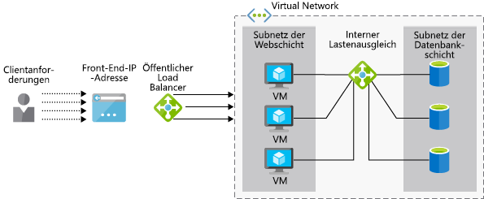

Angenommen, Ihr Unternehmen möchte prüfen, ob Azure Load Balancer Ihre ERP-Anwendung (Enterprise Resource Planning) unterstützt.Your company wants to see if Azure Load Balancer will support your Enterprise Resource Planning (ERP) application. Die Anwendung verfügt über eine Weboberfläche für Benutzer und wird auf mehreren Webservern ausgeführt.Your application has a web interface for users and runs on multiple web servers. Jeder Server verfügt über eine lokale Kopie der ERP-Datenbank, die mit allen Servern synchronisiert wird.Each server has a local copy of the ERP database, which is synced across all servers.

Im Folgenden erfahren Sie, wie ein Lastenausgleich zur Hochverfügbarkeit von Diensten beitragen kann.Here, you will look at how a load balancer can help provide high availability of services. Sie lernen den Unterschied zwischen den Load Balancer-Optionen „Basic“ und „Standard“ kennen und erfahren, wie Sie einen Lastenausgleich für Azure Virtual Machines erstellen.You will identify the difference between the basic and standard load balancer options and see how to create a load balancer for Azure Virtual Machines.

## Was ist ein Lastenausgleich?What is load balancing?

Unter _Lastenausgleich_ sind verschiedene Verfahren zur Verteilung von Workloads auf mehrere Geräte wie Compute-, Speicher- oder Netzwerkgeräte zu verstehen._Load balancing_ describes various techniques for distributing workloads across multiple devices, such as compute, storage, and networking devices. Ziel des Lastenausgleichs ist die Optimierung der Nutzung mehrerer Ressourcen, eine möglichst effiziente Gestaltung dieser Nutzung, wenn eine Infrastruktur horizontal hochskaliert wird, und die Sicherstellung der Aufrechterhaltung von Diensten, wenn einzelne Komponenten nicht verfügbar sind.The goal of load balancing is to optimize the use of multiple resources, to make the most efficient use of these resources as an infrastructure is scaled out, and to ensure services are maintained if some components are unavailable.

Im Folgenden wird erläutert, wie Azure den Lastenausgleich für virtuelle Computer (VMs) unterstützt.Here, we'll look at Azure's load balancing support for virtual machines (VMs).

### Was ist Hochverfügbarkeit?What is high availability?

Als Hochverfügbarkeit gilt die Fähigkeit einer Anwendung oder eines Diensts, trotz eines Ausfalls einer Systemkomponente weiterhin den Zugriff zu ermöglichen.High availability (HA) measures the ability of an application or service to remain accessible despite a failure in any system component. Im Idealfall ist dann keine Dienstunterbrechung spürbar.Ideally, there will not be any noticeable loss of service.

Ein Lastenausgleich ist für die Bereitstellung von Hochverfügbarkeit unerlässlich, da mehrere VMs als ein Pool von Servern fungieren können.Load balancing is fundamental to the delivery of HA because it allows multiple VMs to act as a pool of servers. Der Pool kann weiterhin Dienstanforderungen entgegennehmen, auch wenn einige VMs abstürzen sollten oder zur Wartung offline geschaltet werden.The pool can continue to service requests even if some VMs crash or are taken offline for maintenance.

## Was ist Azure Load Balancer?What is Azure Load Balancer?

**Azure Load Balancer** ist ein Azure-Dienst, der eingehende Anforderungen auf mehrere virtuelle Computer in einem Pool verteilt.**Azure Load Balancer** is an Azure service that distributes incoming requests across multiple VMs in a pool. Der Dienst verteilt eingehenden Netzwerkdatenverkehr auf mehrere ordnungsgemäß funktionierende VMs und umgeht VMs, die nicht reagieren können.It distributes incoming network traffic across a set of healthy VMs and avoids any VM that is not able to respond.

 Azure Load Balancer arbeitet auf der 4. Schicht (TCP, UDP) des aus 7 Schichten bestehenden OSI-Modells.Azure Load Balancer operates at Layer-4 (TCP, UDP) of the OSI 7-layer model. Der Dienst kann zur Unterstützung von TCP- und UDP-Anwendungsszenarios konfiguriert werden, bei denen der Datenverkehr an Azure-VMs gesendet wird. Er unterstützt auch Szenarios mit ausgehendem Datenverkehr, bei denen andere Azure-Dienste den TCP- und UDP-Datenverkehr über Azure-VMs an externe Endpunkte weiterleiten.It can be configured to support TCP and UDP application scenarios where the traffic is inbound to Azure VMs, as well as outbound scenarios where other Azure services are passing TCP and UDP traffic out through Azure VMs to external endpoints.

#### Was ist ein Lastenausgleich mit Load Balancer?What is a Load Balancer?

> [!VIDEO https://www.microsoft.com/videoplayer/embed/RE2yBWo]

## Vergleich zwischen öffentlichen und internen Lastenausgleichsmodulen von Load BalancerPublic vs. internal load balancers

Azure Load Balancer kann je nach Quelle der eingehenden Anforderungen auf _öffentlicher_ oder _interner_ Ebene agieren.An Azure Load Balancer can be either _public_ or _internal_ depending on the source of incoming requests.

Im Rahmen eines **öffentlichen Lastenausgleichs** mit Load Balancer werden Clientanforderungen verarbeitet, die von außerhalb der Azure-Infrastruktur eingehen.A **public load balancer** handles client requests from outside the Azure infrastructure. Die öffentliche IP-Adresse wird dem Lastenausgleichsmodul zugewiesen, und die eingehenden Anforderungen werden an verschiedene Ressourcen weitergeleitet, die sich in einem privaten Netzwerk befinden.The public IP address is assigned to the load balancer and it routes the inbound requests to a set of resources that are on a private virtual network. Dieser Ansatz wird in der Regel verwendet, um Hochverfügbarkeit für Webserver bereitzustellen.This approach is commonly used for making web servers highly available. Auf der folgenden Abbildung sehen Sie ein öffentliches Load Balancer-Modul.The following illustration shows a public load balancer.

Im Rahmen eines **internen Lastenausgleichs** mit Load Balancer werden Anforderungen verarbeitet, die von innerhalb eines virtuellen Netzwerks (oder einem VPN) gesendet werden.An **internal load balancer** processes requests from within a virtual network (or through a VPN). Er verteilt Anforderungen an Ressourcen in diesem virtuellen Netzwerk.It distributes requests to resources within that virtual network. Auf Load Balancer, die Front-End-IP-Adressen und virtuelle Netzwerke kann nicht direkt über das Internet zugegriffen werden.The load balancer, front-end IP addresses, and virtual networks are not directly accessible from the Internet. Die folgende Abbildung zeigt eine Architektur mit einem öffentlichen und einem internen Load Balancer-Modul.The following illustration shows an architecture containing both a public and internal load balancer. Der öffentliche Load Balancer verarbeitet externe Anforderungen, während der interne Load Balancer die Anforderungen zur Verarbeitung an die internen virtuellen Computer und Datenbanken weiterleitet.The public load balancer handles external requests while the internal load balancer forwards the requests to the internal VMs and databases for processing.

## Wie funktioniert Azure Load Balancer?How does Azure Load Balancer work?

Azure Load Balancer verwendet Informationen, die in _Regeln_ und _Integritätstests_ konfiguriert sind, um zu bestimmen, wie eingehender Datenverkehr, der vom _Front-End_ des Load Balancer-Moduls empfangen wird, auf VM-Instanzen in einem _Back-End-Adresspool_ verteilt wird.Azure Load Balancer uses information configured in _rules_ and _health probes_ to determine how inbound traffic that is received on the load balancer _front end_ is distributed to VM instances in a _backend address pool_. Nachfolgend werden die einzelnen Komponenten im Detail erläutert.Let's examine each of these components.

### Was ist das Load Balancer-Front-End?What is the load balancer front end?

Das Load Balancer-Front-End ist eine IP-Konfiguration mit mindestens einer öffentlichen IP-Adresse, die den Zugriff auf Load Balancer und die zugehörigen Anwendungen über das Internet ermöglicht.The load balancer front end is an IP configuration, containing one or more public IP addresses, that enables access to the load balancer and its applications over the Internet.

### Was ist der Back-End-Adresspool?What is the backend address pool?

Virtuelle Computer werden über die zugehörige virtuelle Netzwerkschnittstelle (vNIC) mit einem Load Balancer-Modul verbunden.Virtual machines connect to a load balancer using their virtual network interface (vNIC). Der Back-End-Adresspool enthält die IP-Adressen der vNICs, die mit dem Load Balancer-Modul verbunden sind.The backend address pool contains the IP addresses of the vNICs that are connected to the load balancer. Wenn Sie alle Ihre VMs in einer Verfügbarkeitsgruppe platzieren, können Sie diese verwenden, um Ihre VMs bei der Konfiguration des Load Balancer-Moduls ganz einfach zu einem Back-End-Pool hinzuzufügen.If you place all your VMs in an availability set, you can use this to easily add your VMs to a backend pool when you're configuring the load balancer.

### Was ist ein Integritätstest?What is a health probe?

Load Balancer-Module verwenden _Integritätstests_, um zu bestimmen, welche virtuellen Computer die Anforderungen erfüllen können.Load balancers use _health probes_ to determine which virtual machines can service requests. Der Load Balancer verteilt den Datenverkehr nur an VMs, die verfügbar und betriebsbereit sind.The load balancer will only distribute traffic to VMs that are available and operational.

Ein Integritätstest überwacht auf jedem virtuellen Computer bestimmte Ports.A health probe monitors specific ports on each VM. Sie können definieren, welche Art von Antwort „Integrität“ entspricht. Sie können z.B. eine Antwort `HTTP 200 Available` von einer Webanwendung anfordern.You can define what type of response corresponds to "health"; for example, you might require an `HTTP 200 Available` response from a web application. Standardmäßig wird eine VM nach zwei aufeinanderfolgenden Ausfällen in Abständen von 15 Sekunden als „nicht verfügbar“ gekennzeichnet.By default, a VM will be marked as "unavailable" after two consecutive failures at 15-second intervals.

### LastenausgleichsregelnLoad balancer rules

_Lastenausgleichsregeln_ bestimmen, wie Datenverkehr auf virtuelle Computer im Back-End verteilt wird.Load balancer _rules_ define how traffic is distributed to backend VMs. Ziel ist es, Anforderungen gleichmäßig auf die fehlerfreien VMs im Back-End-Pool zu verteilen.The goal is to distribute requests fairly across the healthy VMs in the backend pool.

Azure Load Balancer verwendet einen hashbasierten Algorithmus, um die Header eingehender Pakete neu zu schreiben.Azure Load Balancer uses a hash-based algorithm to rewrite the headers of inbound packets. Standardmäßig erstellt Load Balancer einen Hash aus folgenden Informationen:By default, Load Balancer creates a hash from:

- IP-Adresse der QuelleSource IP address
- QuellportSource port
- IP-Adresse des ZielsDestination IP address
- ZielportDestination port
- IP-ProtokollnummerIP protocol number

Dieser Mechanismus stellt sicher, dass alle Pakete innerhalb der Paketübertragung eines Clients an dieselbe VM-Instanz im Back-End gesendet werden.This mechanism ensures that all packets within a packet client flow are sent to the same backend VM instance. Für jede Übertragung eines Clients wird ein anderer zufällig zugewiesener Quellport verwendet.A new flow from a client will use a different randomly allocated source port. Das bedeutet, dass sich der Hash ändert und das Load Balancer-Modul diese Daten an einen anderen Endpunkt im Back-End überträgt.This means that the hash will change, and the load balancer may send this flow to a different backend endpoint.

## Gegenüberstellung von Load Balancer-SKUs in den Tarifen „Basic“ und „Standard“Basic vs. Standard Load Balancer SKUs

Es gibt zwei Azure Load Balancer-Versionen: **Basic** und **Standard**.There are two versions of Azure Load Balancer: **Basic** and **Standard**. Sie unterscheiden sich im Hinblick auf Staffelung, Features und Preise.They differ in scale, features, and pricing. Beispiele:For example:

- Der Tarif „Standard“ unterstützt die sichere Weiterleitung von Datenverkehr über HTTPS.Standard supports secure traffic routing over HTTPS.
- Der Tarif „Standard“ unterstützt wesentlich größere Back-End-Pools (1000 im Gegensatz zu 100 im Tarif „Basic“).Backend pool size can be much larger in Standard (1000 vs. 100 in the Basic SKU).
- Datenverkehr kann an einen größeren Endpunktpool weitergeleitet werden, einschließlich einer Mischung aus Skalierungsgruppen, Verfügbarkeitsgruppen und VMs.Traffic can be directed to a larger pool of endpoints, including blends of scale sets, availability sets, and VMs. Die SKU im Tarif „Basic“ ist auf eine Verfügbarkeitsgruppe, eine Skalierungsgruppe oder eine VM beschränkt.The Basic SKU  is restricted to a single availability set, scale set, or VM.
- Unterstützung von Hochverfügbarkeitsports für den gleichzeitigen Lastenausgleich von TCP- und UDP-Datenflüssen auf allen Ports, wenn Sie ein internes Load Balancer-Modul verwenden.Support for High Availability (HA) ports to load-balance TCP and UDP flows on all ports simultaneously when you're using it as an internal load balancer.
- „Basic“ ist kostenlos, während „Standard“ basierend auf Regeln und Durchsatz in Rechnung gestellt wird.Basic is no-cost, while Standard is charged based on rules and throughput.

„Standard“ ist eine Obermenge von „Basic“. Daher sollte jedes für „Basic“ geeignete Szenario auch für „Standard“ funktionieren.Standard is a superset of Basic, so any scenario suitable for Basic should also work on Standard. Die SKU im Tarif „Basic“ ist eher für die Erstellung von Prototypen und Tests vorgesehen, während sich die SKU im Tarif „Standard“ für Produktionsumgebungen eignet.The Basic SKU is generally intended for prototyping and testing while Standard is recommended for production.

## Einleiten der Bereitstellung eines öffentlichen Load Balancer-Moduls im Tarif „Basic“Start the deployment of a basic public load balancer

Zum Erstellen eines VM-Systems mit Lastenausgleich müssen Sie selbst das Load Balancer-Modul und ein virtuelles Netzwerk für Ihre virtuellen Computer erstellen und anschließend dem virtuellen Netzwerk VMs hinzufügen.To create a load-balanced VM system, you need to create the load balancer itself, create a virtual network to contain your virtual machines, and then add VMs to the virtual network.

Zum Erstellen des Load Balancers im Azure-Portal müssen Sie Folgendes definieren:To create the load balancer using the Azure portal, you define the following:

- Name des Load Balancer-ModulsLoad balancer name
- Typ: öffentlich oder internType: public or internal
- SKU: „Basic“ oder „Standard“SKU: Basic or Standard
- Öffentliche IP-Adresse: dynamisch oder statischPublic IP address: dynamic or static
- Ressourcengruppe und -standortResource group and location

Ihre Back-End-VMs werden alle mit demselben virtuellen Netzwerk verbunden. Daher müssen Sie diese Ressource als Nächstes konfigurieren:Your backend VMs will all be connected to the same virtual network, so you need to configure this resource next:

- Name des virtuellen NetzwerksVirtual network name
- Zu verwendender Adressraum, z.B. 172.20.0.0/16Address space to use, such as 172.20.0.0/16
- RessourcengruppeResource group
- Namen des zu verwendenden SubnetzesName for the subnet to use
- Adressraum des Subnetzes (muss sich innerhalb des Hauptbereichs befinden), z.B. 172.20.0.0/24Address space for the subnet (must be within the main space), such as 172.20.0.0/24

Da eingehender Datenverkehr zur erwarten ist, müssen Sie mithilfe einer Netzwerksicherheitsgruppe einige Regeln für die Netzwerksicherheit erstellen.Since we expect inbound traffic, we'll have to create some network security rules using a network security group (NSG). Öffnen Sie für dieses Beispiel Port 80 für HTTP-Datenverkehr.In this case, we'll want to open port 80 for HTTP traffic.

Anschließend müssen Sie virtuelle Computer erstellen, bereitstellen und für die Verwendung Ihres virtuellen Netzwerks konfigurieren.Finally, we then need to create and deploy the virtual machines and configure them to use your virtual network. Erstellen Sie außerdem eine Verfügbarkeitsgruppe, in der diese virtuellen Computer zusammengefasst werden.We will also create an availability set to group them together. Verfügbarkeitsgruppen definieren den Grad an Fehlertoleranz für eine Gruppe von VMs, doch beim Lastenausgleich helfen sie Ihnen auch, Ihre VMs Back-End-Pools zuzuweisen.Availability sets define the level of fault tolerance across a group of VMs, but for load balancing, they also help you assign your VMs to backend pools.

Sie haben soeben erfahren, wie Sie Azure Load Balancer als Teil einer Hochverfügbarkeitslösung einsetzen können.You have now seen how to use Azure Load Balancer as part of a high-availability solution. Führen Sie diese Schritte aus, um Ihr eigenes Load Balancer-Modul bereitzustellen.Next, you will use these steps to deploy your own load balancer.