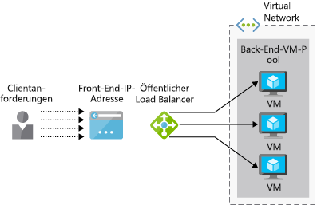

Angenommen Sie, Ihr Unternehmen möchte, um festzustellen, ob Ihre Anwendung (Enterprise Resource Planning, ERP) Azure Load Balancer unterstützt. Die Anwendung verfügt über eine Webschnittstelle für Benutzer und auf mehreren Servern ausgeführt wird. Jeder Server hat eine lokale Kopie der ERP-Datenbank auf allen Servern synchronisiert ist.

Hier erfahren Sie wie ein Load Balancer hohe Verfügbarkeit der Dienste sorgt kann. Den Unterschied zwischen den Basic- und standard-Load-Balancer-Optionen ermitteln und Informationen zum Erstellen eines Lastenausgleichs für Azure Virtual Machines.

## Was ist Lastenausgleich?

_Lastenausgleich_ beschreibt verschiedene Verfahren zur Verteilung von Workloads auf mehreren Geräten, wie COMPUTE-, Speicher-und und Netzwerk Geräte. Das Ziel des Lastenausgleichs ist die Optimierung der Verwendung mehrerer Ressourcen, um die effizienteste Nutzung dieser Ressourcen zu machen, wie eine Infrastruktur hochskaliert horizontal, und um sicherzustellen, dass Dienste verwaltet werden, wenn einige Komponenten nicht verfügbar sind.

Hier betrachten wir Azure Unterstützung für den Lastenausgleich für virtuelle Computer (VMs).

### Was ist Hochverfügbarkeit?

Hoher Verfügbarkeit (HA) Misst die Fähigkeit eines Anwendungs- oder trotz eines Fehlers bei der Systemkomponenten zugänglich bleiben. Im Idealfall werden nicht fallen merkliche Verlust des Diensts.

Der Lastenausgleich ist für die Bereitstellung von HOCHVERFÜGBARKEIT von grundlegender Wichtigkeit, da mehrere virtuelle Computer als einen Pool mit Servern fungieren kann. Der Pool können weiterhin Service Anforderungen auch wenn einige VMs Absturz oder zur Wartung offline geschaltet werden.

## Was ist Azure Load Balancer?

**Der Azure Load Balancer** ist ein Azure-Dienst, der eingehende Anforderungen auf mehrere virtuelle Computer in einem Pool verteilt. Es verteilt die eingehenden Netzwerkdatenverkehr auf einen Satz von fehlerfreie virtuelle Computer und vermeidet jeden virtuellen Computer, die nicht reagieren kann.

 Azure-Lastenausgleich arbeitet auf Layer-4 (TCP, UDP) des OSI-Modells Schicht 7. Sie können Unterstützung TCP- und UDP-Anwendungsszenarien, in denen der Datenverkehr auf virtuellen Azure-Computern eingehende als auch ausgehenden Szenarios, in denen andere Azure-Dienste TCP- und UDP-Datenverkehr über Azure-VMs an externe Endpunkte übergeben werden konfiguriert werden.

> [!VIDEO https://www.microsoft.com/videoplayer/embed/RE2yBWo]

## Öffentliche und interne Load balancer

Azure Load Balancer kann es sich um _öffentliche_ oder _interne_ abhängig von der Quelle der eingehenden Anforderungen.

Ein **öffentlichen Load Balancers** verarbeitet Clientanforderungen von außerhalb Ihrer Azure-Infrastruktur. Die öffentliche IP-Adresse des Load Balancers wird automatisch als Front-End des Load Balancers konfiguriert, wenn Sie die öffentliche IP-Adresse und der Load Balancer-Ressource erstellen. Die folgende Abbildung zeigt einen öffentlichen Load Balancer.

Ein **internen Load Balancer** verarbeitet Anforderungen von innerhalb eines virtuellen Netzwerks (oder über ein VPN). Anforderungen an Ressourcen innerhalb dieses virtuellen Netzwerks verteilt. Der Load Balancer, Front-End-IP-Adressen und virtuelle Netzwerke sind nicht direkt über das Internet zugegriffen werden. Die folgende Abbildung zeigt eine Architektur mit einem öffentlichen und internen Lastenausgleich. Der öffentliche Load Balancer verarbeitet externe Anforderungen, während der interne Load Balancer die Anforderungen an die interne virtuelle Computer und die Datenbanken für die Verarbeitung weitergeleitet.

## Wie funktioniert Azure Load Balancer?

Mit Azure Load Balancer verwendet die Informationen, die im konfigurierten **Regeln** und **Integritätstests** wie die neuen eingehenden Datenverkehr zu ermitteln, die für eines Lastenausgleichs empfangen wird **Front-End** ist an VM-Instanzen verteilt eine **Back-End-Pool**.

### Front-end

Der Load Balancer-Front-End ist eine IP-Konfiguration, die eine oder mehrere öffentliche IP-Adressen, enthält, die Zugriff auf den Load Balancer und der zugehörigen Anwendungen über das Internet ermöglicht.

### Back-End-Adresspool

Verbinden Sie virtuelle Computer mit eines Load Balancers mit ihren virtuellen Netzwerkkarte (vNIC). Die Back-End-Adresspool enthält die IP-Adressen der vNICs, die für den Load Balancer verbunden sind. Wenn Sie alle Ihre virtuellen Computer in einer verfügbarkeitsgruppe platzieren, können dies Sie auf einfache Weise Ihre virtuellen Computer an einen Back-End-Pool hinzufügen, wenn Sie den Load Balancer konfigurieren.

### Integritätstest

Laden Sie die Lastenausgleichsmodule verwenden _Integritätstests_ um zu bestimmen, welche virtuellen Computer die Anforderungen bedienen kann. Der Load Balancer wird nur Datenverkehr zu virtuellen Computern verteilen, die verfügbar und betriebsbereit sein. 

Ein Integritätstest überwacht bestimmte Ports auf jedem virtuellen Computer. Sie können definieren, welche Art von Antwort die "Integrität"; entspricht benötigen Sie z. B. möglicherweise eine `HTTP 200 Available` Antwort aus einer Webanwendung. Standardmäßig wird ein virtueller Computer als "nicht verfügbar" nach zwei aufeinanderfolgenden Fehlern in 15-Sekunden-Intervallen gekennzeichnet.

### Lastenausgleichsregeln

Lastenausgleich _Regeln_ definieren, wie Datenverkehr an Back-End-VMs verteilt wird. Das Ziel ist, um Anforderungen relativ die fehlerfreie virtuelle Computer im Back-End-Pool zu verteilen.

Azure Load Balancer verwendet einen hashbasierten Algorithmus, um die Header der eingehenden Pakete neu zu schreiben. Load Balancer erstellt standardmäßig einen Hash aus:

- Quell-IP-Adressen
- Quellports
- Ziel-IP-Adressen
- Zielports
- IP-Protokollnummern

Dieser Mechanismus wird sichergestellt, dass alle Pakete in einem Paketfluss der Client mit der gleichen Back-End-VM-Instanz gesendet werden. Nach dem Zufallsprinzip zugewiesen Quellport wird ein neuer Datenfluss von einem Client eine andere verwendet. Bedeutet dies, dass der Hash wird geändert, und der Load Balancer dieser Flow möglicherweise an einen anderen Back-End-Endpunkt sendet.

## Gegenüberstellung von Basic- und Standard Load Balancer-SKUs

Es gibt zwei Versionen des Azure Load Balancers: **grundlegende** und **Standard**. Sie unterscheiden sich in der Skalierungsgruppe, Features und Preise. Beispiel:

- Standard unterstützt HTTPS Basic jedoch nicht
- Größe des Pools kann viel größer ist im Standard sein.
- Basic ist kostenlos, während Standard basierend auf Regeln und der Durchsatz berechnet wird.

Standard ist eine Obermenge von Basic, daher wird jeder geeignete Szenario Basic auf Standard auch funktionieren sollte. SKU "Basic" ist in der Regel als Prototypen getestet vorgesehen, während Standard für die Produktion empfohlen wird.

## Starten Sie die Bereitstellung einer öffentlichen basic Load balancer-Instanz

Um ein VM-System mit Lastenausgleich zu erstellen, müssen Sie zum Erstellen des Lastenausgleichs selbst, Erstellen eines virtuellen Netzwerks, Ihrer virtuellen Computer enthalten und fügen Sie dann mit dem virtuellen Netzwerk virtuelle Computer hinzu.

Um den Load Balancer mithilfe der Azure-Portal zu erstellen, definieren Sie die folgenden:

- Name des Load Balancers
- Typ: öffentlich oder intern
- SKU: Basic oder Standard
- Öffentliche IP-Adresse: dynamisch oder statisch
- Ressourcengruppe und Standort

Ihr Back-End-VMs werden alle mit dem gleichen virtuellen Netzwerk verbunden sein müssen Sie als Nächstes konfigurieren Sie diese Ressource:

- Name des virtuellen Netzwerks
- Adressraum an, wie z. B. 172.20.0.0/16
- Ressourcengruppe
- Namen für das Subnetz verwenden
- Adressraum für das Subnetz (innerhalb des Haupt-Bereichs befinden muss), z. B. 172.20.0.0/24

Sie müssen zum Erstellen und Bereitstellen von Ihrem Back-End-VMs aus, und konfigurieren, dass sie Ihr virtuelle Netzwerk verwenden. Sie sollten auch Ihre virtuellen Computer in derselben verfügbarkeitsgruppe platzieren. Verfügbarkeitsgruppen definieren des Grads der Fehlertoleranz für eine Gruppe von VMs, aber für den Lastenausgleich, außerdem können Sie Ihre virtuellen Computer zum Back-End-Pools zuweisen.

Sie haben jetzt mit Azure Load Balancer als Teil einer Lösung mit hoher Verfügbarkeit gesehen. Als Nächstes verwenden Sie diese Schritte auf Ihr eigenes Lastenausgleichsmodul bereitstellen.