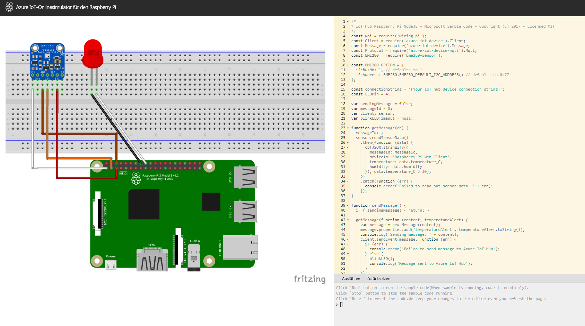

Raspberry Pi-Boards sind neuerdings sehr beliebt, um Theorien zu testen oder um coole Dinge zu entwickeln.Raspberry Pi boards have garnered much interest of late for testing theories or event making cool things. Die Boards sind zwar nicht teuer, möglicherweise möchten Sie die Raspberry Pi-Funktionalität aber erst einmal testen, bevor Sie in ein solches Board investieren.While the cost on this boards are quite low, some may be interested in testing out the Raspberry Pi functionality before investing in one.

Microsoft hat einen [Azure IoT-Onlinesimulator für den Raspberry Pi](https://azure-samples.github.io/raspberry-pi-web-simulator?azure-portal=true) entwickelt, mit dem Benutzer die emulierte Hardware per Code steuern können.Microsoft has built an online [Raspberry Pi Azure IoT Simulator](https://azure-samples.github.io/raspberry-pi-web-simulator?azure-portal=true) allowing users to control the emulated hardware via code. Der Emulator stellt eine Grafik eines Raspberry Pi-Boards dar, das über ein Lochraster, welches die Verbindung der Schaltkreise ermöglicht, mit einem Temperatur-, Feuchtigkeits- und Drucksensor sowie mit einer roten LED verbunden ist.The emulator portrays a graphic of a Raspberry Pi connected to a temperature, humidity, pressure sensor, and a red LED via breadboard allowing circuits to be wired together. Die angezeigte Seitenleiste ermöglicht dem Benutzer die Eingabe von Node.js-JavaScript-Code, um die LED zu steuern und Dummydaten von den simulierten Sensoren zu erfassen.The displayed side panel allows users to enter Node.js JavaScript code to control the LED and collect dummy data from the simulated sensor.

## Azure IoT-Onlinesimulator für den Raspberry PiRaspberry Pi Azure IoT Online Simulator

Im ersten Durchlauf führt der Simulator ein einfaches Programm zur Temperaturerfassung aus, das über die Befehlszeile angezeigt wird.At first run, the simulator operates a sample temperature capture program which is displayed via the command line. Die Beispielanwendung kann auch auf einem echten Pi-Board ausgeführt werden, da der Simulator das Testen von Code ermöglicht, bevor dieser auf ein echtes Gerät übertragen wird.The same sample application can also be run on a real Pi as the simulator is designed to allow people to test code before transferring it to a real device.

Der Websimulator umfasst drei Bereiche:There are three areas in the web simulator:

1. **Assemblybereich:****Assembly Area**. Hier sehen Sie den Status Ihres Geräts.This is where you can see your device status. Standardmäßig handelt es sich hierbei um ein Pi-Board mit einem BME280-Sensor und einer LED.By default, this is a Pi connecting with a BME280 sensor and an LED light. Diese Konfiguration kann momentan nicht angepasst werden.This configuration isn't customizable at this time.
2. **Programmierbereich:****Coding Area**. Ein onlinebasierter Code-Editor, mit dem Sie eine Node.js-App für den Raspberry Pi erstellen können.An online code editor for you to make an app on Raspberry Pi with Node.js. Mit der Standard-Beispielanwendung können Sie Sensordaten von einem BME280-Sensor erfassen und diese an Azure IoT Hub senden.The default sample application helps to collect sensor data from the BME280 sensor and sends it to your Azure IoT Hub.
3. **Integriertes Konsolenfenster:****Integrated console window**. Hier wird die Ausgabe Ihrer App angezeigt.This is where you can see the output of your app. In der Konsole stehen drei Funktionen zur Verfügung:Within the console there are three functions:
    - `run`: Führt den Beispielcode aus. (Während der Ausführung ist der Code schreibgeschützt.)`run` - Runs the sample code (When sample is running, code is read-only).
    - `Stop`: Beendet die Ausführung des Beispielcodes.`Stop` - Stops the sample code running.
    - `Reset`: Setzt den Code zurück.`Reset` - Resets the code.

Nachdem Sie sich nun einen Überblick über den Raspberry Pi-Simulator verschafft haben, sehen wir uns als Nächstes IoT Hub in Azure an. Dort erstellen Sie eine neue Ressource, um Daten aus dem Simulator zu erfassen.Now that you have an overview of the Raspberry Pi simulator, we'll explore the IoT Hub in Azure where you will create a new resource to capture data from the simulator.

<!-- Reference links 
-   Online Raspberry Pi Emulator:
    <https://docs.microsoft.com/azure/iot-hub/iot-hub-raspberry-pi-web-simulator-get-started>
-   <https://azure-samples.github.io/raspberry-pi-web-simulator/#GetStarted>-->