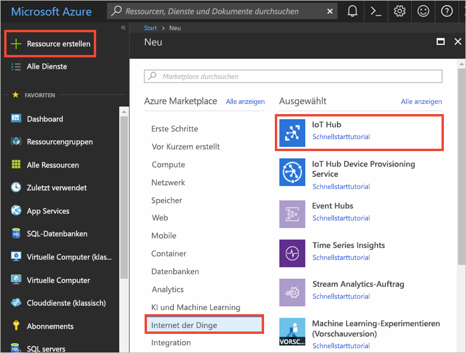
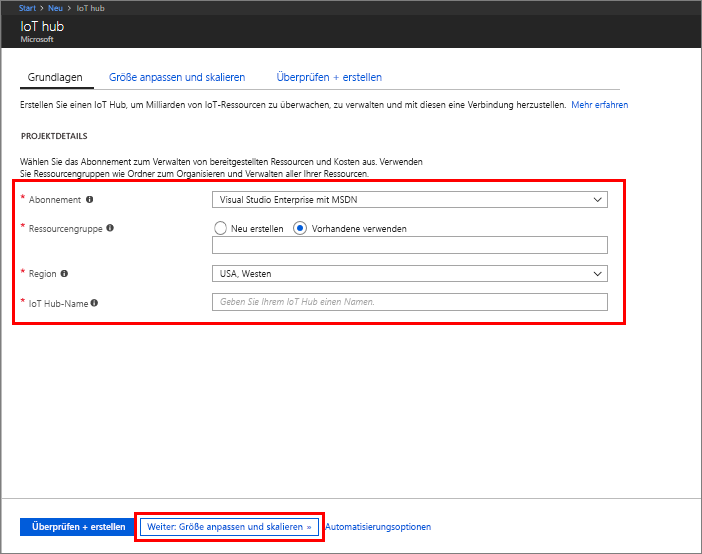
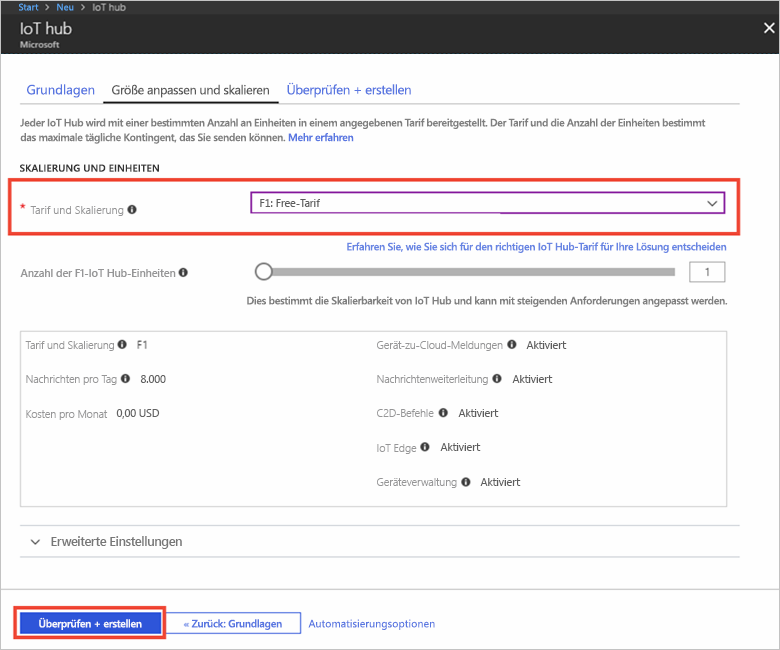
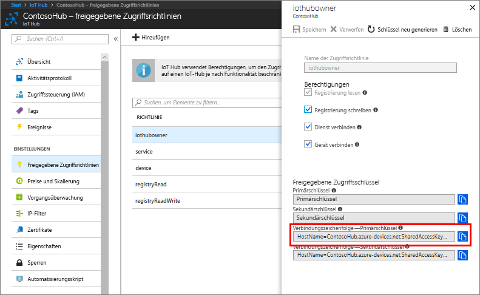
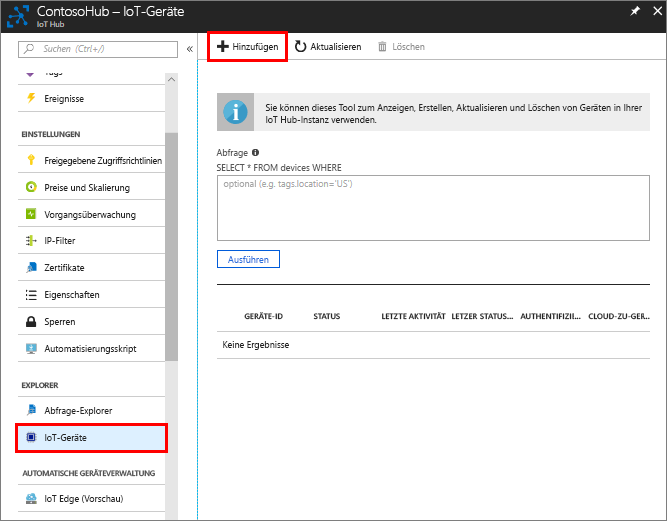
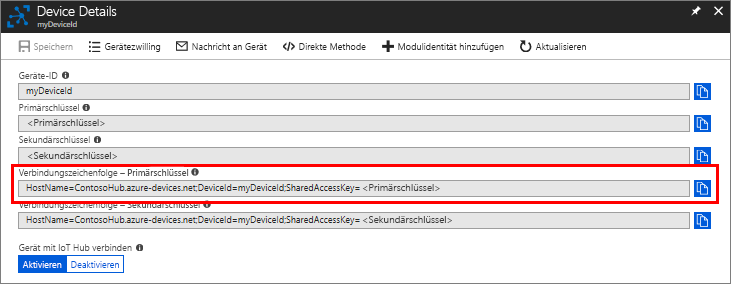
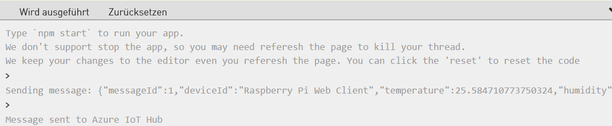

Das Erfassen von Wetterdaten ist eine wichtige Aufgabe, weil das Wetter vieles beeinflusst – von Verkehrsmustern bis hin zum Betrieb von Heizungs-, Lüftungs- und Klimasystemen (Heating, Ventilation, Air Conditioning, HVAC) im Einzelhandel.Capturing of weather data is an important task as weather can effect everything from traffic patterns to how heating, ventilation, and air conditioning (HVAC) systems in retail stores are operated. In dieser Übung interagieren Sie mit dem Raspberry Pi-Onlinesimulator, der in der vorherigen Einheit vorgestellt wurde, um simulierte Wetterdaten zu erfassen und über Azure IoT Hub zu speichern.In this exercise, you will be interacting with the online Raspberry Pi simulator you learned about in the previous unit to capture simulated weather data and via the Azure IoT Hub.

[!include]

Diese Übung wird zwar in einer simulierten Umgebung durchgeführt, die auf dem simulierten Gerät ausgeführte Anwendung kann jedoch später auf ein echtes Gerät übertragen werden.While this exercise is being conducted in a simulated environment, the application running on the simulated device can be transferred to a real device in the future.

## Erstellen einer IoT Hub-InstanzCreate an IoT hub
Auf der Grundlage der Features und des Erweiterungsmodells von Azure IoT Hub können Geräte- und Back-End-Entwickler stabile Geräteverwaltungslösungen entwickeln.Azure IoT Hub provides the features and an extensibility model that enable device and back-end developers to build robust device management solutions. Das Spektrum der Geräte reicht von einfachen Sensoren und zweckgebundenen Microcontrollern bis hin zu leistungsfähigen Gateways zur Weiterleitung der Kommunikation für Gerätegruppen.Devices range from constrained sensors and single purpose microcontrollers, to powerful gateways that route communications for groups of devices. Die Anwendungsfälle und Anforderungen für IoT-Betreiber sind außerdem sehr branchenspezifisch.In addition, the use cases and requirements for IoT operators vary significantly across industries. Trotz dieser Vielfalt bietet die Geräteverwaltung mit Azure IoT Hub Funktionen, Muster und Codebibliotheken für unterschiedlichste Geräte und Endbenutzer.Despite this variation, device management with IoT Hub provides the capabilities, patterns, and code libraries to cater to a diverse set of devices and end users.

Um mit dem Sammeln von Daten aus dem Raspberry Pi-Simulator beginnen zu können, müssen Sie zunächst eine IoT Hub-Instanz erstellen.In order to start collecting the data from the Raspberry Pi simulator, you need to first create an IoT hub.

1. Melden Sie sich beim [Azure-Portal](https://portal.azure.com/learn.docs.microsoft.com?azure-portal=true) mit dem gleichen Konto an, über das Sie die Sandbox aktiviert haben.Sign into the [Azure portal](https://portal.azure.com/learn.docs.microsoft.com?azure-portal=true) using the same account you activated the sandbox with.

2. Klicken Sie links oben im Azure-Portal auf **Ressource erstellen**.Choose **Create a resource** in the upper left-hand corner of the Azure portal.

3. Klicken Sie auf **Internet der Dinge** und anschließend auf **IoT Hub**.Select **Internet of Things**, and then select **IoT Hub**.

4. Geben Sie im Bereich **IoT Hub** die folgenden Informationen für Ihre IoT Hub-Instanz ein:In the **IoT hub** pane, enter the following information for your IoT hub:

   - **Abonnement:** Verwenden Sie für dieses Beispiel das Standardabonnement.**Subscription**: Use the default subscription for this example.
   - **Ressourcengruppe:** Verwenden Sie die vorhandene Ressourcengruppe.**Resource group**: Use the existing resource group. Indem Sie alle verwandten Ressourcen in der gleichen Gruppe zusammenfassen, können Sie sie alle zusammen verwalten.By putting all related resources in the same group you can manage them all together. Wenn Sie also beispielsweise die Ressourcengruppe löschen, werden alle Ressourcen in dieser Gruppe gelöscht.For example, deleting the resource group deletes all resources contained in that group.
   - **Name:** Erstellen Sie einen eindeutigen Namen für Ihre IoT Hub-Instanz.**Name**: Create a unique name for your IoT hub. Ist der eingegebene Name verfügbar, wird ein grünes Häkchen angezeigt.If the name you enter is available, a green check mark appears.
   - **Region:** Wählen Sie in der folgenden Liste den nächstgelegenen Standort aus.**Region**: Select the closest location to you from the following list.

    [!include]

    > [!IMPORTANT]
    > Der IoT Hub wird öffentlich als DNS-Endpunkt ermittelbar sein, sodass Sie beim Benennen die Verwendung von sensiblen Informationen vermeiden sollten.The IoT hub will be publicly discoverable as a DNS endpoint, so make sure to avoid any sensitive information while naming it.

    

1. Klicken Sie auf **Nächster Schritt: Größe festlegen und skalieren**, um die Erstellung Ihres IoT-Hubs fortzusetzen.Select **Next: Size and scale** to continue creating your IoT hub.
2. Wählen Sie eine Option für **Tarif und Skalierung** aus.Choose your **Pricing and scale tier**. Verwenden Sie für dieses Beispiel den Tarif **F1 – Free**.For this example, select the **F1 - Free** tier.

    

3. Klicken Sie auf **Überprüfen + erstellen**.Select **Review + create**.

4. Überprüfen Sie die Informationen zum IoT-Hub, und klicken Sie auf **Erstellen**.Review your IoT hub information, then click **Create**. Die Erstellung des IoT Hubs kann mehrere Minuten dauern.Your IoT hub might take a few minutes to create. Sie können den Fortschritt im Bereich **Benachrichtigungen** überwachen.You can monitor the progress in the **Notifications** pane.

<!--STOPPED HERE-->
<!--
Now that you have created an IoT hub, it's time to locate the important information that you use to connect devices and applications to your IoT hub. In your IoT hub navigation menu, open **Shared access policies**. Select the **iothubowner** policy, and then copy the **Connection string---primary key** of your IoT hub. For more information, see [Control access to IoT Hub](https://docs.microsoft.com/azure/iot-hub/iot-hub-devguide-security).

> [!NOTE]
> You do not need this iothubowner connection string for this set-up exercise. However, you may need it for some of the tutorials or different IoT scenarios after you complete this set-up.

-->

## Registrieren eines GerätsRegister a device
Ein Gerät muss bei Ihrer IoT Hub-Instanz registriert werden, um eine Verbindung herstellen zu können.A device must be registered with your IoT hub before it can connect.

1. Öffnen Sie in Ihrem IoT Hub-Navigationsmenü die Option **IoT-Geräte**, und klicken Sie auf **Hinzufügen**, um ein Gerät bei Ihrer IoT Hub-Instanz zu registrieren.In your IoT hub navigation menu, open **IoT devices**, then click **Add** to register a device in your IoT hub.

   

2. Geben Sie eine **Geräte-ID** für das neue Gerät ein.Enter a **Device ID** for the new device. Bei Geräte-IDs wird die Groß-/Kleinschreibung beachtet.Device IDs are case sensitive.

    > [!IMPORTANT]
    > Diese Geräte-ID ist unter Umständen in den Protokollen sichtbar, die für den Kundensupport und die Problembehandlung erfasst werden. Stellen Sie also sicher, dass Sie beim Benennen keine sensiblen Informationen verwenden.The device ID may be visible in the logs collected for customer support and troubleshooting, so make sure to avoid any sensitive information while naming it.

3. Klicken Sie auf **Speichern**.Click **Save**.
4. Öffnen Sie das Gerät nach der Erstellung in der Liste im Bereich **IoT-Geräte**.After the device is created, open the device from the list in the **IoT devices** pane.
5. Kopieren Sie **Verbindungszeichenfolge – Primärschlüssel** zur späteren Verwendung.Copy the **Connection string---primary key** to use later.

   

## Senden simulierter TelemetriedatenSend simulated telemetry

1. Öffnen Sie den [Azure IoT-Simulator für den Raspberry Pi](https://azure-samples.github.io/raspberry-pi-web-simulator?azure-portal=true).Open the [Raspberry Pi Azure IoT Simulator](https://azure-samples.github.io/raspberry-pi-web-simulator?azure-portal=true).
1. Ersetzen Sie den Platzhalter in Zeile 15 durch die soeben kopierte Verbindungszeichenfolge für das Azure IoT Hub-Gerät.Replace the placeholder in Line 15 with the Azure IoT hub device connection string you just copied.
1. Klicken Sie auf die Schaltfläche `Run`, oder geben Sie im Konsolenfenster `npm start` ein, um die Anwendung auszuführen.Click the `Run` button or type `npm start` in the console window to run the application.

    

1. Die folgende Ausgabe sollte angezeigt werden, die die Sensordaten und Nachrichten zeigt, die an Ihren IoT Hub gesendet werden.You should see the following output that shows the sensor data and the messages that are sent to your IoT hub.

    

## Lesen der Telemetriedaten aus Ihrem HubRead the telemetry from your hub
Nun passiert Folgendes:So what's happening? IoT Hub empfängt die vom simulierten Gerät gesendeten Gerät-zu-Cloud-Nachrichten.IoT hub is receiving the device-to-cloud messages sent from the simulated device. Um das zu sehen, schauen wir uns kurz an, wie Azure IoT Hub die eingehenden Daten verarbeitet.In order to see that, let's take a quick look at how Azure IoT Hub is processing the incoming data. Klicken Sie in Ihrer IoT Hub-Instanz unter **Überwachung** auf **Metriken**.In your IoT Hub, under **Monitoring**, select **Metrics**. Warten Sie ein paar Minuten, bis die Daten eintreffen.Give it a few minutes as you wait for the data to come into the picture.

<!--Reference links
https://docs.microsoft.com/azure/iot-hub/iot-hub-raspberry-pi-web-simulator-get-started-->
