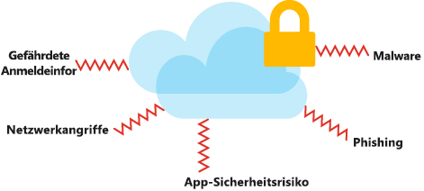
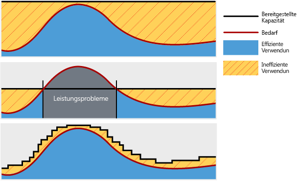
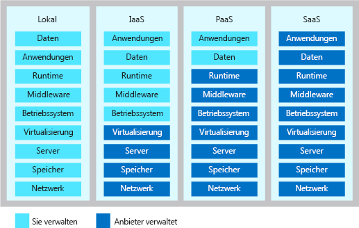

Die Cloud hat die Art und Weise verändert, wie Unternehmen ihre geschäftlichen Herausforderungen meistern und wie Anwendungen und Systeme konzipiert sind.The cloud has changed the way organizations solve their business challenges, and how applications and systems are designed. Die Aufgabe eines Lösungsarchitekten besteht nicht nur darin, dadurch einen geschäftlichen Mehrwert zu erzielen, dass die Anwendung ihre funktionalen Anforderungen erfüllt, sondern auch darin, sicherzustellen, dass die Lösung so konzipiert ist, dass sie skalierbar, ausfallsicher, effizient und sicher ist.The role of a solution architect is not only to deliver business value through the functional requirements of the application, but to ensure the solution is designed in ways that are scalable, resilient, efficient and secure. Bei einer Lösungsarchitektur geht es um Planung, Entwurf, Implementierung und kontinuierliche Verbesserung eines IT-Systems.Solution architecture is concerned with the planning, design, implementation, and ongoing improvement of a technology system. Die Architektur eines Systems muss die geschäftlichen Anforderungen mit den technischen Funktionen in Einklang bringen, die zur Erfüllung dieser Anforderungen erforderlich sind.The architecture of a system must balance and align the business requirements with the technical capabilities needed to execute those requirements. Dazu zählt die Bewertung von Risiken, Kosten und Funktionen für das gesamte System und dessen Komponenten.It includes an evaluation of risk, cost, and capability throughout the system and its components.

#### Entwerfen einer erstklassigen Azure-ArchitekturDesign a great Azure Architecture

<!-- TODO: revisit this video after Ignite -->
<!-- > VIDEO: https://www.microsoft.com/videoplayer/embed/RE2yEv2 -->

Für den Architekturentwurf gibt es zwar keine Standardlösung, jedoch einige universelle Konzepte, die unabhängig von Architektur, Technologie oder Cloudanbieter gelten.While there is no one-size-fits-all approach to designing an architecture, there are some universal concepts that will apply regardless of the architecture, technology, or cloud provider. Obwohl nicht allumfassend, hilft Ihnen die Konzentration auf diese Konzepte, eine zuverlässige, sichere und flexible Grundlage für Ihre Anwendung zu schaffen.While these are not all-inclusive, focusing on these concepts will help you build a reliable, secure, and flexible foundation for your application.

Eine gute Architektur baut auf einem soliden Fundament mit vier Säulen auf:A great architecture starts with a solid foundation built on four pillars:

* SicherheitSecurity
* Leistung und SkalierbarkeitPerformance and scalability
* Verfügbarkeit und ZuverlässigkeitAvailability and recoverability
* Effizienz und BetriebEfficiency and operations

## SicherheitSecurity

Daten sind die wertvollsten Bestandteile des technischen Fußabdrucks Ihrer Organisation.Data is the most valuable piece of your organization's technical footprint. Bei dieser Säule stehen der Schutz des Zugriffs auf Ihre Architektur mittels Authentifizierung sowie der Schutz Ihrer Anwendung und Ihrer Daten vor Netzwerksicherheitslücken im Mittelpunkt.In this pillar, you'll be focused on securing access to your architecture through authentication and protecting your application and data from network vulnerabilities. Darüber hinaus muss die Integrität Ihrer Daten geschützt werden – etwa durch Verschlüsselung.The integrity of your data should be protected as well, using tools like encryption.

Sie müssen die Sicherheit für den gesamten Lebenszyklus Ihrer Anwendung berücksichtigen – von Entwurf und Implementierung bis hin zu Bereitstellung und Betrieb.You must think about security throughout the entire lifecycle of your application, from design and implementation to deployment and operations. Die Cloud bietet Schutzvorkehrungen für eine Vielzahl von Bedrohungen wie das unerlaubte Eindringen in Netzwerke und DDoS-Angriffe, aber Sicherheit muss auch in Ihre Anwendung, Prozesse und Unternehmenskultur integriert werden.The cloud provides protections against a variety of threats, such as network intrusion and DDoS attacks, but you still need to build security into your application, processes, and organizational culture.

## Leistung und SkalierbarkeitPerformance and scalability

Eine gut funktionierende und skalierbare Architektur muss die Ressourcenkapazität ordnungsgemäß auf die Nachfrage abstimmen.For an architecture to perform well and be scalable, it should properly match resource capacity to demand. Hierzu skalieren Cloudarchitekturen Anwendungen in der Regel dynamisch auf der Grundlage der Aktivitäten in der Anwendung.Traditionally, cloud architectures do so by scaling applications dynamically based on activity in the application. Die Nachfrage für Dienste ändert sich. Daher ist es wichtig, dass auch Ihre Architektur an die Nachfrage angepasst werden kann.Demand for services change, so it's important for your architecture to have the ability to adjust to demand as well. Wenn Sie die Leistung und Skalierbarkeit bei Ihrem Architekturentwurf berücksichtigen, können Sie eine großartige und kostengünstige Kundenerfahrung bieten.By designing your architecture with performance and scalability in mind, you'll provide a great experience for your customers while being cost-effective.

## Verfügbarkeit und ZuverlässigkeitAvailability and recoverability

Die größte Sorge eines Architekten ist es, dass die Architektur ausfällt und nicht wiederhergestellt werden kann.Every architect’s worst fear is having your architecture go down with no way to recover it. Das Design einer erfolgreichen Cloudumgebung ist daher auf mögliche Fehler auf sämtlichen Ebenen vorbereitet.A successful cloud environment is designed in a way that anticipates failure at all levels. Zur Antizipierung dieser Fehler muss das System unter anderem so entworfen werden, dass es im Falle eines Fehlers innerhalb der von Ihrer Organisation und Ihren Kunden erwarteten Zeit wiederhergestellt werden kann.Part of anticipating these failures is designing a system that can recover from the failure, within the time required by your stakeholders and customers.

## Effizienz und BetriebEfficiency and operations

Ihre Cloudumgebung soll kostengünstig zu betreiben und entwicklerfreundlich sein.You will want to design your cloud environment so that it's cost-effective to operate and develop against. Ineffizienz und unnötige Cloudausgaben müssen erkannt werden, um sicherzustellen, dass Sie den größtmöglichen Nutzen aus Ihren Investitionen ziehen.Inefficiency and waste in cloud spending should be identified to ensure you're spending money where we can make the greatest use of it. Sie benötigen eine gute Überwachungsarchitektur, um Fehler und Probleme zu erkennen – idealerweise, noch bevor sie auftreten (oder wenigstens, bevor sie von Ihren Kunden bemerkt werden).You need to have a good monitoring architecture in place so that you can detect failures and problems before they happen or, at a minimum, before your customers notice. Darüber hinaus benötigen Sie ein zuverlässiges Überwachungsframework, das Aufschluss über die Nutzung der verfügbaren Ressourcen durch Ihre Anwendung gibt.You also need to have some visibility in to how your application is using its available resources, through a robust monitoring framework.

# Gemeinsame VerantwortungShared responsibility

Die Umstellung auf die Cloud bringt ein Modell der gemeinsamen Verantwortung mit sich.Moving to the cloud introduces a model of shared responsibility. In diesem Modell verwaltet Ihr Cloudanbieter bestimmte Aspekte Ihrer Anwendung, sodass Sie für die restlichen Aspekte Verantwortung tragen.In this model, your cloud provider will manage certain aspects of your application, leaving you with the remaining responsibility. In einer lokalen Umgebung sind Sie für alles verantwortlich.In an on-premises environment you are responsible for everything. Wenn Sie erst auf IaaS (Infrastructure as a Service), dann auf PaaS (Platform as a Service) und auf SaaS (Software as a Service) umsteigen, übernimmt Ihr Cloudanbieter mehr von dieser Verantwortung.As you move to infrastructure as a service (IaaS), then to platform as a service (PaaS) and software as a service (SaaS), your cloud provider will take on more of this responsibility. Diese gemeinsame Verantwortung spielt eine Rolle bei Ihren Architekturentscheidungen, da sie Auswirkungen auf Kosten, Betriebsfunktionen, Sicherheit und die technischen Möglichkeiten Ihrer Anwendung haben kann.This shared responsibility will play a role in your architectural decisions, as they can have implications on cost, operational capabilities, security, and the technical capabilities of your application. Indem Sie diese Verantwortlichkeiten auf Ihren Anbieter übertragen, können Sie sich darauf konzentrieren, einen Mehrwert für Ihr Unternehmen zu schaffen und sich von Aktivitäten zu verabschieden, die keine zentralen geschäftlichen Aufgaben darstellen.By shifting these responsibilities to your provider you can focus on brining value to your business and move away from activities that aren't a core business function.

# DesignentscheidungenDesign choices

In einer idealen Architektur würden wir die sicherste, leistungsfähigste, hochverfügbarste und effizienteste Umgebung überhaupt erstellen.In an ideal architecture, we would build the most secure, high performance, highly available, and efficient environment possible. Wie so oft müssen wir jedoch gewisse Kompromisse eingehen.However, as with everything, there are trade-offs. Eine Umgebung, die bei allen Säulen das Höchstmaß erreicht, hat ihren Preis.To build an environment with the highest level of all these pillars, there is a cost. Das können tatsächliche Kosten sein oder beispielsweise eine höhere Bereitstellungsdauer oder Abstriche bei der betrieblichen Flexibilität.That cost may be in actual money, time to deliver, or operational agility. Jede Organisation hat andere Prioritäten, die sich auf die Entwurfsentscheidungen für die einzelnen Säulen auswirken.Every organization will have different priorities that will impact the design choices made in each pillar. Beim Entwurf Ihrer Architektur müssen Sie entscheiden, welche Kompromisse akzeptabel sind und welche nicht.As you design your architecture, you will need to determine what trade-offs are acceptable and which are not.

Bei der Erstellung einer Azure-Architektur müssen zahlreiche Aspekte berücksichtigt werden.When building an Azure architecture, there are many considerations to keep in mind. Die Architektur soll sicher, skalierbar, verfügbar und wiederherstellbar sein.You want your architecture to be secure, scalable, available, and recoverable. Um das zu erreichen, müssen Sie Entscheidungen auf der Grundlage von Kosten, organisatorischen Prioritäten und Risiken treffen.To make that possible, you'll have to make decisions based on cost, organizational priorities, and risk.
