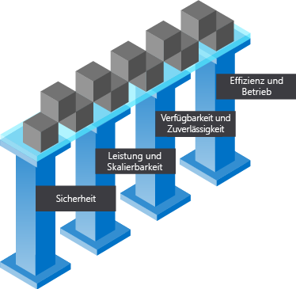

Die Cloud hat die Art und Weise verändert, wie Unternehmen ihre geschäftlichen Herausforderungen meistern und wie Anwendungen und Systeme konzipiert sind. Die Aufgabe eines Lösungsarchitekten besteht nicht nur darin, dadurch einen geschäftlichen Mehrwert zu erzielen, dass die Anwendung ihre funktionalen Anforderungen erfüllt, sondern auch darin, sicherzustellen, dass die Lösung so konzipiert ist, dass sie skalierbar, ausfallsicher, effizient und sicher ist. Bei einer Lösungsarchitektur geht es um Planung, Entwurf, Implementierung und kontinuierliche Verbesserung eines IT-Systems. Die Architektur eines Systems muss die geschäftlichen Anforderungen mit den technischen Funktionen in Einklang bringen, die zur Erfüllung dieser Anforderungen erforderlich sind. Dazu zählt die Bewertung von Risiken, Kosten und Funktionen für das gesamte System und dessen Komponenten.

#### Entwerfen einer erstklassigen Azure-Architektur

<!-- TODO: revisit this video after Ignite -->
<!-- > VIDEO: https://www.microsoft.com/videoplayer/embed/RE2yEv2 -->

Für den Architekturentwurf gibt es zwar keine Standardlösung, jedoch einige universelle Konzepte, die unabhängig von Architektur, Technologie oder Cloudanbieter gelten. Obwohl nicht allumfassend, hilft Ihnen die Konzentration auf diese Konzepte, eine zuverlässige, sichere und flexible Grundlage für Ihre Anwendung zu schaffen.

Eine gute Architektur baut auf einem soliden Fundament mit vier Säulen auf:

* Sicherheit
* Leistung und Skalierbarkeit
* Verfügbarkeit und Zuverlässigkeit
* Effizienz und Betrieb

## Sicherheit

Daten sind die wertvollsten Bestandteile des technischen Fußabdrucks Ihrer Organisation. Bei dieser Säule stehen der Schutz des Zugriffs auf Ihre Architektur mittels Authentifizierung sowie der Schutz Ihrer Anwendung und Ihrer Daten vor Netzwerksicherheitslücken im Mittelpunkt. Darüber hinaus muss die Integrität Ihrer Daten geschützt werden – etwa durch Verschlüsselung.

Sie müssen die Sicherheit für den gesamten Lebenszyklus Ihrer Anwendung berücksichtigen – von Entwurf und Implementierung bis hin zu Bereitstellung und Betrieb. Die Cloud bietet Schutzvorkehrungen für eine Vielzahl von Bedrohungen wie das unerlaubte Eindringen in Netzwerke und DDoS-Angriffe, aber Sicherheit muss auch in Ihre Anwendung, Prozesse und Unternehmenskultur integriert werden.

## Leistung und Skalierbarkeit

Eine gut funktionierende und skalierbare Architektur muss die Ressourcenkapazität ordnungsgemäß auf die Nachfrage abstimmen. Hierzu skalieren Cloudarchitekturen Anwendungen in der Regel dynamisch auf der Grundlage der Aktivitäten in der Anwendung. Die Nachfrage für Dienste ändert sich. Daher ist es wichtig, dass auch Ihre Architektur an die Nachfrage angepasst werden kann. Wenn Sie die Leistung und Skalierbarkeit bei Ihrem Architekturentwurf berücksichtigen, können Sie eine großartige und kostengünstige Kundenerfahrung bieten.

## Verfügbarkeit und Zuverlässigkeit

Die größte Sorge eines Architekten ist es, dass die Architektur ausfällt und nicht wiederhergestellt werden kann. Das Design einer erfolgreichen Cloudumgebung ist daher auf mögliche Fehler auf sämtlichen Ebenen vorbereitet. Zur Antizipierung dieser Fehler muss das System unter anderem so entworfen werden, dass es im Falle eines Fehlers innerhalb der von Ihrer Organisation und Ihren Kunden erwarteten Zeit wiederhergestellt werden kann.

## Effizienz und Betrieb

Ihre Cloudumgebung soll kostengünstig zu betreiben und entwicklerfreundlich sein. Ineffizienz und unnötige Cloudausgaben müssen erkannt werden, um sicherzustellen, dass Sie den größtmöglichen Nutzen aus Ihren Investitionen ziehen. Sie benötigen eine gute Überwachungsarchitektur, um Fehler und Probleme zu erkennen – idealerweise, noch bevor sie auftreten (oder wenigstens, bevor sie von Ihren Kunden bemerkt werden). Darüber hinaus benötigen Sie ein zuverlässiges Überwachungsframework, das Aufschluss über die Nutzung der verfügbaren Ressourcen durch Ihre Anwendung gibt.

# Gemeinsame Verantwortung

Die Umstellung auf die Cloud bringt ein Modell der gemeinsamen Verantwortung mit sich. In diesem Modell verwaltet Ihr Cloudanbieter bestimmte Aspekte Ihrer Anwendung, sodass Sie für die restlichen Aspekte Verantwortung tragen. In einer lokalen Umgebung sind Sie für alles verantwortlich. Wenn Sie erst auf IaaS (Infrastructure as a Service), dann auf PaaS (Platform as a Service) und auf SaaS (Software as a Service) umsteigen, übernimmt Ihr Cloudanbieter mehr von dieser Verantwortung. Diese gemeinsame Verantwortung spielt eine Rolle bei Ihren Architekturentscheidungen, da sie Auswirkungen auf Kosten, Betriebsfunktionen, Sicherheit und die technischen Möglichkeiten Ihrer Anwendung haben kann. Indem Sie diese Verantwortlichkeiten auf Ihren Anbieter übertragen, können Sie sich darauf konzentrieren, einen Mehrwert für Ihr Unternehmen zu schaffen und sich von Aktivitäten zu verabschieden, die keine zentralen geschäftlichen Aufgaben darstellen.

# Designentscheidungen

In einer idealen Architektur würden wir die sicherste, leistungsfähigste, hochverfügbarste und effizienteste Umgebung überhaupt erstellen. Wie so oft müssen wir jedoch gewisse Kompromisse eingehen. Eine Umgebung, die bei allen Säulen das Höchstmaß erreicht, hat ihren Preis. Das können tatsächliche Kosten sein oder beispielsweise eine höhere Bereitstellungsdauer oder Abstriche bei der betrieblichen Flexibilität. Jede Organisation hat andere Prioritäten, die sich auf die Entwurfsentscheidungen für die einzelnen Säulen auswirken. Beim Entwurf Ihrer Architektur müssen Sie entscheiden, welche Kompromisse akzeptabel sind und welche nicht.

Bei der Erstellung einer Azure-Architektur müssen zahlreiche Aspekte berücksichtigt werden. Die Architektur soll sicher, skalierbar, verfügbar und wiederherstellbar sein. Um das zu erreichen, müssen Sie Entscheidungen auf der Grundlage von Kosten, organisatorischen Prioritäten und Risiken treffen.
