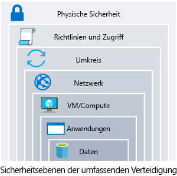

Ihre Organisation aus dem Gesundheitswesen speichert persönliche und potenziell vertrauliche Patientendaten.Your healthcare organization stores personal and potentially sensitive client data. Ein Sicherheitsvorfall könnte diese sensiblen Daten offenlegen, was zu Peinlichkeiten oder finanziellem Schaden führen könnte.A security incident could expose this sensitive data, which could cause personal embarrassment or financial harm. Wie stellen Sie die Integrität ihrer Daten sicher und gewährleisten, dass Ihre Systeme sicher sind?How do you ensure the integrity of their data and ensure your systems are secure? 

Hier wird erläutert, wie wir die Sicherheit einer Architektur angehen können.Here, we'll talk about how to approach the security of an architecture.

## Was sollte ich schützen?What should I protect?

Die Daten, die Ihr Unternehmen speichert oder verwendet, bilden das Herzstück Ihrer zu schützenden Ressourcen.The data your organization stores or handles is at the heart of your securable assets. Diese Daten können sensible Kundendaten, Finanzinformationen Ihrer Organisation oder kritische Branchendaten sein, die Ihre Organisation benötigt.This data could be sensitive data about customers, financial information about your organization, or critical line-of-business data supporting your organization. Neben den Daten ist auch die Sicherung der Infrastruktur, in der sie vorhanden sind, und der Identitäten, mit denen wir auf sie zugreifen, von entscheidender Bedeutung.Along with data, securing the infrastructure it exists on, and the identities we use to access it, are also critically important.

Ihre Daten können zusätzlichen gesetzlichen und regulatorischen Anforderungen unterliegen, je nachdem, wo Sie sich befinden, welche Art von Daten Sie speichern oder in welcher Branche Ihre Anwendung verwendet wird.Your data may be subject to additional legal and regulatory requirements depending on where you are located, the type of data you are storing, or the industry that your application operates in. Beispielsweise gibt es in den USA im Gesundheitswesen ein Gesetz namens Health Insurance Portability and Accountability Act (HIPAA).For instance, in the healthcare industry in the US, there is a law called the Health Insurance Portability and Accountability Act (HIPAA). In der Finanzbrache wird der Umgang mit Kreditkartendaten durch den Payment Card Industry Data Security Standard (PCI DSS) geregelt.In the financial industry, the Payment Card Industry Data Security Standard is concerned with the handling of credit card data. Organisationen, die Daten speichern, die diesen Gesetzen und Standards unterliegen, sind verpflichtet, bestimmte Sicherheitsvorkehrungen für diese Daten zu treffen.Organizations that store data that is in scope for these laws and standards are required to ensure certain safeguards are in place for the protection of this data. In Europa legt die Datenschutz-Grundverordnung (DSGVO) die Regeln für den Schutz personenbezogener Daten fest und definiert die Rechte des Einzelnen in Bezug auf gespeicherte Daten.In Europe, the General Data Protection Regulation (GDPR) lays out the rules of how personal data is protected, and defines individuals' rights related to stored data. Einige Länder verlangen, dass bestimmte Arten von Daten ihre Grenzen nicht überschreiten.Some countries require that certain types of data do not leave their borders.

Wenn eine Sicherheitsverletzung eintritt, kann dies erhebliche Auswirkungen auf die Finanzen und den Ruf von Unternehmen und Kunden haben.When a security breach occurs, there can be substantial impacts to the finances and reputation of both organizations and customers. Dies erschüttert das Vertrauen, das die Kunden bereit sind, in Ihr Unternehmen zu investieren, und kann sich auf seine langfristige Geschäftsentwicklung auswirken.This breaks down the trust customers are willing to instill in your organization, and can impact its long-term health.

## Tiefgehende VerteidigungDefense in depth

Ein Ansatz mit mehreren Ebenen zur Absicherung Ihrer Umgebung erhöht die Sicherheitslage Ihrer Umgebung.A multilayered approach to securing your environment will increase the security posture of your environment. Die Ebenen der sog. _tiefgehenden Verteidigung_ können wir wie folgt aufschlüsseln:Commonly known as _defense in depth_, we can break down the layers as follows:

* DatenData
* AnwendungenApplications
* VM/ComputeVM/compute
* NetzwerkNetworking
* UmkreisPerimeter
* Richtlinien und ZugriffPolicies & access
* Physische SicherheitPhysical security

Jede Ebene konzentriert sich auf einen anderen Bereich, in dem Angriffe möglich sind, und schafft eine gewisse Schutzwirkung, sollte eine Ebene ausfallen oder von einem Angreifer umgangen werden.Each layer focuses on a different area where attacks can happen and creates a depth of protection, should one layer fail or be bypassed by an attacker. Wenn wir uns nur auf eine Ebene konzentrieren würden, hätte ein Angreifer ungehinderten Zugriff auf Ihre Umgebung, wenn er diese Ebene passieren würde.If we were to just focus on one layer, an attacker would have unfettered access to your environment should they get through this layer. Die Behandlung der Sicherheit in Ebenen erhöht den Aufwand, den ein Angreifer treiben muss, um Zugang zu Ihren Systemen und Daten zu erhalten.Addressing security in layers increases the work an attacker must do to gain access to your systems and data. Jede Ebene verfügt über unterschiedliche Sicherheitskontrollen, Technologien und Funktionen, die gelten.Each layer will have different security controls, technologies, and capabilities that will apply. Bei der Ermittlung der zu implementierenden Schutzmaßnahmen sind die Kosten oft von Belang und müssen mit den Geschäftsanforderungen und dem Gesamtrisiko für das Unternehmen in Einklang gebracht werden.When identifying the protections to put in place, cost will often be of concern, and will need to be balanced with business requirements and overall risk to the business.

Es gibt kein einzelnes Sicherheitssystem und keine einzelne Kontrolle oder Technologie, die Ihre Architektur vollständig schützt.There is no single security system, control, or technology that will fully protect your architecture. Sicherheit ist mehr als nur Technologie, es geht auch um Menschen und Prozesse.Security is more than just technology, it's also about people and processes. Die Schaffung einer Umgebung, die die Sicherheit ganzheitlich betrachtet und standardmäßig zur Anforderung erklärt, trägt dazu bei, dass Ihr Unternehmen so sicher wie möglich ist.Creating an environment that looks holistically at security, and making it a requirement by default will help ensure your organization is as secure as possible.

## Gängige AngriffeCommon attacks

Auf jeder Ebene gibt es einige gängige Angriffstypen, vor denen Sie sich schützen müssen.At each layer, there are some common attacks that you will want to protect against. Diese sind nicht allumfassend, können Ihnen aber eine Vorstellung davon geben, wie die einzelnen Ebenen angegriffen werden können und welche Arten von Schutz Sie berücksichtigen müssen.These are not all-inclusive, but can give you an idea of how each layer can be attacked and what types of protections you may need to look at.

* **Datenebene**: Die Offenlegung von Verschlüsselungsschlüsseln oder die Verwendung einer schwachen Verschlüsselung können Ihre Daten anfällig machen, falls ein unbefugter Zugriff erfolgt.**Data layer**: Exposing an encryption key or using weak encryption can leave your data vulnerable should unauthorized access occur.
* **Anwendungsebene**: Die Einschleusung und Ausführung von bösartigem Code ist das Markenzeichen von Angriffen auf Anwendungsebene.**Application layer**: Malicious code injection and execution are the hallmarks of application-layer attacks. Gängige Angriffe umfassen die SQL-Einschleusung und Cross-Site Scripting (XSS).Common attacks include SQL injection and cross-site scripting (XSS).
* **VM/Computeebene**: Schadsoftware ist eine gängige Methode, um eine Umgebung anzugreifen, bei der bösartiger Code ausgeführt wird, um ein System zu gefährden.**VM/compute layer**: Malware is a common method of attacking an environment, which involves executing malicious code to compromise a system. Sobald Schadsoftware auf einem System vorhanden ist, können weitere Angriffe auftreten, die zu einer Offenlegung von Berechtigungen und einer Seitwärtsbewegung in der gesamten Umgebung führen.Once malware is present on a system, further attacks leading to credential exposure and lateral movement throughout the environment can occur.
* **Netzwerkebene**: Unnötige geöffnete Ports zum Internet sind eine gängige Angriffsmethode.**Networking layer**: Unnecessary open ports to the Internet are a common method of attack. Dazu könnte es gehören, SSH oder RDP für virtuelle Computer geöffnet zu lassen.These could include leaving SSH or RDP open to virtual machines. Wenn diese geöffnet sind, können Brute-Force-Angriffe auf Ihre Systeme ermöglicht werden, wenn Angreifer versuchen, Zugriff zu erlangen.When open, these could allow brute-force attacks against your systems as attackers attempt to gain access.
* **Umkreisebene**: Denial-of-Service-Angriffe (DoS-Angriffe) treten häufig auf dieser Ebene auf.**Perimeter layer**: Denial-of-service (DoS) attacks are often seen at this layer. Diese Angriffe versuchen, Netzwerkressourcen zu überfordern, zwingen sie, offline zu gehen, oder machen sie unfähig, auf berechtigte Anforderungen zu reagieren.These attacks attempt to overwhelm network resources, forcing them to go  offline or making them incapable of responding to legitimate requests.
* **Richtlinien- und Zugriffsebene**: Hier erfolgt die Authentifizierung für Ihre Anwendung.**Policies & access layer**: This is where authentication occurs for your application. Dazu gehören ggf. moderne Authentifizierungsprotokolle wie OpenID Connect, OAuth oder Kerberos-basierte Authentifizierung wie Active Directory.This could include modern authentication protocols such as OpenID Connect, OAuth, or Kerberos-based authentication such as Active Directory. Offengelegte Anmeldeinformationen stellen hier ein Risiko dar, und es ist wichtig, die Berechtigungen von Identitäten zu begrenzen.Exposed credentials are a risk here and it's important to limit the permissions of identities. Wir möchten auch eine Überwachung einrichten, um nach möglichen kompromittierten Konten zu suchen (etwa nach Anmeldungen von ungewöhnlichen Orten).We also want to have monitoring in place to look for possible compromised accounts, such as logins coming from unusual places.
* **Physische Ebene**: Unbefugter Zutritt zu Einrichtungen durch Methoden wie unberechtigte Verwendung von Sicherheitscodes und Diebstahl von Sicherheitsausweisen ist auf dieser Ebene zu finden.**Physical layer**: Unauthorized access to facilities through methods such as door drafting and theft of security badges can be seen at this layer.

## Gemeinsame Verantwortung für die SicherheitShared security responsibility

Wenn wir das Modell der gemeinsamen Verantwortung erneut aufgreifen, können wir es im Zusammenhang mit Sicherheit neu fassen.Revisiting the model of shared responsibility, we can reframe this in the context of security. Je nach Art des von Ihnen gewählten Diensts werden einige Sicherheitsvorkehrungen in den Dienst integriert, während andere in Ihrer Verantwortung verbleiben.Depending on the type of service you select, some security protections will be built in to the service, while others will remain your responsibility. Eine sorgfältige Bewertung der von Ihnen gewählten Dienste und Technologien ist unerlässlich, um sicherzustellen, dass Sie die richtigen Sicherheitskontrollen für Ihre Architektur bereitstellen.Careful evaluation of the services and technologies you select will be necessary, to ensure you are providing the proper security controls for your architecture.

![Abbildung, die zeigt, wie sich Cloudanbieter und Kunden Sicherheitsaufgaben unter verschiedenen Arten von Clouddienstmodellen teilen: lokal, Infrastructure-as-a-Service, Platform-as-a-Service und Software-as-a-Service.An illustration showing how cloud providers and customers share security responsibilities under different types of cloud service models: on-premises, infrastructure as a service, platform as a service, and software as a service. ](../media/shared_responsibilities.png)
