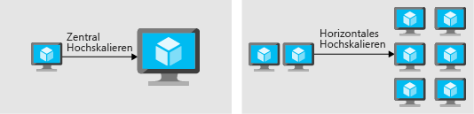

Stellen Sie sich vor, es wurde gerade ein Bericht über die bahnbrechende neue Krebstherapie Ihres Unternehmens veröffentlicht.Imagine a news story has just been published covering your organization's breakthrough cancer treatment. Dies ist ein großartiger Meilenstein, der zweifellos einen großen Zustrom von Besuchern auf Ihre Website bringen wird.This is a terrific milestone, and will undoubtedly bring a large influx of traffic to your website. Wird die Website diesen Anstieg des Datenverkehrs bewältigen, oder wird die Last dazu führen, dass die Website langsam wird oder gar nicht mehr reagiert?Will the website handle this traffic increase, or will the load cause the site to be slow or unresponsive?

Hier betrachten wir einige der Grundprinzipien, um eine hervorragende Anwendungsleistung durch Skalierungs- und Optimierungsprinzipien zu gewährleisten.Here, we'll look at some of the basic principles of ensuring outstanding application performance using scaling and optimization principles.

## Was versteht man unter Skalierung und Leistungsoptimierung?What is scaling and performance optimization?

Bei der Skalierung und Leistungsoptimierung geht es darum, die für eine Anwendung verfügbaren Ressourcen mit dem Bedarf abzugleichen, den sie empfängt.Scaling and performance optimization are about matching the resources available to an application with the demand it is receiving. Die Leistungsoptimierung umfasst die Skalierung von Ressourcen, das Identifizieren und Optimieren potenzieller Engpässe sowie die Optimierung Ihres Anwendungscodes für Spitzenleistung.Performance optimization includes scaling resources, identifying and optimizing potential bottlenecks, and optimizing your application code for peak performance.

### SkalierungScaling

Computeressourcen können in zwei verschiedenen Richtungen skaliert werden:Compute resources can be scaled in two different directions:

* Zentrales *Hochskalieren* ist die Aktion, bei der einer einzelnen Instanz weitere Ressourcen hinzugefügt werden.Scaling *up* is the action of adding more resources to a single instance.
* Horizontales *Hochskalieren* bedeutet das Hinzufügen von Instanzen.Scaling *out* is the addition of instances.

Beim zentralen Hochskalieren geht es darum, einer einzelnen Instanz mehr Ressourcen (etwa CPU oder Arbeitsspeicher) hinzuzufügen.Scaling up is concerned with adding more resources, such as CPU or memory, to a single instance. Bei dieser Instanz kann es sich um einen virtuellen Computer oder einen PaaS-Dienst handeln.This instance could be a virtual machine or a PaaS service. Durch das Hinzufügen von mehr Kapazität zur Instanz werden die für Ihre Anwendung verfügbaren Ressourcen erhöht, aber es gibt eine Einschränkung.The act of adding more capacity to the instance increases the resources available to your application, but it does come with a limit. Virtuelle Computer sind auf die Kapazität des Hosts eingeschränkt, auf dem sie ausgeführt werden, und die Hosts selbst weisen physische Einschränkungen auf.Virtual machines are limited to the capacity of the host they run on, and hosts themselves have physical limitations. Wenn Sie eine Instanz zentral hochskalieren, können Sie gelegentlich an diese Grenzen stoßen, was Ihre Möglichkeit einschränkt, der Instanz weitere Ressourcen hinzuzufügen.Eventually, when you scale up an instance, you can run into these limits, restricting your ability to add further resources to the instance.

Beim horizontalen Hochskalieren geht es darum, einem Dienst zusätzliche Instanzen hinzuzufügen.Scaling out is concerned with adding additional instances to a service. Dies können virtuelle Computer oder PaaS-Dienste sein, aber anstatt mehr Kapazität hinzuzufügen, indem eine einzelne Instanz leistungsfähiger wird, fügen wir Kapazität hinzu, indem wir die Gesamtzahl der Instanzen erhöhen.These can be virtual machines or PaaS services, but instead of adding more capacity by making a single instance more powerful, we add capacity by increasing the overall total number of instances. Der Vorteil der horizontalen Hochskalierung besteht darin, dass Sie unbegrenzt horizontal hochskalieren können, wenn Sie der Architektur weitere Computer hinzufügen müssen.The advantage of scaling out is that you can conceivably scale out forever if you have more machines to add to the architecture. Horizontales Hochskalieren erfordert eine Art der Lastverteilung.Scaling out requires some type of load distribution. Dies könnte ein Load Balancer sein, der Anforderungen auf die verfügbaren Server verteilt, oder ein Dienstermittlungsmechanismus zum Identifizieren der aktiven Server, an die Anforderungen gesendet werden sollen.This could be in the form of a load balancer distributing requests across available servers, or a service discovery mechanism for identifying active servers to send requests to.

In beiden Fällen können Ressourcen verringert und somit Kosten optimiert werden.In both cases, resources can be reduced, bringing cost optimization into the picture.

### LeistungsoptimierungPerformance optimization

Bei der Optimierung der Leistung werden Sie sich mit Netzwerk und Speicher befassen, um sicherzustellen, dass die Leistung akzeptabel ist.When optimizing for performance, you'll look at network and storage to ensure performance is acceptable. Beides kann sich negativ auf die Reaktionszeit der Anwendung auswirken.Both can impact the response time of your application. Die Auswahl der richtigen Netzwerk- und Speichertechnologien für Ihre Architektur wird Ihnen helfen, sicherzustellen, dass Sie Ihren Kunden das beste Erlebnis bieten.Selecting the right networking and storage technologies for your architecture will help you ensure you're providing the best experience for your consumers.

Für die Leistungsoptimierung müssen Sie auch verstehen, wie die Anwendungen selbst ausgeführt werden.Performance optimization will also include understanding how the applications themselves are performing. Fehler, schlechter Code und Engpässe in abhängigen Systemen können durch ein Tool zur Steuerung der Anwendungsleistung aufgedeckt werden.Errors, poorly performing code, and bottlenecks in dependent systems can all be uncovered through an application performance management tool. Diese Probleme bleiben den Endbenutzern, Entwicklern und Administratoren häufig verborgen, können sich aber nachteilig auf die Gesamtleistung Ihrer Anwendung auswirken.Often, these issues may be hidden or obfuscated for end users, developers, and administrators, but can have adverse impact on the overall performance of your application.

## Muster und Verfahren für Skalierbarkeit und LeistungScalability and performance patterns and practices

Sehen wir uns einige Muster und Verfahren an, mit denen Sie die Skalierbarkeit und Leistung Ihrer Anwendung verbessern können.Let's take a look at some patterns and practices that can be leveraged to enhance the scalability and performance of your application.

### DatenpartitionierungData partitioning

In vielen umfangreichen Lösungen werden Daten in separate Partitionen aufgeteilt, die getrennt verwaltet werden können und auf die separat zugegriffen werden kann.In many large-scale solutions, data is divided into separate partitions that can be managed and accessed separately. Die Partitionierungsstrategie muss sorgfältig ausgewählt werden, um die Vorteile zu maximieren und gleichzeitig nachteilige Auswirkungen zu minimieren.The partitioning strategy must be chosen carefully to maximize the benefits while minimizing adverse effects. Partitionierung kann die Skalierbarkeit verbessern, Konflikte reduzieren und die Leistung optimieren.Partitioning can help improve scalability, reduce contention, and optimize performance.

### CachingCaching

Die Verwendung von Caching in Ihrer Architektur kann die Leistung verbessern.Use caching in your architecture can help improve performance. Caching ist ein Mechanismus zum Speichern von häufig verwendeten Daten oder Objekten (Webseiten, Bilder), um diese schneller abrufen zu können.Caching is a mechanism to store frequently used data or assets (web pages, images) for faster retrieval. Caching kann auf verschiedenen Ebenen Ihrer Anwendung verwendet werden.Caching can be used at different layers of your application. Sie können Caching zwischen Ihren Anwendungsservern und einer Datenbank verwenden, um die für den Datenabruf benötigte Zeit zu verringern.You can use caching between your application servers and a database, to decrease data retrieval times. Sie können auch Caching zwischen Ihren Endbenutzern und Ihren Webservern verwenden, indem Sie statische Inhalte näher am Benutzer platzieren und die Zeit verkürzen, die benötigt wird, um Webseiten an den Endbenutzer zurückzugeben.You could also use caching between your end users and your web servers, placing static content closer to the user and decreasing the time it takes to return web pages to the end user. Darüber hinaus werden dadurch Anforderungen von Ihrer Datenbank oder Ihren Webservern ausgelagert, sodass sich die Leistung für andere Anforderungen erhöht.This also has a secondary effect of offloading requests from your database or web servers, increasing the performance for other requests.

### Automatische SkalierungAutoscaling

Die automatische Skalierung ist der Prozess zum dynamischen Zuweisen von Ressourcen gemäß den jeweiligen Leistungsanforderungen.Autoscaling is the process of dynamically allocating resources to match performance requirements. Wenn das Arbeitsvolumen zunimmt, sind für eine Anwendung ggf. zusätzliche Ressourcen erforderlich, um die gewünschten Leistungsebenen aufrechtzuerhalten und die Vereinbarungen zum Servicelevel (SLAs) einzuhalten.As the volume of work grows, an application may need additional resources to maintain the desired performance levels and satisfy service-level agreements (SLAs). Wenn die Nachfrage abnimmt und die zusätzlichen Ressourcen nicht mehr benötigt werden, kann die Zuordnung aufgehoben werden, um Kosten zu sparen.As demand slackens and the additional resources are no longer needed, they can be de-allocated to minimize costs.

Die automatische Skalierung nutzt die Elastizität von Umgebungen, die in der Cloud gehostet werden, und reduziert gleichzeitig den Verwaltungsaufwand.Autoscaling takes advantage of the elasticity of cloud-hosted environments while easing management overhead. Die Leistung des Systems muss nicht ständig von einem Bediener überwacht werden, um zu entscheiden, ob Ressourcen hinzugefügt oder entfernt werden müssen.It reduces the need for an operator to continually monitor the performance of a system and make decisions about adding or removing resources.

### Entkoppeln ressourcenintensiver Aufgaben als HintergrundaufträgeDecouple resource-intensive tasks as background jobs

Viele Arten von Anwendungen benötigen Hintergrundaufgaben, die unabhängig von der Benutzeroberfläche (UI) ausgeführt werden.Many types of applications require background tasks that run independently of the user interface (UI). Beispiele hierfür sind Batchaufträge, rechenintensive Aufgaben und langwierige Prozesse wie Workflows.Examples include batch jobs, intensive processing tasks, and long-running processes such as workflows. Hintergrundaufträge können ohne Benutzerinteraktion ausgeführt werden. Die Anwendung kann den Auftrag starten und dann mit der Verarbeitung interaktiver Benutzeranforderungen fortfahren.Background jobs can be executed without requiring user interaction--the application can start the job and then continue to process interactive requests from users. Damit kann die Arbeitsauslastung der Anwendungsbenutzeroberfläche minimiert werden, was zu einer höheren Verfügbarkeit und zu kürzeren interaktiven Antwortzeiten beitragen kann.This can help to minimize the load on the application UI, which can improve availability and reduce interactive response times.

### Verwenden einer Messagingebene zwischen DienstenUse a messaging layer between services

Das Hinzufügen einer Messagingebene zwischen Diensten kann sich positiv auf die Leistung und Skalierbarkeit auswirken.Adding a messaging layer in between services can have a benefit to performance and scalability. Beim Hinzufügen einer Messagingebene wird ein Puffer für Anforderungen zwischen den Diensten erstellt, damit Anforderungen weiterhin ohne Fehler eingehen können, auch wenn die Anwendung überlastet ist.Adding a messaging layer creates a buffer for requests between the services so that requests can continue to flow in without error if the application can’t keep up. Die Anforderungen werden von der Anwendung in der Reihenfolge beantwortet, in der sie empfangen wurden.As the application works through the requests, they will be answered in the order in which they were received.

### Implementieren von SkalierungseinheitenImplement scale units

Skalieren Sie ganze Einheiten.Scale as a unit. Bestimmen Sie für jede Ressource die Auswirkungen, die eine Skalierungsaktivität auf abhängige Systeme haben kann.For each resource, determine the impact that a scaling activity may have on dependent systems. Dies erleichtert die Anwendung horizontaler Skalierungsvorgänge und ist weniger anfällig für negative Auswirkungen auf die Anwendung.This makes applying scale-out operations easier, and less prone to negative impact on the application. Zum Beispiel kann das Hinzufügen von x Web- und Workerrollen möglicherweise y zusätzliche Warteschlangen und z Speicherkonten erforderlich machen, um die durch die Rollen generierte Workload zu bewältigen.For example, adding x number of web and worker roles might require y number of additional queues and z number of storage accounts to handle the additional workload generated by the roles. Eine Skalierungseinheit kann aus x Web- und Workerrollen, y Warteschlangen und z Speicherkonten bestehen.A scale unit could consist of x web and worker roles, y queues, and z storage accounts. Fügen Sie Skalierungseinheiten hinzu, um eine problemlose Skalierung der Anwendung zu ermöglichen.Design the application so that it's easily scaled by adding one or more scale units.

### LeistungsüberwachungPerformance monitoring

Verteilte Anwendungen und Dienste in der Cloud sind naturgemäß komplexe Softwarekomponenten mit zahlreichen Variablen.Distributed applications and services running in the cloud are, by their nature, complex pieces of software that comprise many moving parts. In einer Produktionsumgebung sollten Sie unbedingt nachvollziehen können, auf welche Weise Benutzer Ihr System verwenden. Ferner müssen Sie in der Lage sein, die Ressourcennutzung nachzuverfolgen und allgemein die Integrität und Leistung des Systems zu überwachen.In a production environment, it's important to be able to track the way in which users utilize your system, trace resource utilization, and generally monitor the health and performance of your system. Diese Informationen dienen als Diagnosehilfe, um vorhandene Probleme zu erkennen und zu korrigieren und potenziellen Problemen vorzubeugen.You can use this information as a diagnostic aid to detect and correct issues, and also to help spot potential problems and prevent them from occurring.

Überprüfen Sie alle Ebenen Ihrer Anwendung, und identifizieren und beheben Sie Leistungsengpässe in Ihrer Anwendung.Look across all layers of your application and identify and remediate performance bottlenecks in your application. Bei diesen Engpässen kann es sich beispielsweise um eine mangelhafte Arbeitsspeicherverwaltung in Ihrer Anwendung oder sogar um den Prozess zum Hinzufügen von Indizes zu Ihrer Datenbank handeln.These bottlenecks could be poor memory handling in your application, or even the process of adding indexes into your database. Dabei kann es durchaus vorkommen, dass Sie nach der Beseitigung eines Engpasses einen weiteren entdecken, von dem Sie bislang gar nichts wussten.It may be an iterative process as you relieve one bottleneck and then uncover another that you were unaware of.

Mit einem sorgfältig ausgearbeiteten Leistungsüberwachungskonzept können Sie ermitteln, welche Muster und Verfahren für Ihre Architektur von Vorteil sind.With a thorough approach to performance monitoring, you'll be able to determine what types of patterns and practices your architecture will benefit from.