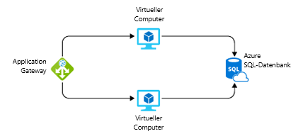

Stellen Sie sich vor, Sie sollen ein System in Azure erstellen und eine Schätzung der Kosten erstellen, die für dessen Ausführung in den nächsten 12 Monaten anfallen. Sie wissen bereits, dass die Azure-Preise vollständig transparent sind und Ihnen monatlich nur die Dienste in Rechnung gestellt werden, die Sie tatsächlich verwenden. Wie würden Sie zu dieser Schätzung gelangen, ohne diese Dienste bereitzustellen und auszuführen bzw. ohne die Preise für die einzelnen Dienste anhand der Seiten mit den Preisen der Azure-Dienste manuell herauszusuchen?

## Einführung in den Azure-Preisrechner

Um Kunden eine einfache Erstellung von Schätzungen zu ermöglichen, hat Microsoft den **Azure-Preisrechner** entwickelt. Der Azure-Preisrechner ist ein kostenloses, webbasiertes Tool, in das Sie die Details von Azure-Diensten eingeben und Eigenschaften und mit dem Sie Eigenschaften und Optionen der Dienste ändern können. Als Ergebnis erhalten Sie die Kosten pro Dienst und die Gesamtkosten für die vollständige Schätzung.

Wechseln Sie in einem anderen Browserfenster oder in einer anderen Browserregisterkarte zum [Azure-Preisrechner](https://azure.microsoft.com/pricing/calculator/). Auf der Seite des Preisrechners werden drei Registerkarten angezeigt:

1. **Produkte**: Auf dieser Registerkarte führen Sie den Großteil Ihrer Aufgaben aus. Diese Registerkarte zeigt alle Azure-Dienste an. Sie können hier Dienste hinzufügen oder entfernen, um Ihre Schätzung zu erstellen.
2. **Schätzungen**: Diese Registerkarte enthält alle zuvor gespeicherten Schätzungen. Auf diesen Vorgang gehen wir in Kürze ein.
3. **Häufig gestellte Fragen**: Wie der Name schon sagt, werden auf dieser Registerkarte häufig gestellten Fragen beantwortet.

Beginnen wir mit der Registerkarte **Produkte**. Auf der linken Seite sehen Sie die vollständige Liste der Dienstkategorien. Durch Klicken auf eine der Kategorien werden die Dienste in der jeweiligen Kategorie angezeigt. Es gibt auch ein Suchfeld, in dem Sie in allen Diensten nach dem jeweiligen Dienst suchen können. Durch Klicken auf den Dienst wird er Ihrer Schätzung hinzugefügt. Sie können beliebig viele Dienste oder auch denselben Dienst mehrmals hinzufügen (z.B. mehrere virtuelle Computer).

Nachdem Sie die Dienste hinzugefügt haben, sollten Sie die Preise ermitteln. Wenn Sie auf der Seite nach unten scrollen, werden anpassbare Details für diesen Dienst angezeigt, die für die Preise gelten. Bei virtuellen Computern können Sie z.B. Details wie Region, Betriebssystem und Instanzgröße auswählen, die sich alle auf die Preise für die VM auswirken. Eine Zwischensumme wird für den Dienst angezeigt. Wenn Sie weiter nach unten scrollen, wird die Gesamtsumme für alle Dienste angezeigt, die in der Schätzung enthalten sind. Neben dem Gesamtbetrag sind Schaltflächen zum Exportieren, Speichern und Freigeben der Schätzung zu sehen.

## Kostenschätzung für eine Lösung

Ausgehend vom ursprünglichen Szenario wird nun angenommen, dass dieses System auf zwei Azure-VMs ausgeführt wird und eine Verbindung mit einer Azure SQL-Datenbankinstanz hergestellt wird. Wir möchten auch über eine Layer-7-Firewall verfügen, um sicherzustellen, dass wir Lastenausgleichsfunktionen verbessert haben. Die folgende Abbildung zeigt ein Anwendungsgateway, das mit zwei virtuellen Computern verbunden ist. Diese sind wiederum mit einer einzelnen Azure SQL-Datenbankinstanz verbunden.

Mithilfe des Azure-Preisrechners können Sie die Höhe der Kosten für eine Lösung ermitteln und die Schätzung zur Freigabe für das Team exportieren.

> [!TIP]
> Stellen Sie sicher, dass der Preisrechner keine Einstellungen aufweist und die Schätzung keine Angaben enthält. Klicken Sie anderenfalls auf das Papierkorbsymbol für die einzelnen Elemente, um die Schätzung zurückzusetzen.

Fügen Sie im Azure-Preisrechner auf der Registerkarte **Produkte** die folgenden Dienste zur Schätzung hinzu, indem Sie auf diese klicken:

* Microsoft Azure Virtual Machines in der Kategorie „Compute“
* Azure SQL-Datenbank in der Kategorie „Datenbank“
* Application Gateway in der die Kategorie „Netzwerk“

Die Details der einzelnen Elemente können auf der Registerkarte **Schätzungen** konfiguriert werden. Dadurch erhalten Sie eine solide Schätzung der Kosten. Verwenden Sie für alle Ressourcen die Region **USA, Westen**.

* **Virtuelle Computer**: Da es sich um eine ASP.NET-Anwendung handelt, muss eine VM mit **Windows-Betriebssystem** eingesetzt werden. Diese Anwendung erfordert keine enorme Rechenleistung, weshalb Sie als Instanzgröße **D2v3** auswählen können. Es werden zwei virtuelle Computer benötigt, die durchgehend ausgeführt werden (730 Stunden pro Monat). Für diese VMs wird Storage Premium (SSD) verwendet, und für insgesamt zwei Datenträger ist nur ein Datenträger pro VM der Größe **E10** erforderlich.

* **SQL-Datenbank**: Für die Datenbank wird ein **Einzeldatenbanktyp** mithilfe des **Modells auf Basis von virtuellen Kernen** bereitgestellt. Eine Gen 4-Datenbank mit 4 virtuellen Kernen soll im Tarif „Universell“ erstellt werden. Ein Speicher mit 32 GB ist erforderlich und ein Speicherplatz von durchschnittlich 16 GB wird beibehalten. Unsere Aufbewahrungsrichtlinie werden acht Wochen 12 Monate und 5 Jahre.

* **Application Gateway**: Für Application Gateway wird die Web Application Firewall-Ebene verwendet, damit wir unserer Umgebung einen gewissen Grad an Schutz bieten können. Es werden nur zwei Instanzen mittlerer Größe verwendet, da die Last nicht hoch ausfallen wird. Monatlich werden voraussichtlich 1 TB an Daten verarbeitet.

In Ihrer Schätzung sollte eine Kostenübersicht für die einzelnen Dienste, die Sie hinzugefügt haben, und ein Gesamtbetrag für die gesamte Schätzung angezeigt werden. In diesem Fall sollte sich Ihre Schätzung ungefähr auf einem Niveau von **1.400,00 USD pro Monat** bewegen. Sie können einige der Optionen ändern, um herauszufinden, inwiefern sich dies auf die Schätzung auswirkt.

## Freigeben und Speichern der Schätzung

Nun haben Sie eine Schätzung für unsere Lösung erstellt. Sie können diese Schätzung speichern, um zu einem späteren Zeitpunkt darauf zurückzugreifen und ggf. Anpassungen vorzunehmen, diese zur weiteren Analyse in Excel exportieren und die Schätzung über eine URL freigeben.

Um die Schätzung zu exportieren, klicken Sie am unteren Rand der Schätzung auf `Export`. Ihre Schätzung wird dabei im Excel-Format (**XLSX**) heruntergeladen und umfasst alle Dienste, die Sie Ihrer Schätzung hinzugefügt haben.

Sie können die Excel-Arbeitsmappe entweder freigeben oder im Rechner auf die Schaltfläche `Share` klicken. Hierdurch wird eine URL erstellt, über die Sie diese Schätzung freigeben können. Jeder Benutzer mit diesem Link kann dann darauf zugreifen, was eine unkomplizierte Freigabe innerhalb Ihres Teams ermöglicht.

Wenn Sie sich mit Ihrem Azure-Konto angemeldet haben, können Sie die Schätzung speichern und zu einem späteren Zeitpunkt darauf zurückgreifen. Fahren Sie fort, indem Sie auf die Schaltfläche **Speichern** klicken. Wenn Sie angemeldet sind, sollten Sie eine Benachrichtigung sehen, dass Ihre Schätzung gespeichert wurde. Wenn Sie nicht angemeldet sind, wird eine Meldung angezeigt, in der Sie aufgefordert werden, sich zum Speichern Ihrer Schätzung anzumelden. Nachdem Sie die Schätzung gespeichert haben, scrollen Sie wieder zum Anfang der Seite und wählen die Registerkarte **Schätzungen** aus. Hier wird Ihre Schätzung angezeigt. Sie können sie dann wieder öffnen oder löschen, wenn Sie sie nicht mehr benötigen.

## Zusammenfassung

Ohne Geld ausgeben zu müssen, haben Sie für eine Reihe von Azure-Diensten eine Kostenschätzung erstellt. Ohne etwas zu erstellen verfügen Sie nun über eine vollständige Schätzung, die weitergegeben werden kann und die wir weiter analysieren oder an der wir zu einem späteren Zeitpunkt Änderungen vornehmen können. Damit können Sie nicht nur Schätzungen für Systeme erstellen, bei denen Sie die jeweiligen Dienste kennen, die Sie verwenden möchten, sondern auch vergleichen können, wie sich verschiedene Dienste auf Ihrer Gesamtkosten auswirken könnten. Ein Beispiel ist Microsoft SQL Server auf einer VM im Vergleich zu Azure SQL-Datenbank. Werfen wir nun einen Blick darauf, wie wir einen Einblick in die Kosten für bereits bereitgestellte Dienste erhalten können.
