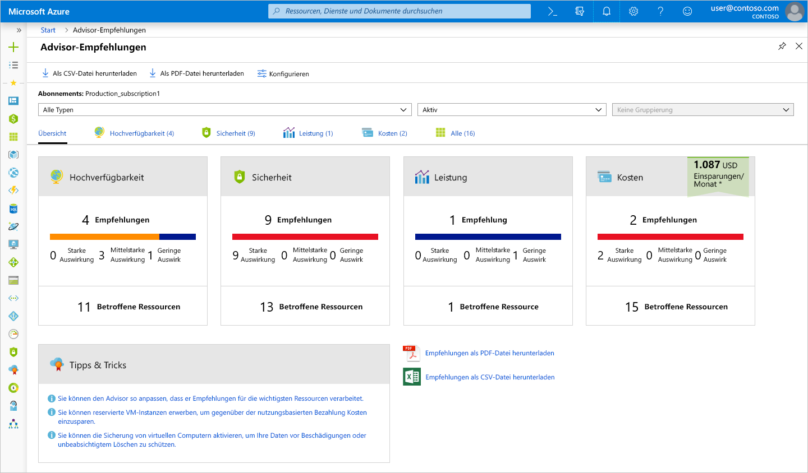
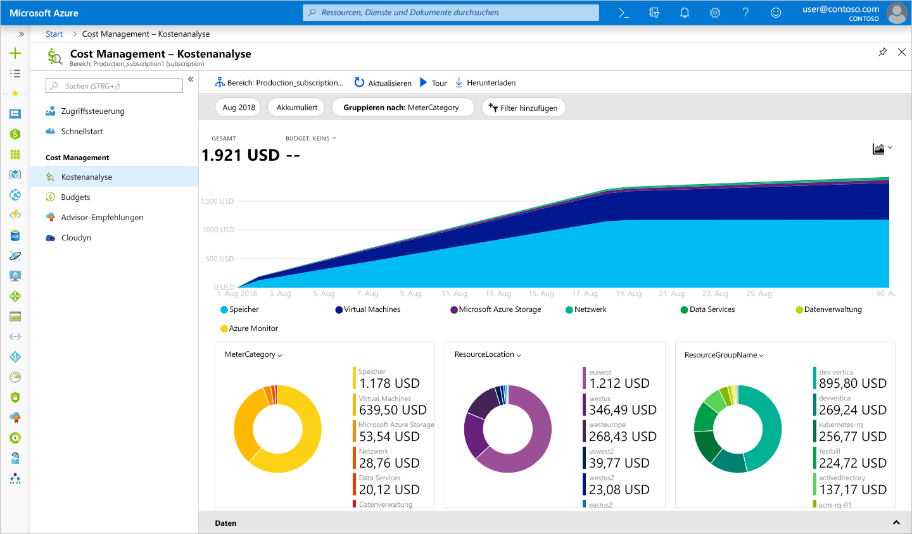
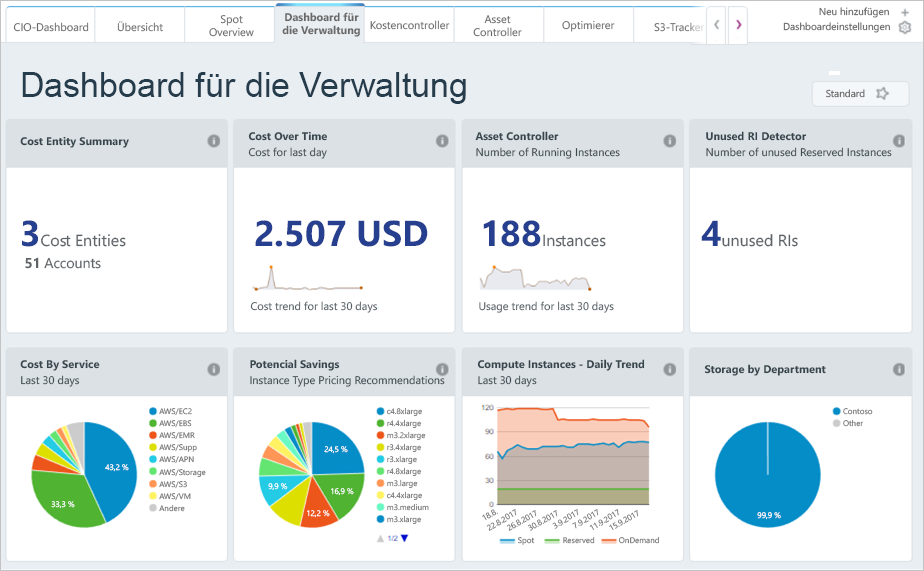

Sie haben erfahren, wie Sie Ihre Kosten vor der Bereitstellung von Diensten in Azure schätzen können. Doch was passiert, wenn Sie bereits Ressourcen bereitgestellt haben? Wie erhalten Sie Einblick in die Kosten, die Ihnen bereits berechnet werden? Wie kann nach der Bereitstellung der vorherigen Lösung in Azure jetzt überprüft werden, ob die Größe der virtuellen Computer ordnungsgemäß angepasst ist, und vorhersagen, wie hoch die Rechnung ausfallen wird? Werfen wir einen Blick auf einige Tools in Azure, die Sie verwenden können, um diesen Fragen nachzugehen.

## Was ist Azure Advisor?

Der **Azure Advisor** ist ein kostenloser in Azure integrierter Dienst, der Empfehlungen zu Hochverfügbarkeit, Sicherheit, Leistung und Kosten bietet. Der Advisor analysiert Ihre bereitgestellten Dienste und sucht nach Möglichkeiten, um Ihre Umgebung in diesen vier Bereichen zu verbessern. Wir konzentrieren uns auf die Empfehlungen zu Kosten, Sie sollten sich jedoch auch die anderen Empfehlungen ansehen.

Der Advisor stellt Empfehlungen zu Kosten in den folgenden Bereichen bereit:

1. **Kostensenkung durch die Beseitigung von nicht bereitgestellten ExpressRoute-Verbindungen.**
    Der Advisor identifiziert ExpressRoute-Verbindungen , die sich für mehr als einen Monat im Anbieterstatus *Nicht bereitgestellt* befunden haben, und empfiehlt, die Verbindung zu löschen, wenn Sie nicht beabsichtigen, die Verbindung durch Ihren Konnektivitätsanbieter bereitzustellen.

1. **Erwerb von reservierten VM-Instanzen, um gegenüber dem Modell mit nutzungsbasierter Bezahlung Kosten einzusparen.**
    Der Advisor überprüft Ihre VM-Nutzung der letzten 30 Tage und ermittelt, ob der Erwerb reservierter Instanzen für Sie in Zukunft günstiger wäre. Der Advisor zeigt die Regionen und Größen mit dem größten Einsparpotenzial sowie die voraussichtlichen Einsparungen an, die sich durch den Erwerb reservierter Instanzen erzielen lassen könnten.

1. **Ändern der Größe oder Herunterfahren von wenig genutzten virtuellen Computern.**
    Damit wird die Verwendung Ihres virtuellen Computers 14 Tage lang überwacht, und es werden virtuelle Computer mit geringer Auslastung ermittelt. Virtuelle Computer, deren durchschnittliche CPU-Auslastung höchstens 5 Prozent und deren durchschnittliche Netzwerkauslastung höchstens 7 MB über einen Zeitraum von mindestens vier Tagen beträgt, gelten als virtuelle Computer mit unterdurchschnittlicher Auslastung. Der Schwellenwert für die durchschnittliche CPU-Auslastung ist um bis zu 20 Prozent anpassbar. Durch die Ermittlung dieser virtuellen Computer können Sie deren Größe an einen kleineren Instanztyp anpassen, wodurch Sie Ihre Kosten reduzieren.

[!include]

Azure Advisor ist über das Azure-Portal zugänglich. Melden Sie sich zunächst auf die [Azure-Portal](https://portal.azure.com?azure-portal=true). Klicken Sie auf **Alle Dienste**. In der Kategorie **Verwaltungstools** wird daraufhin **Advisor** angezeigt. Sie können auch eingeben `Advisor` im Filterfeld zum Filtern nach diesem Dienst.

Klicken Sie auf „Advisor“. Sie werden dann zum Advisor-Dashboard weitergeleitet, auf dem alle Empfehlungen für Ihr Abonnement angezeigt werden. Für jede Empfehlungskategorie wird ein Feld angezeigt.

> [!NOTE]
> Eventuell werden keine Empfehlungen zu Kosten im Advisor angezeigt. Dies ist möglicherweise darauf zurückzuführen, dass Bewertungen noch nicht abgeschlossen sind oder einfach weil Advisor keine Empfehlungen bietet.

Durch Klicken auf das Feld **Kosten** gelangen Sie zu ausführlichen Empfehlungen, die Advisor bereitstellt.

Durch Klicken auf Empfehlungen gelangen Sie zu den Details für die jeweilige Empfehlung. Dann können Sie bestimmte Aktionen ausführen, wie etwa die Größenänderung bei virtuellen Computern, um Ausgaben zu reduzieren.

All diese Empfehlungen weisen auf Bereiche hin, in denen die Ausgaben möglicherweise ineffizient verwaltet werden. Sie stellen einen idealen Ausgangspunkt dar, um an Bereichen anzusetzen, an denen sich möglicherweise Geld einsparen lässt. In unserem Beispiel besteht die Möglichkeit, etwa 700 USD pro Monat zu sparen, wenn wir diese Empfehlungen umsetzen. Da sich diese Einsparungen summieren, sollten Sie in regelmäßigen Abständen auf Empfehlungen für alle vier Bereiche prüfen.

## Azure Cost Management

Azure Cost Management ist ein weiteres kostenloses integriertes Azure-Tool, mit dem Sie bessere Einblicke in die Bereiche erhalten, in die Ihre Cloudausgaben fließen. Sie können aufgeschlüsselte Verlaufsdaten der Dienste sehen, für die Sie Geld ausgeben und wie diese im Vergleich zu den von Ihnen festgelegten Budgets abschneiden. Sie können Budgets festlegen, Berichte planen und Ihre Kostenbereiche analysieren.

## Cloudyn

Cloudyn, eine Tochtergesellschaft von Microsoft, ermöglicht Ihnen das Nachverfolgen der Cloudnutzung und der Ausgaben für Ihre Azure-Ressourcen sowie andere Cloudanbieter, einschließlich Amazon Web Services und Google. Leicht verständliche Dashboardberichte unterstützen Sie bei (verbrauchsbasierten) Kostenzuteilungen. Cost Management unterstützt Sie beim Optimieren Ihrer Cloudausgaben, indem zu gering ausgelastete Ressourcen ermittelt werden, die Sie dann verwalten und anpassen können. Die Nutzung von Azure ist kostenlos, und es gibt kostenpflichtige Optionen für Premium-Support und zum Anzeigen von Daten aus anderen Clouds.

## Zusammenfassung

Wie Sie sehen können, stehen mehrere Tools kostenlos in Azure zur Verfügung, mit denen Sie Ihre Cloudausgaben nachverfolgen und vorhersagen und identifizieren können, welche Bereiche Ihrer Umgebung im Hinblick auf die Kosten möglicherweise ineffizient sind. Sie sollten sicherstellen, dass Sie Berichte und Empfehlungen, die diese Tools zur Verfügung stellen, in regelmäßigen Abstand überprüfen, damit Sie Einsparungen in Bezug auf Ihre Cloudnutzung erzielen können. Nun werfen wir einen Blick auf einige Best Practices, um die Infrastrukturkosten zu senken.
