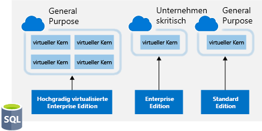
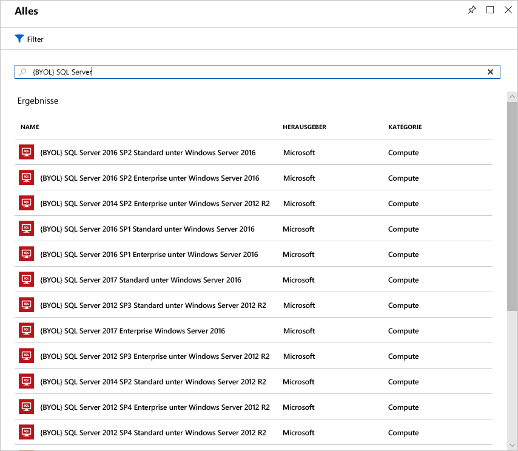

Die Lizenzierung ist ein weiterer Bereich, der Ihre Cloudkosten erheblich erhöhen kann.Licensing is another area that can dramatically impact your cloud spending. Im Folgenden werden einige Möglichkeiten erläutert, um Ihre Lizenzierungskosten zu reduzieren.Let's look at some ways you can reduce your licensing costs.

## Azure-Hybridvorteil für Windows ServerAzure Hybrid Benefit for Windows Server

Viele Kunden haben in Windows Server-Lizenzen investiert und möchten diese in Azure wiederverwenden.Many customers have made an investment in Windows Server licenses and would like to repurpose this investment on Azure. Mit dem Azure-Hybridvorteil können Kunden diese Lizenzen für virtuelle Computer in Azure verwenden.The Azure Hybrid Benefit gives customers the right to use these licenses for virtual machines on Azure. Das bedeutet, dass keine Kosten für die Windows Server-Lizenz entstehen und stattdessen die Linux-Gebühr abgerechnet wird.That means you won't be charged for the Windows Server license and will instead be billed at the Linux rate.

Ihre Windows-Lizenzen müssen ebenfalls durch Software Assurance abgedeckt sein, um diesen Vorteil nutzen zu können.To be eligible for this benefit, your Windows licenses must be covered by Software Assurance. Es gelten ebenfalls folgende Richtlinien:The following guidelines will also apply:

- Jede Lizenz für zwei Prozessoren oder alle Lizenzen für je 16 Kerne kann für zwei Instanzen mit bis zu acht Kernen oder für eine Instanz mit bis zu 16 Kernen eingesetzt werden.Each two-processor license or each set of 16-core licenses is entitled to two instances of up to 8 cores or one instance of up to 16 cores.
- Standard Edition-Lizenzen können nur einmalig entweder lokal oder in Azure verwendet werden.Standard Edition licenses can only be used once either on-premises or in Azure. Das bedeutet, dass Sie dieselbe Lizenz nicht für einen virtuellen Azure-Computer und einen lokalen Computer verwenden können.That means you can't use the same license for an Azure VM and a local computer.
- Mit der Datacenter Edition ist die gleichzeitige Nutzung sowohl lokal als auch in Azure möglich. Diese Lizenz umfasst also zwei ausgeführte Windows-Computer.Datacenter Edition benefits allow for simultaneous usage both on-premises and in Azure, so the license will cover two running Windows machines.

> [!NOTE]
> Die meisten Kunden verwenden eine Lizenzierung pro Kern, deshalb wird dieses Modell für die Berechnung verwendet.Most customers are typically licensed by core, so you'll use that model for your calculation. Wenn Sie Fragen zu Ihren Lizenzen haben, wenden Sie sich an Ihren Lizenzanbieter oder an Ihr Microsoft-Kontoteam.If you have questions about what licenses you have, reach out to your license reseller or your Microsoft account team.

Das Anwenden des Vorteils ist einfach.Applying the benefit is easy. Er kann für vorhandene virtuelle Computer jederzeit aktiviert oder deaktiviert werden oder zum Zeitpunkt der Bereitstellung auf neue virtuelle Computer angewendet werden.It can be turned on and off at any time with existing VMs or applied at deployment time for new VMs. Der Hybridvorteil (insbesondere in Kombination mit reservierten Instanzen) kann erheblich zur Einsparung von Lizenzkosten beitragen.The Hybrid Benefit (especially when combined with reserved instances) can provide substantial license savings.

## Azure-Hybridvorteil für SQL ServerAzure Hybrid Benefit for SQL Server

Der Azure-Hybridvorteil für SQL Server ermöglicht eine maximale Nutzung Ihrer aktuellen Lizenzinvestitionen sowie eine schnellere Migration in die Cloud.The Azure Hybrid Benefit for SQL Server helps you maximize the value from your current licensing investments and accelerate your migration to the cloud. Mit dem Azure-Hybridvorteil für SQL Server können Sie Ihre SQL Server-Lizenzen mit aktiver Software Assurance verwenden und zahlen so einen geringeren Preis.Azure Hybrid Benefit for SQL Server is an Azure-based benefit that enables you to use your SQL Server licenses with active Software Assurance to pay a reduced rate.

Sie können diesen Vorteil auch in Anspruch nehmen, wenn die Azure-Ressource aktiv ist. Die reduzierte Gebühr wird jedoch von dem Zeitpunkt an angewendet, zu dem dieser im Portal ausgewählt wird.You can apply this benefit even if the Azure resource is active, but the reduced rate will be applied from the time you select it in the portal. Guthaben werden nicht rückwirkend gewährt.No credit will be issued retroactively.

### Auf virtuellen Kernen basierende Optionen für Azure SQL-DatenbankAzure SQL Database vCore-based options

Für Azure SQL-Datenbank funktioniert der Azure-Hybridvorteil folgendermaßen:For Azure SQL Database, the Azure Hybrid Benefit works as follows:

- Wenn Sie die Standard Edition mit Lizenzen pro Kern mit aktiver Software Assurance besitzen, erhalten Sie einen virtuellen Kern in der universellen Dienstebene für jeden Kern, den Sie durch eine Lizenz lokal besitzen.If you have Standard Edition per core licenses with active Software Assurance, you can get one vCore in the General Purpose service tier for every one license core you own on-premises.
- Wenn Sie die Enterprise Edition mit Lizenzen pro Kern mit aktiver Software Assurance besitzen, erhalten Sie einen virtuellen Kern in der unternehmenskritischen Dienstebene für jeden Kern, den Sie durch eine Lizenz lokal besitzen.If you have Enterprise Edition per core licenses with active Software Assurance, you can get one vCore in the Business Critical service tier for every one license core you own on-premises. Beachten Sie, dass der Azure-Hybridvorteil für SQL Server für die unternehmenskritische Dienstebene nur für Kunden verfügbar ist, die Enterprise Edition-Lizenzen besitzen.Note that the Azure Hybrid Benefit for SQL Server for the Business Critical service tier is available only to customers who have Enterprise Edition licenses.
- Wenn Sie die hochgradig virtualisierte Enterprise Edition mit Lizenzen pro Kern mit aktiver Software Assurance besitzen, erhalten Sie vier virtuelle Kerne in der universellen Dienstebene für jeden Kern, den Sie durch eine Lizenz lokal besitzen.If you have highly virtualized Enterprise Edition per core licenses with active Software Assurance, you can get four vCores in the General Purpose service tier for every one license core you own on-premises. Dies ist ein einzigartiger Virtualisierungsvorteil, der nur für Azure SQL-Datenbank verfügbar ist.This is a unique virtualization benefit available only on Azure SQL Database.

Die folgende Abbildung zeigt die auf virtuellen Kernen basierenden Optionen, die in jeder Dienstebene mit Azure-Hybridvorteil für SQL Server-Lizenzen verfügbar sind.The following illustration shows the vCore-based options available in each service tier with Azure Hybrid Benefit for SQL Server licenses.

Für SQL Server auf virtuellen Azure-Computern funktioniert der Azure-Hybridvorteil folgendermaßen:For SQL Server in Azure Virtual Machines, the Azure Hybrid Benefit works as follows:

- Wenn Sie die Enterprise Edition mit Lizenzen pro Kern mit aktiver Software Assurance besitzen, erhalten Sie einen Kern für SQL Server Enterprise Edition auf virtuellen Azure-Computern für jeden Kern, den Sie durch eine Lizenz lokal besitzen.If you have Enterprise Edition per core licenses with active Software Assurance, you can get one core of SQL Server Enterprise Edition in Azure Virtual Machines for every one license core you own on-premises.
- Wenn Sie die Standard Edition mit Lizenzen pro Kern mit aktiver Software Assurance besitzen, erhalten Sie einen Kern für SQL Server Standard Edition auf virtuellen Azure-Computern für jeden Kern, den Sie durch eine Lizenz lokal besitzen.If you have Standard Edition per core licenses with active Software Assurance, you can get one core of SQL Server Standard Edition in Azure Virtual Machines for every one license core you own on-premises.

Dies kann sich erheblich auf Ihre Ausgaben in Azure durch SQL Server-Workloads auswirken.This can make a dramatic impact on your Azure spending with SQL Server workloads.

## Verwenden von Dev/Test-AbonnementangebotenUse Dev/Test subscription offers

Die Angebote [Enterprise Dev/Test](https://azure.microsoft.com/offers/ms-azr-0148p/) und [Pay-As-You-Go Dev/Test](https://azure.microsoft.com/offers/ms-azr-0023p/) sind Vorteile, die Sie nutzen können, um Kosten in Ihren Nicht-Produktionsumgebungen zu sparen.The [Enterprise Dev/Test](https://azure.microsoft.com/offers/ms-azr-0148p/) and [Pay-As-You-Go Dev/Test](https://azure.microsoft.com/offers/ms-azr-0023p/) offers are a benefit you can take advantage of to save costs on your non-production environments. Durch diesen Vorteil erhalten Sie verschiedene Rabatte, insbesondere für Windows-Workloads, sodass Lizenzgebühren und Kosten nur auf Basis der Linux-Rate für virtuelle Computer entstehen.This benefit gives you several discounts, most notably for Windows workloads, eliminating license charges and only billing you at the Linux rate for virtual machines. Dies gilt ebenfalls für SQL Server und andere Microsoft-Software, die in Visual Studio-Abonnements (früher MSDN) enthalten ist.This also applies to SQL Server and any other Microsoft software that is covered under a Visual Studio subscription (formerly known as MSDN). Für diesen Vorteil müssen einige Voraussetzungen erfüllt werden. Eine Voraussetzung ist, dass der Vorteil nur für Nicht-Produktionsworkloads gilt, und eine weitere ist, dass alle Benutzer dieser Umgebungen (mit Ausnahme von Testern) im Visual Studio-Abonnement abgedeckt sein müssen.There are a few requirements for this benefit, one being that it's only for non-production workloads, and another being that any users of these environments (excluding testers) must be covered under a Visual Studio subscription. Kurz gesagt können Sie für Nicht-Produktionsworkloads Kosten für Ihre Windows-, SQL-Server und sonstige Microsoft-Workloads für virtuelle Computer sparen.In short, for non-production workloads, this allows you to save money on your Windows, SQL Server, and other Microsoft virtual machine workloads.
Im Folgenden finden Sie die vollständigen Informationen zu jedem Angebot.Below are the full details of each offer. Wenn Sie Kunde im Rahmen eines Enterprise Agreement sind, können Sie das Enterprise Dev/Test-Angebot nutzen. Wenn kein Enterprise Agreement vorliegt und Sie Pay-As-You-Go-Konten verwenden, können Sie das Pay-As-You-Go Dev/Test-Angebot nutzen.If you are a customer on an Enterprise Agreement, you'd leverage the Enterprise Dev/Test offer, and if you are a customer without an Enterprise Agreement and are instead using PAYG accounts, you'd leverage the Pay-As-You-Go Dev/Test offer.

## Bring Your Own License (SQL Server)Bring your own SQL Server license

Wenn Sie einen Kunden im Rahmen eines Enterprise Agreements und bereits über eine Investition in SQL Server-Lizenzen verfügen und diese durch die Verschiebung von Ressourcen in Azure frei geworden sind, können Sie **Bring Your Own License**-Images (BYOL) über den Azure Marketplace bereitstellen, um diese nicht verwendeten Lizenzen zu nutzen und Ihre Kosten für virtuelle Azure-Computer zu reduzieren.If you are a customer on an Enterprise Agreement and already have an investment in SQL Server licenses, and they have freed up as part of moving resources to Azure, you can provision **bring your own license** (BYOL) images off the Azure Marketplace, giving you the ability to take advantage of these unused licenses and reduce your Azure VM cost. Dies war zuvor bereits möglich, indem ein virtueller Windows-Computer bereitgestellt und SQL Server manuell auf diesem installiert wurde. Dieses Verfahren erleichtert jedoch den Erstellungsprozess durch die Verwendung von durch Microsoft zertifizierten Images.You've always been able to do this by provisioning a Windows VM and manually installing SQL Server, but this simplifies the creation process by leveraging Microsoft certified images. Suchen Sie in Marketplace nach **BYOL**, um diese Images zu finden.Search for **BYOL** in the Marketplace to find these images.

> [!IMPORTANT]
> Ein Enterprise Agreement-Abonnement ist erforderlich, um diese zertifizierten BYOL-Images zu verwenden.An Enterprise Agreement subscription is required to use these certified BYOL images.

## Verwenden von SQL Server Developer EditionUse SQL Server Developer Edition

Vielen Benutzern ist nicht bekannt, dass SQL Server Developer Edition ein kostenloses Produkt ist, das jedoch **nicht für Produktionszwecke** gedacht ist.A lot of people are unaware that SQL Server Developer Edition is a free product for **nonproduction use**. Developer Edition enthält die gleichen Features wie Enterprise Edition, für Nicht-Produktionsworkloads können Sie jedoch erheblich an Lizenzierungskosten einsparen.Developer Edition has all the same features that Enterprise Edition has, but for nonproduction workloads, you can save dramatically on your licensing costs.

Suchen Sie im Azure Marketplace nach SQL Server-Images für Developer Edition, und verwenden Sie diese für Entwicklungs- oder Testzwecke, um in diesen Fällen zusätzliche Kosten für SQL Server zu vermeiden.Look for SQL Server images for Developer Edition on the Azure Marketplace and use them for development or testing purposes to eliminate the additional cost for SQL Server in these cases.

> [!TIP]
> Vollständige Informationen zur Lizenzierung finden Sie in den [Preisinformationen](https://docs.microsoft.com/azure/virtual-machines/windows/sql/virtual-machines-windows-sql-server-pricing-guidance).For full licensing information, take a look at the [documented pricing guidance](https://docs.microsoft.com/azure/virtual-machines/windows/sql/virtual-machines-windows-sql-server-pricing-guidance).

## Verwenden von eingeschränkten Instanzgrößen für DatenbankworkloadsUse constrained instance sizes for database workloads

Viele Kunden haben hohe Anforderungen an Arbeitsspeicher, Speicherplatz oder E/A-Bandbreite, besitzen jedoch wenige CPU-Kerne.Many customers have high requirements for memory, storage, or I/O bandwidth but low CPU core counts. Auf Grundlage dieser Anforderungen hat Microsoft die beliebtesten Größen für virtuelle Computer (DS, ES, GS und MS) in neuen Größen zur Verfügung gestellt, durch die die Anzahl der virtuellen CPUs auf die Hälfte oder sogar ein Viertel der ursprünglichen Größe des virtuellen Computers eingeschränkt wird, während gleich viel Arbeitsspeicher, Speicherplatz und E/A-Bandbreite beibehalten bleibt.Based on this popular request, Microsoft has made available the most popular VM sizes (DS, ES, GS, and MS) in new sizes that constrain the vCPU count to one half or one quarter of the original VM size, while maintaining the same memory, storage, and I/O bandwidth.

| Größe des virtuellen ComputersVM Size | vCPUsvCPUs | ArbeitsspeicherMemory | Max. Anzahl DatenträgerMax disks | Maximaler E/A-DurchsatzMax I/O throughput | SQL Server Enterprise-Lizenzierungskosten pro JahrSQL Server Enterprise licensing cost per year | Gesamtkosten pro Jahr (Compute und Lizenzierung)Total cost per year (compute + licensing) |
|---------|-------|--------|-----------|--------------------|-----------------------------------------------|---------------------------|
| Standard_DS14v2Standard_DS14v2   | 1616 | 112 GB112 GB | 3232 | 51.200 IOPS oder 768 MB/s51,200 IOPS or 768 MB/s |           |           |
| Standard_DS14-4v2Standard_DS14-4v2 | **4****4**  | 112 GB112 GB | 3232 | 51.200 IOPS oder 768 MB/s51,200 IOPS or 768 MB/s | 75 % niedriger75% lower | 57 % niedriger57% lower |
| Standard_GS5Standard_GS5      | 3232 | 448448    | 6464 | 80.000 IOPS oder 2 GB/s80,000 IOPS or 2 GB/s   |           |           |
| Standard_GS5-8Standard_GS5-8    | **8****8**  | 448448    | 6464 | 80.000 IOPS oder 2 GB/s80,000 IOPS or 2 GB/s   | 75 % niedriger75% lower | 42 % niedriger42% lower |

Da Datenbankprodukte wie SQL Server und Oracle pro CPU lizenziert werden, können Kunden die Lizenzierungskosten um bis zu 75 % senken und dennoch weiterhin die hohe Leistung nutzen, die ihre Datenbanken benötigen.Because database products like SQL Server and Oracle are licensed per CPU, this allows customers to reduce licensing cost by up to 75 percent but still maintain the high performance their database requires.
