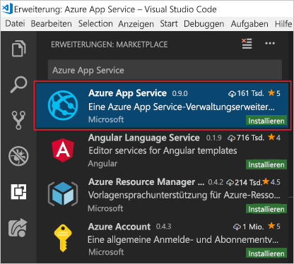

In this unit, you will install Visual Studio Code and the Azure App Service extension, which will get you ready to develop for Microsoft Azure and to deploy a web app.

## Exercise steps

First, identify which operating system you are using, and follow the steps in the appropriate section below to install Visual Studio Code.

### Windows

1. Download the Visual Studio Code installer for Windows.

1. Run the installer. This won't take long.

1. Open VS Code by navigating to the installation folder (the default path is C:\Program Files\Microsoft VS Code for a 64-bit machine).

### macOS

1. Download Visual Studio Code for macOS.

1. Double-click on the downloaded archive to expand the contents.

1. Drag Visual Studio Code.app to the Applications folder, making it available in the Launchpad.

1. Add VS Code to your Dock by right-clicking on the icon, and choosing Options > Keep in Dock.

### Linux – Debian and Ubuntu

1. Download and install the [.deb package (64-bit)](https://go.microsoft.com/fwlink/?LinkID=760868), either through the graphical software center, if it's available, or through the command line (replacing `<file>` with the .deb filename you downloaded):

    ```bash
    sudo dpkg -i <file>.deb
    sudo apt-get install -f # Install dependencies
    ```

### Linux – RHEL, Fedora, and CentOS

1. Use the following script to install the key and repository:

    ```bash
    sudo rpm --import https://packages.microsoft.com/keys/microsoft.asc
    sudo sh -c 'echo -e "[code]\nname=Visual Studio Code\nbaseurl=https://packages.microsoft.com/yumrepos/vscode\nenabled=1\ngpgcheck=1\ngpgkey=https://packages.microsoft.com/keys/microsoft.asc" > /etc/yum.repos.d/vscode.repo'
    ```

1. Update the package cache, and install the package by using dnf (Fedora 22 and above):

    ```bash
    dnf check-update
    sudo dnf install code
    ```

### Linux – openSUSE and SLE

1. The yum repository also works for openSUSE and SLE based systems. The following script will install the key and repository:

    ```bash
    sudo rpm --import https://packages.microsoft.com/keys/microsoft.asc
    sudo sh -c 'echo -e "[code]\nname=Visual Studio Code\nbaseurl=https://packages.microsoft.com/yumrepos/vscode\nenabled=1\ntype=rpm-md\ngpgcheck=1\ngpgkey=https://packages.microsoft.com/keys/microsoft.asc" > /etc/zypp/repos.d/vscode.repo'
    ```

1. Update the package cache and install the package by using:

    ```bash
    sudo zypper refresh
    sudo zypper install code
    ```

> [!NOTE]
> For further details about installing or updating VS Code on various Linux distributions, please see the [Running VS Code on Linux documentation](https://code.visualstudio.com/docs/setup/linux).

## Install Azure App Service extension

Once you have installed VS Code, open it.

1. Go to the Extensions tab.

1. Search for Azure App Service.

1. Click Install.

    The following screenshot shows the Azure App Service extension selected from the Visual Studio Code extension search results.

    

This will install the extension. You will be ready to connect to your Azure subscription, and develop for and deploy your web, mobile, or API app to an Azure App Service.
