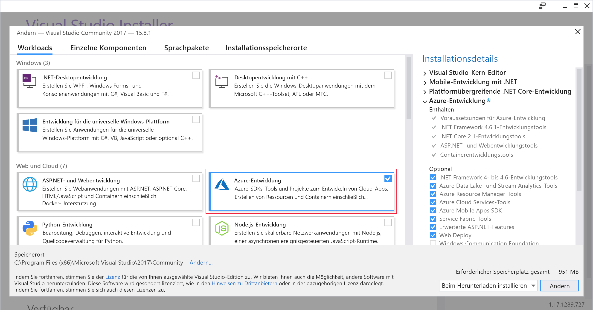
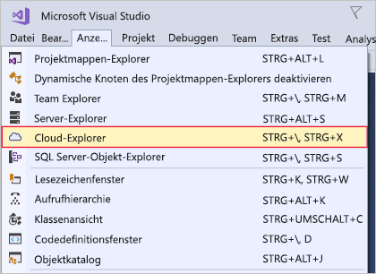

Im Folgenden installieren Sie Visual Studio auf Ihrem Windows- oder macOS-Entwicklungscomputer.Here, you'll install Visual Studio on either your Windows or your macOS development machine.

## Schritte in dieser ÜbungExercise steps

::: zone pivot="windows"::: zone pivot="windows"

### WindowsWindows

1. Laden Sie den Visual Studio-Installer von https://visualstudio.microsoft.com/downloads/ herunter.Download the Visual Studio installer from https://visualstudio.microsoft.com/downloads/.

1. Führen Sie das Installationsprogramm aus.Run the installer.

1. Wählen Sie auf der Registerkarte **Workloads** die Workload **Azure-Entwicklung** aus.On the **Workloads** tab, select the **Azure development** workload.

    Der folgende Screenshot stellt den Visual Studio-Installer mit der ausgewählten Workload dar, durch die die Azure-Entwicklung in Visual Studio ermöglicht wird.The following screenshot shows the Visual Studio Installer workload selected to allow Azure development within Visual Studio.

    

1. (Optional) Installieren Sie die Workload „ASP.NET und Webentwicklung“, damit Sie Webanwendungen für Azure erstellen können.(Optional) Install the ASP.NET and web development workload to be ready to create web applications for Azure.

1. Klicken Sie auf **Installieren**, und warten Sie, bis Visual Studio installiert ist.Click **Install**, and wait for Visual Studio to install. Für Systeme, auf denen Visual Studio bereits installiert ist, kann diese Schaltfläche beispielsweise **Ändern** heißen.For systems with Visual Studio already installed, this button may say **Modify**.

1. Öffnen Sie Visual Studio nach der Installation.When the installation is complete, open Visual Studio.

1. Navigieren Sie zum Menü „Ansicht“ in Visual Studio, und stellen Sie sicher, dass die Option **Cloud-Explorer** vorhanden ist.Go to the View menu in Visual Studio and make sure you have the **Cloud Explorer** option.

    Auf dem folgenden Screenshot wird die Menüoption „Cloud-Explorer“ dargestellt, die vorhanden ist, wenn die Workload „Azure-Entwicklung“ installiert ist.The following screenshot shows the Cloud Explorer menu option that will be present if you have the Azure development workload installed.

    

::: zone-end::: zone-end

::: zone pivot="macos"::: zone pivot="macos"

### macOSmacOS

1. Navigieren Sie zu https://visualstudio.microsoft.com/, und laden Sie den Installer für Visual Studio für Mac herunter.Go to https://visualstudio.microsoft.com/ and download the Visual Studio for Mac installer.

1. Klicken Sie auf die Datei „VisualStudioInstaller.dmg“, um den Installer einzubinden, und führen Sie diesen anschließend aus, indem Sie auf das Logo doppelklicken.Click the VisualStudioInstaller.dmg file to mount the installer, then run it by double-clicking the logo.

1. Stimmen Sie den Datenschutzbestimmungen und Lizenzbedingungen zu, wenn diese angezeigt werden.Acknowledge the Privacy and License terms when presented.

1. Wählen Sie im Installer die Komponenten aus, die installiert werden sollen.The installer will ask which components you wish to install. Azure-Komponenten sind in Visual Studio für Mac bereits enthalten, es wird jedoch empfohlen, die Plattform **.NET Core** zu installieren, um Webinhalte für Azure entwickeln zu können.Azure components are already part of Visual Studio for Mac, but it is recommended to install the **.NET Core** platform to develop web experiences for Azure.

    Der folgende Screenshot zeigt die .NET Core-Plattform an, die zum Hinzufügen von Azure-Entwicklungsfunktionen zu Visual Studio für Mac erforderlich ist.The following screenshot shows the .NET Core platform required to add Azure development capabilities to Visual Studio for Mac.

    

1. Klicken Sie auf **Installieren und aktualisieren**, sobald Sie mit der Auswahl zufrieden sind, und warten Sie, bis die Installation abgeschlossen ist.Click **Install and Update** once you are happy with the selections, and wait for the installer to complete.

1. Wenn Sie dazu aufgefordert werden, die Berechtigungen zu erhöhen, verwenden Sie Ihre Administratoranmeldeinformationen.If you are prompted to elevate the permissions needed, use your administrator credentials to do so.

1. Starten Sie Visual Studio für Mac nach der Installation.Once the installer is complete, start Visual Studio for Mac.

::: zone-end::: zone-end