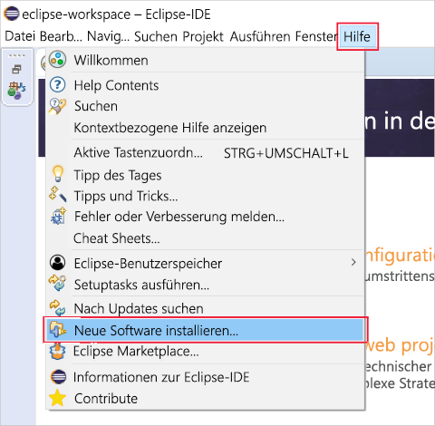

In this unit, you will install Eclipse on your local machine and then install the Azure Toolkit, preparing you for developing Java applications with Azure integration. The installation is quick and simple. At the end of the exercise, you will have everything set up that you need to start your first Java application, taking advantage of the features and services of Azure.

## Install Eclipse IDE

1. Download the Eclipse version that suits your operating system from http://www.eclipse.org/downloads/packages/installer.

1. Start the Eclipse installer once downloaded.

    1. On Windows, double-click the downloaded file.

    1. On macOS and Linux, unzip the installer from the downloaded file. Then start the installer once unzipped.

        > [!NOTE]
        > The installer may prompt you to install the Java Development Kit, if it is missing.

1. Select the packages to install. For Java developers, choose either the Java or Java EE Eclipse IDE option.

1. Select the installation destination on your machine.

1. Launch Eclipse to validate that it installed correctly.

## Install Azure Toolkit for Eclipse

Installing the Azure Toolkit is the same across Windows, macOS, and Linux.

1. Start Eclipse.

1. Go to **Help** > **Install New Software...**.

    The following screenshot shows the menu location of the **Install New Software...** item.

    

1. The **Available Software** dialog will open. In the **Work with:** text box, type `http://dl.microsoft.com/eclipse/` and press Enter.

1. In the results, check the **Azure Toolkit for Java** option. Make sure you uncheck the **Contact all update sites during install to find required software** option, if it isn't already.

    The following screenshot shows the **Available Software** install configuration as described above.

    

1. Click **Next**.

1. Review and accept the license agreements when prompted, and click **Finish**.

1. Eclipse will download and install the Azure Toolkit.

1. Restart Eclipse if required.

1. Validate installation of Azure Toolkit by verifying that you can find a **Tools** > **Azure** menu option in Eclipse.

## Summary

In this unit, you installed Eclipse for Java, and prepared it to take advantage of the integration with Azure services and products. The installation is quick and straightforward, making Eclipse ideal for the task of Java development with cloud services integration.
