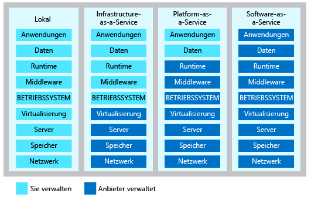

Cloud Computing lässt sich in drei Hauptkategorien untergliedern. Diese müssen verstanden werden, da sie in Konversationen, Dokumentationen und Schulungen verwendet werden.

## Lernen Sie die drei Kategorien von Cloud Computing kennen

<!-- TODO: replace video link? -->

> [!VIDEO https://www.microsoft.com/videoplayer/embed/RE2yEbs]

### Infrastructure-as-a-Service (IaaS)

Infrastructure-as-a-Service ist die flexibelste Kategorie von Clouddiensten. Sie zielt darauf ab, Ihnen die komplette Kontrolle über die Hardware zu geben, die die Anwendung ausführt. Mit IaaS mieten Sie die Hardware, anstatt sie zu kaufen.

### Platform-as-a-Service (PaaS)

PaaS bietet eine Umgebung zum Erstellen, Testen und Bereitstellen von Softwareanwendungen. Mit PaaS erstellen Sie Anwendungen in kurzer Zeit, ohne sich um die Verwaltung der zugrunde liegenden Infrastruktur kümmern zu müssen. Beim Bereitstellen einer Webanwendung mithilfe von PaaS müssen Sie beispielsweise kein Betriebssystem, keinen Webserver und auch keine Systemupdates installieren.

### Software-as-a-Service (SaaS)

Bei SaaS handelt es sich um Software, die zentral für den Endkunden gehostet und verwaltet wird. Sie basiert normalerweise auf Architektur, bei der eine Version der Anwendung für alle Kunden verwendet wird und die durch ein Monats- oder Jahresabonnement lizenziert wird. Office 365 ist ein perfektes Beispiel für SaaS-Software.

## Stellen Sie sich Dienstkategorien als Ebenen vor

Sie sollten verstehen, dass diese Kategorien Ebenen darstellen, die aufeinander aufbauen. PaaS ist beispielsweise IaaS aufgrund einer zusätzlichen Abstraktionsebene übergeordnet. Diese Abstraktion hat den Vorteil, dass unwichtige Details verborgen werden, sodass Sie schneller mit der Programmierung beginnen können. Ein Nachteil besteht jedoch darin, dass Sie weniger Kontrolle über die zugrunde liegende Hardware besitzen. Die folgende Abbildung zeigt eine Liste der Ressourcen, die Sie verwalten und die von Ihrem Dienstanbieter in jeder Clouddienstkategorie verwaltet werden.

## Zusammenfassung

IaaS, PaaS und SaaS enthalten alle verschiedene Ebenen der verwalteten Dienste. Sie können einfach eine Kombination dieser Infrastrukturtypen verwenden. Sie könnten z.B. Office 365 auf Ihren Unternehmenscomputern verwenden (SaaS), Ihre virtuellen Computer in Azure hosten (IaaS) und Azure SQL-Datenbank zum Speichern Ihrer Daten verwenden (PaaS). Dank der Flexibilität der Cloud können Sie jede Kombination verwenden, um das beste Ergebnis für sich zu erzielen.
