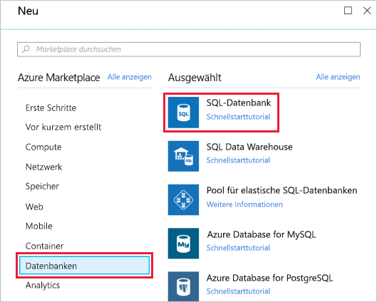
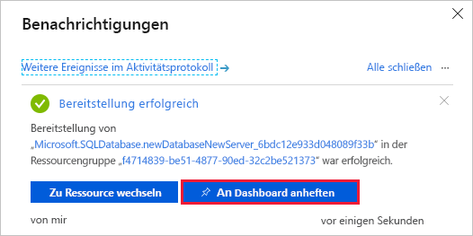
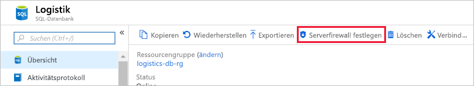
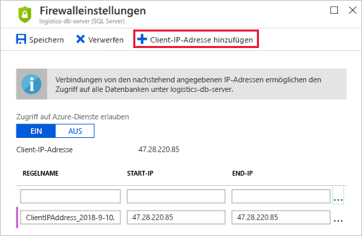

Ihr Transportunternehmen möchte sich von anderen Unternehmen abheben, jedoch ohne umfangreiche Investitionen.Your transportation company wants to set themselves apart from other companies but without breaking the bank. Sie müssen die Datenbank optimal einrichten, um den besten Service bereitzustellen und dabei die Kosten unter Kontrolle zu halten.You must have a good handle on how to set up the database to provide the best service while controlling costs.

[!include]

Hier lernen Sie Folgendes:Here, you'll learn:

- Welche Aspekte Sie beim Erstellen einer Azure SQL-Datenbank berücksichtigen müssen, einschließlich:What considerations you need to make when creating an Azure SQL database, including:
  - Wie ein logischer Server als administrativer Container für Ihre Datenbanken fungiert.How a logical server acts as an administrative container for your databases.
  - Die Unterschiede zwischen Kaufmodellen.The differences between purchasing models.
  - Wie Pools für elastische Datenbanken Ihnen ermöglichen, die Verarbeitungsleistung zwischen Datenbanken zu verteilen.How elastic pools enable you to share processing power among databases.
  - Wie Sortierungsregeln sich auf das Vergleichen und Sortieren von Daten auswirken.How collation rules affect how data is compared and sorted.
- Wie Azure SQL-Datenbank im Portal aufgerufen wird.How to bring up Azure SQL Database from the portal.
- Wie Firewallregeln hinzugefügt werden, damit nur vertrauenswürdige Quellen auf Ihre Datenbank zugreifen können.How to add firewall rules so that your database is accessible from only trusted sources.

Wir werfen kurz einen Blick auf einige Dinge, die Sie bei der Erstellung einer Instanz von Azure SQL-Datenbank berücksichtigen müssen.Let's take a quick look at some things you need to consider when you create an Azure SQL database.

## Ein Server, viele DatenbankenOne server, many databases

Wenn Sie Ihre erste Azure SQL-Datenbank erstellen, erstellen Sie auch einen _logischen Azure SQL-Server_.When you create your first Azure SQL database, you also create an _Azure SQL logical server_. Stellen Sie sich einen logischen Server als administrativen Container für Ihre Datenbanken vor.Think of a logical server as an administrative container for your databases. Sie können Anmeldungen, Firewallregeln und Sicherheitsrichtlinien über den logischen Server steuern.You can control logins, firewall rules, and security policies through the logical server. Sie können diese Richtlinien auch für jede Datenbank auf dem logischen Server überschreiben.You can also override these policies on each database within the logical server.

Im Moment benötigen Sie nur eine einzige Datenbank.For now, you need just one database. Mit einem logischen Server können Sie jedoch später weitere Datenbanken hinzufügen und die Leistung aller Ihrer Datenbanken optimieren.But a logical server enables you to add more later and tune performance among all your databases.

## Wählen Sie die Leistung: DTUs oder V-KerneChoose performance: DTUs versus vCores

Azure SQL-Datenbank bietet zwei Kaufmodelle: DTU und V-Kern.Azure SQL Database has two purchasing models: DTU and vCore.

### Was sind DTUs?What are DTUs?

DTU steht für Database Transaction Unit (Datenbanktransaktionseinheit) und ist ein kombiniertes Maß aus Compute-, Speicher- und E/A-Ressourcen.DTU stands for Database Transaction Unit and is a combined measure of compute, storage, and IO resources. Stellen Sie sich das DTU-Modell als einfache, vorkonfigurierte Kaufoption vor.Think of the DTU model as a simple, preconfigured purchase option.

Die Idee der eDTUs, elastischer Datenbanktransaktionseinheiten, basiert darauf, dass Ihr logischer Server mehrere Datenbanken enthalten kann.Because your logical server can hold more than one database, there's also the idea of eDTUs, or elastic Database Transaction Units. Mit dieser Option können Sie einen Preis auswählen, aber zulassen, dass jede Datenbank im Pool abhängig von der aktuellen Auslastung weniger oder mehr Ressourcen nutzen kann.This option enables you to choose one price, but allow each database in the pool to consume fewer or greater resources depending on current load.

### Was sind V-Kerne?What are vCores?

V-Kerne erlauben Ihnen größere Kontrolle darüber, welche Compute- und Speicherressourcen Sie erstellen und bezahlen.vCore gives you greater control over what compute and storage resources you create and pay for.

Während das DTU-Modell feste Kombinationen aus Compute-, Speicher- und E/A-Ressourcen bietet, ermöglicht das V-Kern-Modell Ihnen die unabhängige Konfiguration von Ressourcen.While the DTU model provides fixed combinations of compute, storage, and IO resources, the vCore model enables you to configure resources independently. Mit dem V-Kern-Modell können Sie z.B. Speicherkapazität erhöhen, jedoch die vorhandene Menge an Computeleistung und E/A-Durchsatz beibehalten.For example, with the vCore model you can increase storage capacity but keep the existing amount of compute and IO throughput.

Ihr Transport- und Logistikprototyp benötigt nur eine einzige Azure SQL-Datenbank-Instanz.Your transportation and logistics prototype only needs one Azure SQL Database instance. Sie entscheiden sich für die DTU-Option, da sie eine gute Balance zwischen Compute-, Speicher- und E/A-Leistung bietet und für den Anfang kostengünstiger ist.You decide on the DTU option because it provides a good balance of compute, storage, and IO performance and is less expensive to get started.

## Was sind Pools für elastische SQL-Datenbanken?What are SQL elastic pools?

Wenn Sie Ihre Azure SQL-Datenbank erstellen, können Sie einen _Pool für elastische SQL-Datenbanken_ erstellen.When you create your Azure SQL database, you can create a _SQL elastic pool_.

Pools für elastische SQL-Datenbanken stehen mit eDTUs in Zusammenhang.SQL elastic pools relate to eDTUs. Sie ermöglichen Ihnen, einen Satz von Compute- und Speicherressourcen zu kaufen, die von allen Datenbanken im Pool gemeinsam verwendet werden.They enable you to buy a set of compute and storage resources that are shared among all the databases in the pool. Jede Datenbank kann innerhalb der von Ihnen festgelegten Grenzen die Ressourcen nutzen, die sie abhängig von der aktuellen Last benötigt.Each database can use the resources they need, within the limits you set, depending on current load.

Für Ihren Prototyp benötigen Sie keinen Pool für elastische SQL-Datenbanken, da Sie nur eine einzige SQL-Datenbank benötigen.For your prototype, you won't need a SQL elastic pool because you need only one SQL database.

## Was ist eine Sortierung?What is collation?

Sortierung bezieht sich auf die Regeln zum Sortieren und Vergleichen von Daten.Collation refers to the rules that sort and compare data. Sortierung vereinfacht das Definieren von Sortierregeln, wenn Groß-/Kleinschreibung, Akzente und andere Merkmale der Sprache wichtig sind.Collation helps you define sorting rules when case sensitivity, accent marks, and other language characteristics are important.

Nun betrachten wir, was die Standardsortierung **SQL_Latin1_General_CP1_CI_AS** bedeutet.Let's take a moment to consider what the default collation, **SQL_Latin1_General_CP1_CI_AS**, means.

- **Latin1_General** bezieht sich auf die Familie der westeuropäischen Sprachen.**Latin1_General** refers to the family of Western European languages.
- **CP1** bezieht sich auf Codepage 1252, eine gängige Zeichencodierung des lateinischen Alphabets.**CP1** refers to code page 1252, a popular character encoding of the Latin alphabet.
- **CI** bedeutet, dass die Groß-/Kleinschreibung beim Vergleichen nicht beachtet wird.**CI** means that comparisons are case insensitive. Beispielsweise werden „HELLO“ und „Hello“ im Vergleich als gleich angesehen.For example, "HELLO" compares equally to "hello".
- **CI** bedeutet, dass Akzente beim Vergleichen beachtet werden.**AS** means that comparisons are accent sensitive. Beispielsweise werden „résumé“ und „resume“ im Vergleich nicht als gleich angesehen.For example, "résumé" doesn't compare equally to "resume".

Da Sie keine bestimmten Anforderungen bezüglich der Art haben, in der Daten sortiert und verglichen werden, wählen Sie die Standardsortierung.Because you don't have specific requirements around how data is sorted and compared, you choose the default collation.

## Erstellen der Azure SQL-DatenbankCreate your Azure SQL database

Hier richten Sie Ihre Datenbank ein, was das Erstellen des logischen Servers beinhaltet.Here you'll set up your database, which includes creating your logical server. Sie wählen Einstellungen aus, die Ihre Transportlogistikanwendung unterstützen.You'll choose settings that support your transportation logistics application. In der Praxis würden Sie Einstellungen auswählen, die die Art von App unterstützen, die Sie erstellen.In practice, you would choose settings that support the kind of app you're building.

Wenn Sie im Laufe der Zeit bemerken, dass Sie weitere Computeleistung benötigen, um den Anforderungen gerecht zu werden, können Sie die Leistungsoptionen anpassen oder zwischen DTU- und V-Kern-Leistungsmodellen wechseln.Over time if you you realize you need additional compute power to keep up with demand, you can adjust performance options or even switch between the DTU and vCore performance models.

1. Melden Sie sich beim [Azure-Portal](https://portal.azure.com/learn.docs.microsoft.com?azure-portal=true) mit dem gleichen Konto an, über das Sie die Sandbox aktiviert haben.Sign into the [Azure portal](https://portal.azure.com/learn.docs.microsoft.com?azure-portal=true) using the same account you activated the sandbox with.

1. Klicken Sie im Portal links oben auf **Ressource erstellen**.From the portal, click **Create a resource** from the upper left-hand corner. Wählen Sie **Datenbanken** und dann **SQL-Datenbank** aus.Select **Databases**, then select **SQL Database**.

   

1. Klicken Sie unter **Server** auf **Erforderliche Einstellungen konfigurieren**, füllen Sie das Formular aus, und klicken Sie dann auf **Auswählen**.Under **Server**, click **Configure required settings**, fill out the form, then click **Select**. Hier finden Sie weitere Informationen zum Ausfüllen des Formulars:Here's more information on how to fill out the form:

    | EinstellungSetting      | WertValue |
    | ------------ | ----- |
    | **Servername****Server name** | Ein global eindeutiger [Servername](https://docs.microsoft.com/azure/architecture/best-practices/naming-conventions).A globally unique [server name](https://docs.microsoft.com/azure/architecture/best-practices/naming-conventions). |
    | **Serveradministratoranmeldung****Server admin login** | Ein [Datenbankbezeichner](https://docs.microsoft.com/sql/relational-databases/databases/database-identifiers), der als Ihr primärer Administrator-Anmeldename dient.A [database identifier](https://docs.microsoft.com/sql/relational-databases/databases/database-identifiers) that serves as your primary administrator login name. |
    | **Kennwort****Password** | Ein gültiges Kennwort umfasst mindestens acht Zeichen und enthält Zeichen aus drei der folgenden Kategorien: Großbuchstaben, Kleinbuchstaben, Zahlen und nicht alphanumerische Zeichen.Any valid password that has at least eight characters and contains characters from three of these categories: uppercase characters, lowercase characters, numbers, and non-alphanumeric characters. |
    | **Speicherort****Location** | Jeder gültige Speicherort aus der unten verfügbaren Liste.Any valid location from the available list below. |

    [!include]

1. Klicken Sie auf **Tarif**, um die Dienstebene anzugeben.Click **Pricing tier** to specify the service tier. Wählen Sie die Dienstebene **Basic** aus, und klicken Sie dann auf **Übernehmen**.Select the **Basic** service tier, then click **Apply**.

1. Verwenden Sie diese Werte, um den Rest des Formulars auszufüllen.Use these values to fill out the rest of the form.

    | EinstellungSetting      | WertValue |
    | ------------ | ----- |
    | **Datenbankname****Database name** | **Logistik****Logistics** |
    | **Abonnement****Subscription** | Ihr AbonnementYour subscription |
    | **Ressourcengruppe****Resource group** |  Verwenden Sie die vorhandene Gruppe <rgn>[Name der Sandboxressourcengruppe]</rgn>.Use the existing group <rgn>[sandbox resource group name]</rgn> |
    | **Quelle auswählen****Select source** | **Leere Datenbank****Blank database** |
    | **Möchten Sie einen Pool für elastische SQL-Datenbanken verwenden?****Want to use SQL elastic pool?** | **Jetzt nicht****Not now** |
    | **Sortierung****Collation** | **SQL_Latin1_General_CP1_CI_AS****SQL_Latin1_General_CP1_CI_AS** |

1. Klicken Sie zum Erstellen der Azure SQL-Datenbank-Instanz auf **Erstellen**.Click **Create** to create your Azure SQL database.

    > [!IMPORTANT]
    > Merken Sie sich Ihren Servernamen, Administratoranmeldenamen und Ihr Kennwort zur späteren Verwendung.Remember your server name, admin login, and password for later.

1. Klicken Sie in der Symbolleiste auf **Benachrichtigungen**, um den Bereitstellungsprozess zu überwachen.On the toolbar, click **Notifications** to monitor the deployment process.

Wenn der Prozess abgeschlossen ist, klicken Sie auf **An Dashboard anheften**, um Ihren Datenbankserver an das Dashboard anzuheften, sodass Sie später bei Bedarf schnellen Zugriff haben.When the process completes, click **Pin to dashboard** to pin your database server to the dashboard so that you have quick access when you need it later.

   

## Festlegen der ServerfirewallSet the server firewall

Ihre Azure SQL-Datenbank ist jetzt eingerichtet und in Betrieb.Your Azure SQL database is now up and running. Es gibt viele weitere Optionen zum Konfigurieren, Sichern, Überwachen und zur Problembehandlung für Ihre neue Datenbank.You have many options to further configure, secure, monitor, and troubleshoot your new database.

Sie können auch angeben, welche Systeme über die Firewall auf Ihre Datenbank zugreifen können.You can also specify which systems can access your database through the firewall. Zunächst verhindert die Firewall jeglichen Zugriff auf Ihren Datenbankserver von außerhalb von Azure.Initially, the firewall prevents all access to your database server from outside of Azure.

Für den Prototypen müssen Sie nur von Ihrem Laptop aus auf die Datenbank zugreifen.For your prototype, you only need to access the database from your laptop. Später können Sie zusätzliche Systeme wie Ihre mobile App auf die Whitelist setzen.Later, you can whitelist additional systems, such as your mobile app.

Wir ermöglichen nun Ihrem Entwicklungscomputer, über die Firewall auf die Datenbank zuzugreifen.Let's enable your development computer to access the database through the firewall now.

1. Wechseln Sie zum Übersichtsblatt der Logistics-Datenbank.Go to the overview blade of the Logistics database. Wenn Sie die Datenbank zuvor angeheftet haben, können Sie im Dashboard auf die **Logistics**-Kachel klicken, um dorthin zu gelangen.If you pinned the database earlier, you can click the **Logistics** tile on the dashboard to get there.

1. Klicken Sie auf **Serverfirewall festlegen**.Click **Set server firewall**.

    

1. Klicken Sie auf **Client-IP hinzufügen** und dann auf **Speichern**.Click **Add client IP**, and then click **Save**.

    

Im nächsten Teil finden Sie einige praktische Übungen mit der neuen Datenbank und Azure Cloud Shell.In the next part, you'll get some hands-on practice with your new database and with Azure Cloud Shell. Sie werden eine Verbindung mit der Datenbank herstellen, eine Tabelle erstellen, einige Beispieldaten hinzufügen und ein paar SQL-Anweisungen ausführen.You'll connect to the database, create a table, add some sample data, and execute a few SQL statements.