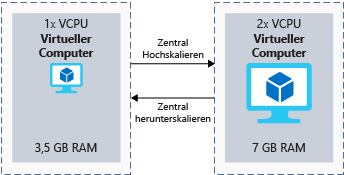

Ihr Server benötigt genügend Ressourcen, um tägliche Anforderungen zu verarbeiten. Es ist üblich, beim Erstellen einer VM die Größe auszuwählen, die für Standardarbeitsauslastungen ausreicht, und diese bei Bedarf anzupassen.

Im Spielzeugunternehmensszenario wäre diese Strategie hilfreich, um Ressourcen für das mittelfristige Wachstum zu verwalten. Sie können die Größe Ihrer VM erhöhen, um die zusätzliche Nachfrage zu decken, wenn Ihr Unternehmen wächst.

## <a name="what-is-virtual-machine-size"></a>VM-Größe

Die _Größe_ einer VM ist ein Messwert für CPU, Arbeitsspeicher, Datenträger und erwartete Netzwerkbandbreite. VMs sind in einer festgelegten Anzahl von Größen verfügbar. So hat beispielsweise die Größe **Standard_F32s_v2** 32 virtuelle CPUs, 64 GiB Arbeitsspeicher, eine lokale SSD mit 256 GiB und eine erwartete Netzwerkbandbreite von 14.000 MBit/s.

Wenn Sie eine neue VM in Azure erstellen, müssen Sie eine Größe auswählen. Je größer die VM ist, umso mehr kostet sie. Das Ziel besteht darin, eine Größe auszuwählen, die Ihre Arbeitsauslastung bewältigen kann, ohne mehr Leistung zu konfigurieren, als Sie benötigen.

## <a name="what-is-virtual-machine-type"></a>VM-Typ

Der _Typ_ einer VM ist die Arbeitsauslastung, für die die VM optimiert wurde. Einige VMs sind beispielsweise auf CPU-intensive Aufgaben wie das Hosten eines Webservers ausgerichtet. Andere sind für speicherorientierte Aufträge wie das Ausführen einer Datenbank konzipiert.

Es gibt _Typen_, die jeder Hardwarekernkomponenten in einem modernen Computer entsprechen: **Compute**, **Arbeitsspeicher**, **Speicher** und **GPU**. Es gibt auch einen **universellen** Typ, falls Sie eine ausgewogene Kombination von Ressourcen benötigen. Die folgende Tabelle enthält die VM-Typen und deren jeweiligen Größen sowie eine kurze Beschreibung der Zielworkload.

|Typ|Größen|Beschreibung|
|---|---|---|
|Universell|B, Ds_v3, D_v3, einige DS_v2, einige D_v2, A_v2|Universelle VMs zeichnen sich durch ein ausgewogenes Verhältnis zwischen CPU und Arbeitsspeicher aus. Universelle VMs eignen sich gut zum Testen oder Entwickeln von Servern, kleinen bis mittleren Datenbanken oder Webservern mit geringem bis mittlerem Datenverkehr.|
|Für Compute optimiert|Fs_v2, Fs, F|Bei computeoptimierten VMs ist im Vergleich zu universellen VMs die CPU-Leistung besser als die Arbeitsspeicherleistung. Diese VMs eignen sich für Aufgaben, die zusätzliche Verarbeitungsleistung erfordern, z.B. für Anwendungsserver, Netzwerkappliances oder Webserver mit mittlerer Auslastung.|
|Arbeitsspeicheroptimiert|Es_v3, E_v3, M, GS, G, einige DS_v2, einige D_v2|Arbeitsspeicheroptimierte VMs haben eine höhere Arbeitsspeicherleistung als CPU-Leistung. Diese VMs eignen sich für Server mit relationalen Datenbanken, Server, die viel Zwischenspeicherung erfordern oder ausführen, oder Server, die In-Memory-Analysen durchführen.|
|Datenspeicheroptimiert|Ls|Diese VMs sind für hohen Datenträgerdurchsatz und E/A-Vorgänge konfiguriert, um Big Data-, SQL- und NoSQL-Datenbanken zu unterstützen.|
|GPU-optimiert|NV, NC, NC_v2, NC_v3, ND|GPU-optimierte VMs eignen sich für folgende Aufgaben: anspruchsvolles Grafikrendering oder grafikintensive Videobearbeitung neben Modelltraining und -rückschlüssen (ND-Serie) mit Deep Learning. Sie können für diese VMs eine GPU oder mehrere GPUs auswählen.|
|High Performance Computing|H|In diesen VMs sind die schnellsten und leistungsfähigsten CPUs verfügbar. Sie können auch Netzwerkschnittstellen für hohen Durchsatz (RDMA) hinzufügen.|

## <a name="clusters"></a>Cluster

Die physische Serverhardware in Azure-Regionen wird in Cluster zusammengefasst. Jeder Cluster unterstützt je nach physischer Hardware mehrere verschiedene VM-Größen.

Wenn Sie eine VM erstellen und eine bestimmte Größe auswählen, wird die VM in einem für diese Größe geeigneten Hardwarecluster bereitgestellt. Sie können die Größe von VMs zwar nach dem Erstellen ändern, doch möglicherweise sind die Größenanpassungsoptionen durch den für die ursprüngliche Größe ausgewählten Hardwarecluster eingeschränkt.

## <a name="what-is-vertical-scaling"></a>Was ist vertikales Skalieren?

Als _vertikales Skalieren_ wird das Ändern der _Größe_ einer VM bezeichnet. Sie können durch Auswahl einer leistungsfähigeren Größe _zentral hochskalieren_, um die steigende Nachfrage zu verarbeiten, oder _zentral herunterskalieren_, um weniger Ressourcen zuzuweisen und Kosten zu senken. Die folgende Abbildung zeigt ein Beispiel für die Größenänderung einer VM.



Sie können die Größe einer VM im Azure-Portal, mit Azure PowerShell oder über die Azure CLI ändern.

### <a name="resize-in-the-portal"></a>Ändern der Größe im Portal

Im Azure-Portal können Sie die Größe einer VM ändern, indem Sie die VM auswählen, auf den Eintrag **Größe** klicken und einen Eintrag auf dem Blatt **Größe auswählen** auswählen. 

Wenn die VM zu diesem Zeitpunkt ausgeführt wird, hängen die verfügbaren Größen von Ihrer Region ab. Es werden nur Größenanpassungsoptionen angezeigt, die mit dem Hardwarecluster kompatibel sind, in dem die VM aktuell ausgeführt wird. Das wird auch als *Größenfamilie* bezeichnet. Wenn Sie eine neue Größe auswählen, während die VM ausgeführt wird, wird die VM automatisch neu gestartet, um die neue Größe anzuwenden.

Wenn die gesuchte Größe bei VM-Ausführung im Portal nicht angezeigt wird, fahren Sie die VM herunter, um weitere Optionen anzuzeigen. Wenn die VM den Status **Beendet (Zuordnung aufgehoben)** hat, können Sie Größen aus anderer Hardware in der gleichen Region auswählen.

### <a name="resize-with-powershell"></a>Ändern der Größe mit PowerShell

Sie können PowerShell verwenden, um interaktiv oder mit Skripten vertikal zu skalieren. Skripte eignen sich für komplexe Szenarien, z.B. wenn Sie die Größe mehrerer VMs gleichzeitig ändern möchten. Sie sind auch praktisch, um die Größenänderung außerhalb der Betriebszeit auszuführen, um Störungen beim Benutzer zu vermeiden.

Das folgende Cmdlet listet VM-Größen der gleichen Größenfamilie als aktuelle Hardware auf:

```PowerShell
Get-AzureRmVMSize -ResourceGroupName "myResourceGroup" -VMName "MyVM"
```

Wenn die gewünschte Größe angezeigt wird, ändern Sie die Größe der VM mit dem folgenden Cmdlet:

```PowerShell
$vm = Get-AzureRmVM -ResourceGroupName "myResourceGroup" -VMName "MyVM"
$vm.HardwareProfile.VmSize = "<newVMsize>"
Update-AzureRmVM -VM $vm -ResourceGroupName "myResourceGroup"
```

Wenn die gewünschte Größe bei ausgeführter VM nicht angezeigt wird, können Sie mit den folgenden Befehlen die VM freigeben, die VM-Größe ändern und die VM erneut starten:

```PowerShell
Stop-AzureRmVM -ResourceGroupName "myResourceGroup" -Name "MyVM" -Force
$vm = Get-AzureRmVM -ResourceGroupName "myResourceGroup" -VMName "MyVM"
$vm.HardwareProfile.VmSize = "<newVMSize>"
Update-AzureRmVM -VM $vm -ResourceGroupName "myResourceGroup"
Start-AzureRmVM -ResourceGroupName "myResourceGroup" -Name "MyVM"
```

VMs in Azure können bei Bedarf skaliert werden, um die Leistung zu erhöhen oder Kosten zu senken. Das manuelle Ändern der Größe – im Portal oder mit einem Skript – ist nützlich, um ein ständiges Unternehmenswachstum zu bewältigen, oder wenn Sie im Voraus wissen, dass sich die Nachfrage ändern wird. Im Szenario des Spielzeugunternehmens könnten Sie durch zentrales Hochskalieren vor einem Feiertag den Nachfrageanstieg bewältigen und danach wieder zentral herunterskalieren.
