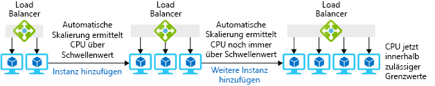

Sie erhalten die benötigten Ressourcen mit einem großen virtuellen Computer oder mit mehreren kleinen virtuellen Computern mit einem Lastenausgleich, der die Anforderungen zwischen den VMs verteilt.You can get the resources you need using either one large virtual machine or several small VMs with a load balancer to distribute requests among the VMs.

Der VM-Pool hat den Vorteil, dass Sie VMs schnell hinzufügen oder entfernen können, wenn sich der Bedarf ändert.The VM pool has the nice advantage that you can add or remove VMs quickly when demand changes. Im Szenario mit dem Spielzeugunternehmen wäre diese Strategie nützlich, um unerwartete Spitzen bei der Nachfrage zu bewältigen.In the toy company scenario, this strategy would be useful to handle unexpected spikes in demand. Sie könnten VMs zum Pool hinzufügen, wenn der Bedarf steigt, und sie entfernen, wenn der Bedarf wieder den Normalzustand erreicht.You could add VMs to the pool when demand increased and remove them when demand returned to normal. Der Pool bietet auch Redundanz: Wenn eine VM ausfällt, können die anderen weiterhin ohne Unterbrechung des Diensts Anforderungen verarbeiten.The pool also gives you redundancy; if one VM fails, the others can continue to handle requests with no interruption in service.

In diesem Abschnitt sehen Sie, wie mehrere VMs mithilfe von Skalierungsgruppen bereitgestellt werden und wie automatisch Instanzen als Reaktion auf Bedarfsänderungen hinzugefügt und entfernt werden.In this section, you will see how to provision multiple VMs using scale sets and how to automatically add and remove instances in response to changing demand. 

## Was ist horizontale Skalierung?What is horizontal scaling?

*Horizontale Skalierung* ist der Prozess des Hinzufügens und Entfernens von virtuellen Computern in einem Pool, um die Anzahl der verfügbaren Ressourcen anzupassen.*Horizontal scaling* is the process of adding or removing virtual machines from a pool to adjust the amount of available resources. Das Hinzufügen von Computern wird _horizontales Hochskalieren_ genannt, und das Entfernen von Computern heißt _horizontales Herunterskalieren_.Adding machines is called _scaling out_ and removing machines is called _scaling in_. Lösungen, die die horizontale Skalierung verwenden, enthalten einen Lastenausgleich oder ein Gateway, um Anforderungen zwischen den VMs im Pool zu verteilen.Solutions that use horizontal scaling include a load balancer or gateway to distribute requests among the VMs in the pool. Die folgende Abbildung zeigt ein Beispiel für das Ändern der Anzahl von VM-Instanzen.The following illustration shows an example of changing the number of virtual machine instances.

Dieses Verfahren funktioniert am besten für Anwendungen, die auf mehreren identischen Servern ausgeführt werden können.This technique works best for applications that can be run across multiple, identical servers. Beispielsweise können Sie Ihren Webserver und die Webseiten auf mehreren VMs duplizieren, und alle geben die gleiche Antwort, unabhängig davon, welcher Server die Anforderung empfängt.For example, you can duplicate your web server and web pages on multiple VMs and they will all give the same response no matter which server receives the request. Auf der anderen Seite ist eine VM, auf der Ihre Back-End-Datenbank ausgeführt wird, kein idealer Kandidat. Durch das Ausführen mehrerer Kopien der Datenbank entsteht ein gewisser Aufwand beim Synchronisieren der Kopien.On the other hand, a VM that runs your backend database is not an ideal candidate because running multiple copies of the database requires some effort to keep the copies in sync.

## Was ist eine Skalierungsgruppe?What is a scale set?

Eine *Skalierungsgruppe* ist ein Pool mit identischen virtuellen Computern, einem Lastenausgleich oder Gateway zum Verteilen von Anforderungen und einem optionalen Satz von Regeln, die steuern, wann VMs zum Pool hinzugefügt oder daraus entfernt werden.A *scale set* is a pool of identical virtual machines, a load balancer or gateway to distribute requests, and an optional set of rules that control when VMs are added or removed from the pool. Hier bedeutet „identisch“, dass jede VM in der Gruppe mit dem gleichen Image erstellt wird und die gleiche Größe hat.Here, "identical" means that each VM in the set is created using the same image and has the same size.

Sie haben eine gewisse Flexibilität hinsichtlich der Konfiguration einer neuen VM mit der Software, die Sie benötigen.You have some flexibility in how a new VM is configured with the software you need. Sie können mit einem vordefinierten Image für das Basisbetriebssystem beginnen und dann Skripts zum automatischen Installieren oder Kopieren von Dateien nach dem Einrichten des Betriebssystems verwenden.You can start with a predefined image for the base OS and then use scripts to install or copy files automatically after the OS is set up. Alternativ können Sie ein benutzerdefiniertes VM-Image erstellen, bei dem das Betriebssystem und Ihre Anwendungssoftware bereits installiert sind.Alternately, you can create a custom virtual machine image with the operating system and your application software already installed.

## Verteilen von AnforderungenHow to distribute requests

Sie können entweder einen Lastenausgleich oder ein Anwendungsgateway verwenden, um Anforderungen an die VM-Instanzen in einer Skalierungsgruppe zu verteilen.You can use either a load balancer or an Application Gateway to distribute requests to the VM instances in a scale set.

Ein Azure-Lastenausgleich wird auf der OSI-Schicht 4 (TCP und UDP) eingesetzt und leitet Datenverkehr basierend auf der IP-Quelladresse und dem dazugehörigen Port kombiniert mit der IP-Zieladresse und dem entsprechenden Port weiter.An Azure load balancer operates at OSI layer 4 (TCP and UDP) and routes traffic based on source IP address and port combined with the destination IP address and port. Er kann Affinität bereitstellen, sodass Datenverkehr von einer IP-Quelladresse an den gleichen Zielserver weitergeleitet wird, um Konsistenz für eine Clientsitzung zu ermöglichen.It can provide affinity, where traffic from the same source IP address is routed to the same destination server to provide consistency across a client session. Der Lastenausgleich verfügt auch über einen Integritätstestmechanismus, der die Verfügbarkeit von Serverinstanzen bestimmt.The load balancer also has a health probe mechanism that determines the availability of server instances. Wenn ein virtueller Computer nicht mehr auf den Integritätstest reagiert, vermeidet der Lastenausgleich, neue Verbindungen an diesen Computer weiterzuleiten.If a virtual machine becomes unresponsive to the health probe, the load balancer will avoid routing any new connections to that machine.

Ein Anwendungsgateway wird auf OSI-Schicht 7 (Anwendungsschicht) eingesetzt.An Application Gateway operates at OSI layer 7 (the application layer). Wenn Ihre VMs beispielsweise einen Webserver ausführen, kann das Gateway die angeforderte URL für das Routing verwenden.For example, if your VMs are running a web server, then the gateway can use the requested URL to perform routing. Dies bedeutet, dass Sie Anforderungen mit `*/customers*` in der URL zu einem Pool von Servern und Anforderungen mit `*/partners*` in der URL zu einem anderen Pool weiterleiten können.This means you could forward requests with `*/customers*` in the URL to one pool of servers and requests with `*/partners*` in the URL to a different pool. Das Anwendungsgateway kann auch Folgendes bereitstellen: HTTP-zu-HTTPS-Umleitung, SSL-Beendigung (Secure Sockets Layer) zum Verringern der Verarbeitungsanforderungen auf den virtuellen Computern für die Verschlüsselung und eine Web Application Firewall (WAF), die Regeln verwendet, um bekannte Web-Exploits zu erkennen und zu verhindern, dass diese Anforderungen die Webserver erreichen.The Application Gateway can also provide HTTP to HTTPS redirection, Secure Sockets Layer (SSL) termination to reduce the processing requirement on the virtual machines for encryption, and a Web application firewall (WAF) that uses rules to detect known web exploits and prevent these requests from reaching the web servers.

## Was ist automatische Skalierung?What is autoscaling?

_Automatische Skalierung_ ist der Prozess, basierend auf einem Satz von Regeln automatisch horizontal hoch- oder herunterzuskalieren._Autoscaling_ is the process of automatically scaling out or in based on a set of rules. Die Regeln können durch die Computerlast oder nach einem Zeitplan ausgelöst werden.The rules can be triggered by machine load or a schedule. Die folgende Abbildung zeigt, wie die Funktion zur automatischen Skalierung Instanzen verwaltet, um die Last zu bewältigen.The following illustration shows how the autoscale feature manages instances to handle the load.

Zum Aktivieren der automatischen Skalierung für eine Skalierungsgruppe müssen Sie ein Profil für die automatische Skalierung erstellen.To enable autoscaling for a scale set, you must create an autoscale profile. Das Profil definiert die minimale und maximale Anzahl von VM-Instanzen für die Gruppe und die Skalierungsregeln.The profile defines the minimum and maximum number of VM instances for the set and the scaling rules. Regeln zur automatischen Skalierung weisen die folgenden Elemente auf:Autoscale rules have the following elements:

* Metrikquelle: Die Quelle der Informationen oder Daten, die die Regel für die automatische Skalierung auslösen.Metric source - the source of information or data that triggers the autoscale rule. Es gibt vier Optionen:There are four options:
  * *Aktuelle Skalierungsgruppe*: Bietet hostbasierte Metriken, die keine zusätzliche Agents erfordern.*Current scale set* provides host-based metrics that do not require any additional agents.
  * *Speicherkonto*: Die Azure-Diagnoseerweiterung schreibt Leistungsmetriken in den Azure-Speicher, mit denen Regeln für die automatische Skalierung ausgelöst werden.*Storage account* the Azure diagnostic extension writes performance metrics to Azure storage that are used to trigger autoscale rules.
  * *Service Bus-Warteschlange*: Kann anwendungsbasierte oder andere Azure Service Bus-Nachrichten angeben, um die automatische Skalierung auszulösen.*Service Bus Queue* can specify application-based or other Azure Service Bus messages to trigger autoscaling.
  * *App Insights*: Verwendet ein Instrumentierungspaket, das in der Anwendung installiert werden muss, die in der Skalierungsgruppe ausgeführt wird, um Metrikdaten direkt aus der Anwendung zu streamen.*App Insights* uses an instrumentation package that needs to be installed in the application running on the scale set to stream metric data direct from the application.
* Regelkriterien: Dies ist die Metrik, die Sie zum Auslösen einer Regel für die automatische Skalierung verwenden möchten.Rule criteria - This is the specific metric you want to use to trigger an autoscale rule. Wenn Sie hostbasierte Metriken verwenden, können Aspekte wie die CPU-Auslastung, der Umfang an Netzwerkdatenverkehr, Datenträgervorgänge oder CPU-Guthaben berücksichtigt werden.If you are using host-based metrics, this can include aspects such as CPU usage, volume of network traffic, disk operations, or CPU credits. Sie können z.B. eine Regel konfigurieren, um horizontal hochzuskalieren, wenn Datenträger-Schreibvorgänge pro Sekunde einen Schwellenwert überschreiten.For example, you could configure a rule to scale out if disk write operations per second exceed a threshold. Mit der Azure-Diagnoseerweiterung oder App Insights können Sie beliebige verfügbare Kennzahlen verwenden, um die Regel auszulösen. Dies erfordert jedoch die Konfiguration des entsprechenden Agents.Using the Azure diagnostic extension or App Insights enables you to use any available measure to trigger the rule but requires configuration of the appropriate agent.
* Aggregationstyp: Damit wird angegeben, wie Sie die Metrikdaten messen möchten. Sie haben folgende Optionen:Aggregation type - This specifies how you want to measure the metric data and will be one of the following options:
  * DurchschnittAverage
  * MinimumMinimum
  * MaximumMaximum
  * GesamtTotal
  * LetzteLast
  * AnzahlCount
* Operator: Der Operator gibt an, wie eine Metrik von einem festgelegten Schwellenwert abweichen muss, um die Regelaktion auszulösen.Operator - The operator denotes how a metric must be different to a defined threshold to trigger the rules action. Dies ist besonders wichtig, um festzustellen, ob mit der Regel horizontal hoch- oder herunterskaliert wird.This is particularly important when identifying whether the rule will scale out or in. Folgende Operatoren sind möglich:Operators can be:
  * Größer alsGreater than
  * Größer als oder gleichGreater than or equal to
  * Kleiner alsLess than
  * Kleiner als oder gleichLess than or equal to
  * Ist gleichEqual to
  * UngleichNot equal to
* Aktion: Damit wird bestimmt, wie sich die Anzahl der Instanzen ändert, wenn die Regel ausgelöst wird.Action - This determines how the number of instances will change when the rule is triggered. Die folgenden Aktionen sind verfügbar:The following actions are available:
  * *Anzahl erhöhen um* eine feste Anzahl von virtuellen Computern.*Increase count by* a fixed number of virtual machines.
  * *Prozentsatz erhöhen um* einen Prozentsatz von vorhandenen Instanzen.*Increase percent by* a percentage of existing instances.
  * *Anzahl erhöhen auf* eine bestimmte Anzahl von virtuellen Computern.*Increase count to* a specific number of virtual machines.
  * *Anzahl verringern um* eine feste Anzahl von virtuellen Computern.*Decrease count by* a fixed number of virtual machines.
  * *Prozentsatz verringern um* einen Prozentsatz von vorhandenen Instanzen.*Decrease percent by* a percentage of existing instances.
  * *Anzahl verringern auf* eine bestimmte Anzahl von virtuellen Computern.*Decrease count to* a specific number of virtual machines.

Sie können auch Regeln für die automatische Skalierung erstellen, die nach Zeitplänen ausgelöst werden.You can also create autoscale rules that trigger on a schedule. Sie können z.B. eine Regel definieren, mit der morgens horizontal hochskaliert wird, da dann der Bedarf erfahrungsgemäß hoch ist. Wenn nachmittags der Bedarf wieder sinkt, wird horizontal herunterskaliert.For example, you might define a rule that scales out in the morning when you know demand is high and then scales in after lunch when demand typically decreases.

## Erstellen einer SkalierungsgruppeHow to create a scale set

Sie können eine Skalierungsgruppen mit dem Azure-Portal, Azure PowerShell oder der Azure-Befehlszeilenschnittstelle (CLI) erstellen.You can create a scale set using the Azure portal, Azure PowerShell, or the Azure command-line interface (CLI).

### PortalPortal

Wenn Sie das Azure-Portal verwenden, um die Skalierungsgruppe zu erstellen, geben Sie das Betriebssystemimage für die virtuellen Computer und die Anzahl von VM-Instanzen an, die beim Start erstellt werden sollen.If you use the Azure portal to create the scale set, you will specify the operating system image to use for the virtual machines and how many VM instances to create at startup. Sie geben auch die VM-Größe für jede Instanz an und legen fest, ob der Azure-Lastenausgleich oder das Anwendungsgateway für den Lastenausgleich verwendet werden soll.You will also specify the size of virtual machine for each instance and whether to use the Azure load balancer or the Application Gateway for load balancing. Wenn Sie einen Lastenausgleich auswählen, erstellt das Portal dafür einen standardmäßigen Integritätstest an Port 80.If you choose a load balancer, the portal will create a default health probe on port 80 for it.

### PowerShellPowerShell

Sie können mit dem PowerShell-Cmdlet **New-AzureRmVmss** eine VM-Skalierungsgruppe erstellen.You can create a virtual machine scale set with the **New-AzureRmVmss** PowerShell cmdlet. Dieses Cmdlet kann eine neue Skalierungsgruppe und einen Lastausgleich erstellen und die Zuweisungen von IP-Adressen und virtuellen Netzwerken steuern.This cmdlet can create a new scale set, a load balancer, and control IP address and virtual network assignments. In der Regel verwendet das Cmdlet **New-AzureRmVmss** die folgenden Standardeinstellungen:Unless specified in the cmdlet, **New-AzureRmVmss** will use the following default settings:

* Erstellen von zwei VM-InstanzenCreate two virtual machine instances
* Verwenden des Windows Server 2016 Datacenter-ImagesUse the Windows Server 2016 Datacenter image
* Verwenden der VM-Größe „Standard DS1_v2“Use the Standard DS1_v2 virtual machine size
* Einrichten eines LastenausgleichsCreate a load balancer
* Erstellen von Lastenausgleichsregeln für die Ports 3389 und 5985 für Windows und für Port 22 für LinuxCreate load balancer rules for ports 3389 and 5985 for Windows, port 22 for Linux

**New-AzureRmVmss** erstellt keinen Integritätstest für den Lastenausgleich.**New-AzureRmVmss** does not create a health probe for the load balancer. Es empfiehlt sich, diesen mit **Add-AzureRmLoadBalancerProbeConfig** nach der Erstellung der Skalierungsgruppe zu erstellen.Best practice would be to create this using **Add-AzureRmLoadBalancerProbeConfig** after you have created the scale set.

Durch horizontale Skalierung mit Skalierungsgruppen verfügen Sie über mehrere Server zum Ausführen der Anwendung.Horizontal scaling with scale sets gives you multiple servers to run your application. Die Nutzung mehrerer Server ermöglicht es Ihnen, große Lasten zu verarbeiten. Zudem stellen Sie dadurch sicher, dass Ihre Dienste verfügbar bleiben, selbst wenn ein Server abstürzt.Using multiple servers lets you handle high loads and ensures your services remain available even if a server crashes. Sie können Ihren Skalierungsgruppen eine automatische Skalierung hinzufügen, damit Ihr System automatisch an unerwartete Bedarfsänderungen angepasst wird.You can add autoscale to your scale sets, so your system automatically adjusts to unexpected changes in demand.