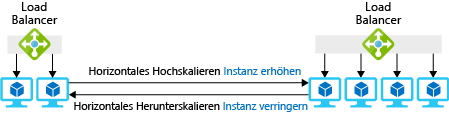

Sie erhalten die benötigten Ressourcen mit einem großen virtuellen Computer oder mit mehreren kleinen virtuellen Computern mit einem Lastenausgleich, der die Anforderungen zwischen den VMs verteilt.

Der VM-Pool hat den Vorteil, dass Sie VMs schnell hinzufügen oder entfernen können, wenn sich der Bedarf ändert. Im Szenario mit dem Spielzeugunternehmen wäre diese Strategie nützlich, um unerwartete Spitzen bei der Nachfrage zu bewältigen. Sie könnten VMs zum Pool hinzufügen, wenn der Bedarf steigt, und sie entfernen, wenn der Bedarf wieder den Normalzustand erreicht. Der Pool bietet auch Redundanz: Wenn eine VM ausfällt, können die anderen weiterhin ohne Unterbrechung des Diensts Anforderungen verarbeiten.

In diesem Abschnitt sehen Sie, wie mehrere VMs mithilfe von Skalierungsgruppen bereitgestellt werden und wie automatisch Instanzen als Reaktion auf Bedarfsänderungen hinzugefügt und entfernt werden. 

## Was ist horizontale Skalierung?

*Horizontale Skalierung* ist der Prozess des Hinzufügens und Entfernens von virtuellen Computern in einem Pool, um die Anzahl der verfügbaren Ressourcen anzupassen. Das Hinzufügen von Computern wird _horizontales Hochskalieren_ genannt, und das Entfernen von Computern heißt _horizontales Herunterskalieren_. Lösungen, die die horizontale Skalierung verwenden, enthalten einen Lastenausgleich oder ein Gateway, um Anforderungen zwischen den VMs im Pool zu verteilen. Die folgende Abbildung zeigt ein Beispiel für das Ändern der Anzahl von VM-Instanzen.

Dieses Verfahren funktioniert am besten für Anwendungen, die auf mehreren identischen Servern ausgeführt werden können. Beispielsweise können Sie Ihren Webserver und die Webseiten auf mehreren VMs duplizieren, und alle geben unabhängig davon, welcher Server die Anforderung empfängt, die gleiche Antwort. Auf der anderen Seite ist eine VM, auf der Ihre Back-End-Datenbank ausgeführt wird, kein idealer Kandidat. Durch das Ausführen mehrerer Kopien der Datenbank entsteht ein gewisser Aufwand beim Synchronisieren der Kopien.

## Was ist eine Skalierungsgruppe?

Eine *Skalierungsgruppe* ist ein Pool mit identischen virtuellen Computern, einem Lastenausgleich oder Gateway zum Verteilen von Anforderungen und einem optionalen Satz von Regeln, die steuern, wann VMs zum Pool hinzugefügt oder daraus entfernt werden. Hier bedeutet „identisch“, dass jede VM in der Gruppe mit dem gleichen Image erstellt wird und die gleiche Größe hat.

Sie haben eine gewisse Flexibilität hinsichtlich der Konfiguration einer neuen VM mit der Software, die Sie benötigen. Sie können mit einem vordefinierten Image für das Basisbetriebssystem beginnen und dann Skripts zum automatischen Installieren oder Kopieren von Dateien nach dem Einrichten des Betriebssystems verwenden. Alternativ können Sie ein benutzerdefiniertes VM-Image erstellen, bei dem das Betriebssystem und Ihre Anwendungssoftware bereits installiert sind.

## Verteilen von Anforderungen

Sie können entweder einen Lastenausgleich oder ein Anwendungsgateway verwenden, um Anforderungen an die VM-Instanzen in einer Skalierungsgruppe zu verteilen.

Ein Azure-Lastenausgleich wird auf der OSI-Schicht 4 (TCP und UDP) eingesetzt und leitet Datenverkehr basierend auf der IP-Quelladresse und dem dazugehörigen Port kombiniert mit der IP-Zieladresse und dem entsprechenden Port weiter. Er kann Affinität bereitstellen, sodass Datenverkehr von einer IP-Quelladresse an den gleichen Zielserver weitergeleitet wird, um Konsistenz für eine Clientsitzung zu ermöglichen. Der Lastenausgleich verfügt auch über einen Integritätstestmechanismus, der die Verfügbarkeit von Serverinstanzen bestimmt. Wenn ein virtueller Computer nicht mehr auf den Integritätstest reagiert, vermeidet es der Lastenausgleich, neue Verbindungen an diesen Computer weiterzuleiten.

Ein Anwendungsgateway wird auf OSI-Schicht 7 (Anwendungsschicht) eingesetzt. Wenn Ihre VMs beispielsweise einen Webserver ausführen, kann das Gateway die angeforderte URL für das Routing verwenden. Dies bedeutet, dass Sie Anforderungen mit `*/customers*` in der URL an einen Pool mit Servern und Anforderungen und mit `*/partners*` in der URL an einen anderen Pool weiterleiten können. Das Anwendungsgateway kann auch Folgendes bereitstellen: HTTP-zu-HTTPS-Umleitung, SSL-Beendigung (Secure Sockets Layer) zum Verringern der Verarbeitungsanforderungen auf den virtuellen Computern für die Verschlüsselung und eine Web Application Firewall (WAF), die Regeln verwendet, um bekannte Web-Exploits zu erkennen und zu verhindern, dass diese Anforderungen die Webserver erreichen.

## Was ist automatische Skalierung?

_Automatische Skalierung_ ist der Prozess, basierend auf einem Satz von Regeln automatisch horizontal hoch- oder herunterzuskalieren. Die Regeln können durch die Computerlast oder nach einem Zeitplan ausgelöst werden. Die folgende Abbildung zeigt, wie die Funktion zur automatischen Skalierung Instanzen verwaltet, um die Last zu bewältigen.

Zum Aktivieren der automatischen Skalierung für eine Skalierungsgruppe müssen Sie ein Profil für die automatische Skalierung erstellen. Das Profil definiert die minimale und maximale Anzahl von VM-Instanzen für die Gruppe und die Skalierungsregeln. Regeln zur automatischen Skalierung weisen die folgenden Elemente auf:

* Metrikquelle: Die Quelle der Informationen oder Daten, die die Regel für die automatische Skalierung auslösen. Es gibt vier Optionen:
  * *Aktuelle Skalierungsgruppe*: Stellt hostbasierte Metriken bereit, die keine zusätzlichen Agents erfordern.
  * *Speicherkonto*: Die Azure-Diagnoseerweiterung schreibt Leistungsmetriken in Azure Storage. Diese Metriken werden verwendet, um Regeln zur automatischen Skalierung auszulösen.
  * *Azure Service Bus-Warteschlange*: Kann anwendungsbasierte oder andere Azure Service Bus-Nachrichten angeben, um die automatische Skalierung auszulösen.
  * *Azure Application Insights*: Verwendet ein Instrumentierungspaket, das in der Anwendung (die in der Skalierungsgruppe ausgeführt wird) installiert werden muss, um Metrikdaten direkt aus der Anwendung zu streamen.
* Regelkriterien: Dies ist die Metrik, die Sie zum Auslösen einer Regel für die automatische Skalierung verwenden möchten. Wenn Sie hostbasierte Metriken verwenden, können Aspekte wie die CPU-Auslastung, der Umfang an Netzwerkdatenverkehr, Datenträgervorgänge oder CPU-Guthaben berücksichtigt werden. Sie können beispielsweise eine Regel konfigurieren, um horizontal hochzuskalieren, wenn die Datenträger-Schreibvorgänge pro Sekunde einen Schwellenwert überschreiten. Mit der Azure-Diagnoseerweiterung oder Application Insights können Sie beliebige verfügbare Kennzahlen verwenden, um die Regel auszulösen. Dies erfordert aber die Konfiguration des entsprechenden Agents.
* Aggregationstyp: Hiermit wird angegeben, wie Sie die Metrikdaten messen möchten. Sie haben folgende Optionen:
  * Durchschnitt
  * Minimum
  * Maximum
  * Gesamt
  * Letzte
  * Anzahl
* Operator: Der Operator gibt an, wie eine Metrik von einem festgelegten Schwellenwert abweichen muss, um die Regelaktion auszulösen. Dies ist besonders wichtig, um festzustellen, ob mit der Regel horizontal hoch- oder herunterskaliert wird. Folgende Operatoren sind möglich:
  * Größer als
  * Größer als oder gleich
  * Kleiner als
  * Kleiner als oder gleich
  * Ist gleich
  * Ungleich
* Aktion: Damit wird bestimmt, wie sich die Anzahl der Instanzen ändert, wenn die Regel ausgelöst wird. Die folgenden Aktionen sind verfügbar:
  * *Anzahl erhöhen um* eine feste Anzahl von virtuellen Computern.
  * *Prozentsatz erhöhen um* einen Prozentsatz von vorhandenen Instanzen.
  * *Anzahl erhöhen auf* eine bestimmte Anzahl von virtuellen Computern.
  * *Anzahl verringern um* eine feste Anzahl von virtuellen Computern.
  * *Prozentsatz verringern um* einen Prozentsatz von vorhandenen Instanzen.
  * *Anzahl verringern auf* eine bestimmte Anzahl von virtuellen Computern.

Sie können auch Regeln für die automatische Skalierung erstellen, die nach Zeitplänen ausgelöst werden. Sie können z.B. eine Regel definieren, mit der morgens horizontal hochskaliert wird, da dann der Bedarf erfahrungsgemäß hoch ist. Wenn nachmittags der Bedarf wieder sinkt, wird horizontal herunterskaliert.

## Erstellen einer Skalierungsgruppe

Sie können eine Skalierungsgruppe mit dem Azure-Portal, Azure PowerShell oder der Azure CLI erstellen.

### Azure-Portal

Wenn Sie das Azure-Portal verwenden, um die Skalierungsgruppe zu erstellen, geben Sie das Betriebssystemimage für die virtuellen Computer und die Anzahl von VM-Instanzen an, die beim Start erstellt werden sollen. Sie geben auch die VM-Größe für jede Instanz an und legen fest, ob der Azure-Lastenausgleich oder das Anwendungsgateway für den Lastenausgleich verwendet werden soll. Wenn Sie einen Lastenausgleich auswählen, erstellt das Portal dafür einen standardmäßigen Integritätstest an Port 80.

### Azure PowerShell

Sie können mit dem PowerShell-Cmdlet `New-AzureRmVmss` eine VM-Skalierungsgruppe erstellen. Dieses Cmdlet kann eine neue Skalierungsgruppe und einen Lastenausgleich erstellen und die Zuweisungen von IP-Adressen und virtuellen Netzwerken steuern. Wenn im Cmdlet keine Einstellungen angegeben sind, werden für `New-AzureRmVmss` die folgenden Standardeinstellungen verwendet:

* Erstellen von zwei VM-Instanzen
* Verwenden des Windows Server 2016 Datacenter-Images
* Verwenden der VM-Größe „Standard DS1_v2“
* Einrichten eines Lastenausgleichs
* Erstellen von Lastenausgleichsregeln für die Ports 3389 und 5985 für Windows und für Port 22 für Linux

`New-AzureRmVmss` erstellt keinen Integritätstest für den Lastenausgleich. Die bewährte Methode besteht darin, diesen mit `Add-AzureRmLoadBalancerProbeConfig` nach der Erstellung der Skalierungsgruppe zu erstellen.

Durch die horizontale Skalierung mit Skalierungsgruppen verfügen Sie über mehrere Server zum Ausführen der Anwendung. Die Nutzung mehrerer Server ermöglicht es Ihnen, große Lasten zu verarbeiten. Zudem stellen Sie dadurch sicher, dass Ihre Dienste verfügbar bleiben, selbst wenn ein Server abstürzt. Sie können Ihren Skalierungsgruppen eine automatische Skalierung hinzufügen, damit Ihr System automatisch an unerwartete Bedarfsänderungen angepasst wird.