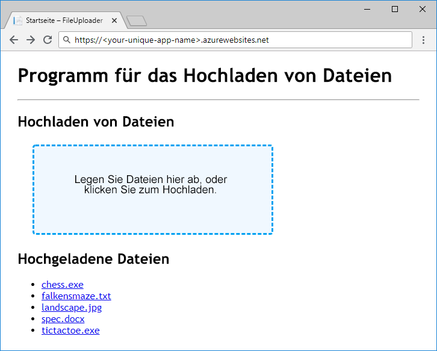

Sobald wir wissen, wie wir die Daten in Speicherkonten, Containern und Blobs speichern möchten, können wir uns überlegen, welche Azure-Ressourcen wir zur Unterstützung der App erstellen müssen.

### <a name="storage-accounts"></a>Speicherkonten

Die Erstellung eines Speicherkontos ist eine Verwaltungsaktivität, die vor der Bereitstellung und Ausführung Ihrer App stattfindet. Konten werden in der Regel durch ein Skript für die Einrichtung einer Bereitstellung oder Umgebung, eine Azure Resource Manager-Vorlage oder manuell durch einen Administrator erstellt. Anwendungen, bei denen es sich nicht um Verwaltungstools handelt, sollten grundsätzlich nicht über die Berechtigungen zum Erstellen von Speicherkonten verfügen.

### <a name="containers"></a>Container

Im Gegensatz zum Erstellen eines Speicherkontos ist das Erstellen eines Containers eine relativ einfache Aktivität, die problemlos in einer App ausgeführt werden kann. Es ist nicht ungewöhnlich, dass Apps im Rahmen ihrer Funktionalität Container erstellen und löschen.

Bei Apps, die einen bekannten Satz an Containern mit hartcodierten oder vorkonfigurierten Namen benötigen, ist es gang und gäbe, dass diese Apps die benötigten Container beim Starten oder bei der ersten Verwendung erstellen, falls diese noch nicht vorhanden sind. Wenn Sie die Containererstellung nicht im Rahmen der App-Bereitstellung durchführen, sondern Ihrer App überlassen, entfällt sowohl für Ihre Anwendung als auch für Ihren Bereitstellungsprozess die Notwendigkeit, die Namen der Container kennen zu müssen, die von der App verwendet werden.

## <a name="exercise"></a>Übung

Die Bereitstellung einer ASP.NET Core-App wird abgeschlossen, indem Sie Code zum Verwenden von Azure Blob Storage hinzufügen. Bei dieser Übung geht es nicht um das Entwerfen einer Organisation und eines Benennungsschemas, sondern um das Kennenlernen der Blob Storage-API. Dennoch finden Sie hier einen kurzen Überblick über die App und die Art der Datenspeicherung:



Unsere App funktioniert wie ein freigegebener Ordner, der Dateiuploads akzeptiert und diese zum Download zur Verfügung stellt. Sie verwendet keine Datenbank zum Organisieren von Blobs, sondern bereinigt die Namen von hochgeladenen Dateien und verwendet diese direkt als Blobnamen. Alle hochgeladenen Dateien werden in einem einzigen Container gespeichert.

Der Code, mit dem wir beginnen, lässt sich kompilieren und ausführen, aber die für das Speichern und Laden von Daten zuständigen Teile sind leer. Nachdem wir den Code fertig gestellt haben, stellen wir die App in Azure App Service bereit und testen sie.

Nun richten wir die Speicherinfrastruktur für unsere App ein.

### <a name="storage-account"></a>Speicherkonto

[!include[](../../../includes/azure-sandbox-activate.md)]

[!include[](../../../includes/azure-sandbox-regions-first-mention-note.md)]

Verwenden Sie die Azure Cloud Shell-Terminal, um ein Speicherkonto erstellen. Sie müssen einen eindeutigen Namen für das Speicherkonto angeben. Notieren Sie sich diesen Namen, da Sie in später benötigen.

```console
az storage account create --name <your-unique-storage-account-name> --resource-group <rgn>[Sandbox resource group name]</rgn> --location <location-name> --kind StorageV2
```

> [!NOTE]
> Warum „`--kind StorageV2`“? Es gibt verschiedene Arten von Speicherkonten. Für die meisten Szenarios sollten Sie Konten vom Typ „Allgemein v2“ verwenden. Der einzige Grund, aus dem hier `--kind StorageV2` explizit angegeben werden sollten, besteht darin, dass Konten vom Typ „Allgemein v2“ noch recht neu sind und im Azure-Portal oder der in der Azure CLI noch nicht als Standardkonten festgelegt wurden.

### <a name="container"></a>Container

Die App, mit der wir in diesem Modul arbeiten, verwendet einen einzelnen Container. Wir wenden eine bewährte Methode an und überlassen der App die Erstellung des Containers beim Start. Die Containererstellung kann aber auch über die Azure CLI erfolgen: Führen Sie „`az storage container create -h`“ im Cloud Shell-Terminal aus, wenn Sie sich die Dokumentation ansehen möchten.