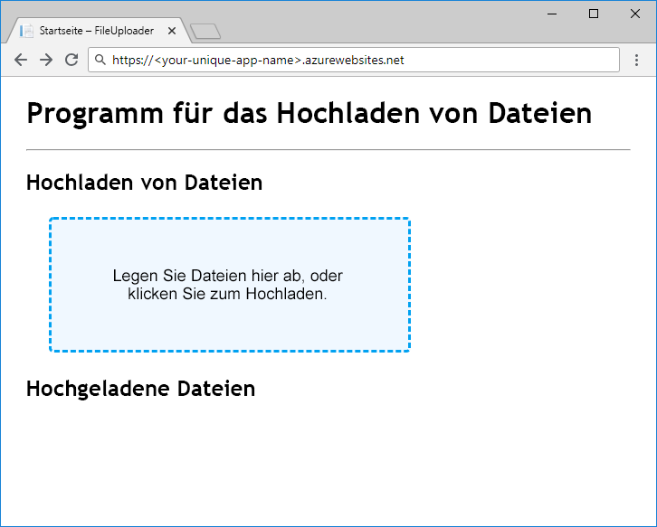

Sobald wir einen Verweis auf ein Blob haben, können wir Daten hoch- und herunterladen. `ICloudBlob`-Objekte verfügen über die Methoden `Upload` und `Download`, die Bytearrays, Datenströme und Dateien als Quellen und Ziele unterstützen. Bestimmte Typen bieten zur Vereinfachung zusätzliche Methoden. `CloudBlockBlob` unterstützt z.B. das Hoch- und Herunterladen von Zeichenfolgen mit `UploadTextAsync` und `DownloadTextAsync`.

## <a name="creating-new-blobs"></a>Erstellen neuer Blobs

Rufen Sie eine der `Upload`-Methoden für einen Verweis auf ein Blob auf, das nicht im Speicher vorhanden ist, um ein neues Blob zu erstellen. Dadurch werden die Daten hochgeladen und das Blob wird erstellt.

## <a name="moving-data-to-and-from-blobs"></a>Verschieben von Daten in und aus Blobs

Das Verschieben von Daten in und aus einem Blob ist ein Netzwerkvorgang, der Zeit in Anspruch nimmt. Im Azure Storage SDK für .NET Core geben alle Methoden, die Netzwerkaktivität erfordern, Aufgaben des Typs `Task` zurück. Stellen Sie deshalb sicher, dass Sie `await` entsprechend in Ihren Controllermethoden verwenden.

Eine gängige Empfehlung beim Arbeiten mit großen Datenobjekten ist die Verwendung von Datenströmen anstelle von In-Memory-Strukturen wie Bytearrays oder Zeichenfolgen. Dadurch wird vermieden, dass der gesamte Inhalt vor dem Senden zum Ziel im Speicher gepuffert wird. ASP.NET Core unterstützt das Lesen und Schreiben von Datenströmen aus Anforderungen und Antworten.

## <a name="concurrent-access"></a>Paralleler Zugriff

Andere Prozesse können Blobs hinzufügen, ändern oder löschen, während Ihre App sie verwendet. Programmieren Sie stets defensiv, und denken Sie an Probleme, die durch Parallelität verursacht werden, z.B. Blobs, die direkt gelöscht werden, wenn Sie versuchen, aus ihnen Daten herunterzuladen, oder Blobs, deren Inhalt sich ändert, wenn Sie dies nicht erwarten. Weitere Informationen zur Verwendung von „AccessConditions“ und Leases von Blobs zum Verwalten des parallelen Zugriffs auf Blobs finden Sie im Abschnitt „Weitere Informationen“ am Ende dieses Moduls.

## <a name="exercise"></a>Übung

Lassen Sie uns unsere App fertig stellen, indem wir Code zum Hoch- und Herunterladen hinzufügen und ihn dann zum Testen an Azure App Service verteilen.

### <a name="upload"></a>Hochladen

Um ein Blob hochzuladen, implementieren wir die `BlobStorage.Save`-Methode `GetBlockBlobReference` zum Abrufen von `CloudBlockBlob` aus dem Container. `FilesController.Upload` übergibt den Dateidatenstrom an `Save`, sodass Sie `UploadFromStreamAsync` zum Durchführen des Hochladens mit maximaler Effizienz nutzen können.

Öffnen Sie `Save` im Editor, und ersetzen Sie `BlobStorage.cs` durch folgenden Code:

```csharp
public Task Save(Stream fileStream, string name)
{
    CloudStorageAccount storageAccount = CloudStorageAccount.Parse(storageConfig.ConnectionString);
    CloudBlobClient blobClient = storageAccount.CreateCloudBlobClient();
    CloudBlobContainer container = blobClient.GetContainerReference(storageConfig.FileContainerName);
    CloudBlockBlob blockBlob = container.GetBlockBlobReference(name);
    return blockBlob.UploadFromStreamAsync(fileStream);
}
```

> [!NOTE]
> Der hier gezeigte datenstrombasierte Uploadcode ist effizienter als das Einlesen der Datei in ein Bytearray, bevor sie an Azure Blob Storage gesendet wird. Die ASP.NET Core-Technik `IFormFile`, die wir verwenden, um die Datei vom Client abzurufen, ist jedoch keine echte durchgängige Streamingimplementierung und eignet sich nur für das Hochladen kleiner Dateien. Informationen zu vollständig gestreamten Uploads von Dateien finden Sie im Abschnitt „Weitere Informationen“ am Ende dieses Moduls.

### <a name="download"></a>Herunterladen

`BlobStorage.Load` gibt einen `Stream` zurück, was bedeutet, dass unser Code die Bytes aus dem Blobspeicher überhaupt nicht verschieben muss. Wir müssen nur einen Verweis auf den Blobdatenstrom zurückgeben. Dazu verwenden wir `OpenReadAsync`. ASP.NET Core übernimmt das Lesen und Schließen des Datenstroms, wenn die Clientantwort erstellt wird.

Ersetzen Sie `Load` durch den folgenden Code, und speichern Sie Ihre Arbeit:

```csharp
public Task<Stream> Load(string name)
{
    CloudStorageAccount storageAccount = CloudStorageAccount.Parse(storageConfig.ConnectionString);
    CloudBlobClient blobClient = storageAccount.CreateCloudBlobClient();
    CloudBlobContainer container = blobClient.GetContainerReference(storageConfig.FileContainerName);
    return container.GetBlobReference(name).OpenReadAsync();
}
```

### <a name="deploy-and-run-in-azure"></a>Bereitstellen und Ausführen in Azure

Ihre App ist fertig. Stellen Sie sie bereit, und sehen Sie sich an, wie sie funktioniert. Erstellen Sie eine App Service-App, und konfigurieren Sie diese mit den Anwendungseinstellungen für die Verbindungszeichenfolge und den Containernamen des Speicherkontos. Rufen Sie mit `az storage account show-connection-string` die Verbindungszeichenfolge des Speicherkontos ab, und legen Sie `files` für den Namen des Containers fest.

Der App-Name muss global eindeutig sein. Daher müssen Sie für `<your-unique-app-name>` einen eigenen Namen auswählen.

```azurecli
az appservice plan create --name blob-exercise-plan --resource-group <rgn>[sandbox resource group name]</rgn>
az webapp create --name <your-unique-app-name> --plan blob-exercise-plan --resource-group <rgn>[sandbox resource group name]</rgn>
CONNECTIONSTRING=$(az storage account show-connection-string --name <your-unique-storage-account-name> --output tsv)
az webapp config appsettings set --name <your-unique-app-name> --resource-group <rgn>[sandbox resource group name]</rgn> --settings AzureStorageConfig:ConnectionString=$CONNECTIONSTRING AzureStorageConfig:FileContainerName=files
```

Jetzt stellen Sie die App bereit. Mit den folgenden Befehlen wird die Website im Ordner `pub` veröffentlicht, in `site.zip` komprimiert und die ZIP-Datei in App Service bereitgestellt.

> [!NOTE]
> Stellen Sie sicher, dass Ihre Shell sich im `mslearn-store-data-in-azure/store-app-data-with-azure-blob-storage/src/start`-Verzeichnis für die folgenden Befehle befindet.

```azurecli
dotnet publish -o pub
cd pub
zip -r ../site.zip *
az webapp deployment source config-zip --src ../site.zip --name <your-unique-app-name> --resource-group <rgn>[sandbox resource group name]</rgn>
```

Öffnen Sie `https://<your-unique-app-name>.azurewebsites.net` in einem Browser, um die ausgeführte App anzuzeigen. Es sollte etwa wie im folgenden Bild aussehen.



Versuchen Sie, einige Dateien hochzuladen und herunterzuladen, um die App zu testen. Nachdem Sie einige Dateien hochgeladen haben, führen Sie Folgendes in der Shell aus, um die Blobs anzuzeigen, die in den Container hochgeladen wurden:

```console
az storage blob list --account-name <your-unique-storage-account-name> --container-name files --query [].{Name:name} --output table
```