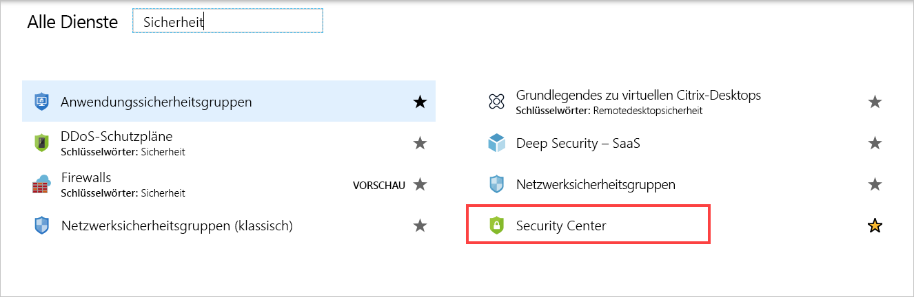
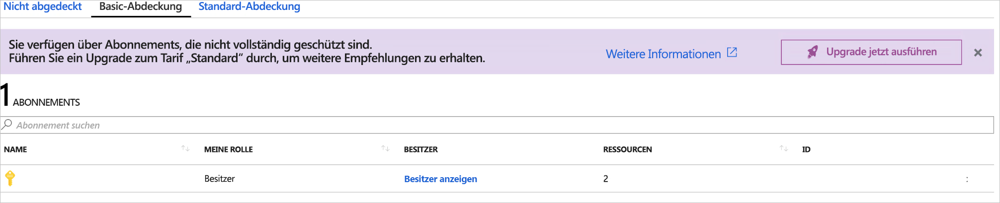
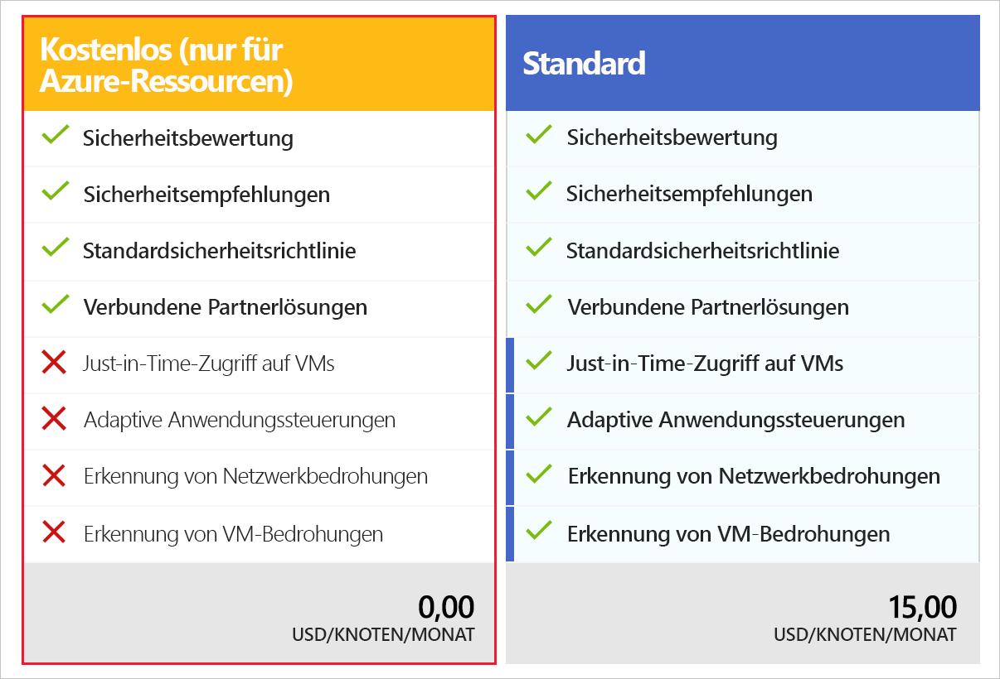

Eines der größten Probleme in Bezug auf die Sicherheit besteht darin, alle Bereiche zu erkennen, die geschützt werden müssen, und Sicherheitsrisiken zu ermitteln, bevor Hackern dies gelingt.One of the biggest problems with security is being able to see all the areas you need to protect and to find vulnerabilities before hackers do. Azure stellt den Azure Security Center-Dienst bereit, um dies zu vereinfachen.Azure provides a service which makes this much easier called Azure Security Center.

## Was ist Azure Security Center?What is Azure Security Center?

Azure Security Center (ASC) ist ein Überwachungsdienst, der Schutz vor Bedrohungen für Ihre gesamten Dienste ermöglicht – sowohl in Azure als auch lokal.Azure Security Center (ASC) is a monitoring service that provides threat protection across all of your services both in Azure, and on-premises. Sie haben damit folgende Möglichkeiten:It can:

- Bereitstellen von Sicherheitsempfehlungen basierend auf Ihren Konfigurationen, Ressourcen und NetzwerkenProvide security recommendations based on your configurations, resources, and networks.
- Überwachen von Sicherheitseinstellungen für Workloads lokal und in der Cloud und automatisches Anwenden der erforderlichen Sicherheitsmaßnahmen auf neue Dienste, wenn diese in den Onlinezustand versetzt werdenMonitor security settings across on-premises and cloud workloads and automatically apply required security to new services as they come online.
- Fortlaufendes Überwachen Ihrer gesamten Dienste und Durchführen von automatischen Sicherheitsbewertungen zur Identifikation von potenziellen Sicherheitsrisiken, bevor diese ausgenutzt werden könnenContinuously monitor all your services and perform automatic security assessments to identify potential vulnerabilities before they can be exploited.
- Verwenden des maschinellen Lernens zum Erkennen und Blockieren der Installation von Schadsoftware in Ihren Diensten und auf Ihren virtuellen Computern.Use machine learning to detect and block malware from being installed in your services and virtual machines. Sie können Anwendungen auch auf eine Positivliste setzen, um sicherzustellen, dass die von Ihnen überprüften Apps ausgeführt werden dürfen.You can also white-list applications to ensure that only the apps you validate are allowed to execute.
- Analysieren und Identifizieren von potenziellen eingehenden Angriffen und Untersuchen von Bedrohungen und etwaigen Aktivitäten nach SicherheitsverletzungenAnalyze and identify potential inbound attacks and help to investigate threats and any post-breach activity which might have occurred.
- Just-In-Time-Zugriffssteuerung für Ports zur Reduzierung Ihrer Angriffsfläche, indem sichergestellt wird, dass für das Netzwerk nur benötigter Datenverkehr zugelassen wirdJust-In-Time access control for ports, reducing your attack surface by ensuring the network only allows traffic you require.

ASC ist Teil der Empfehlungen des [Center for Internet Security](https://www.cisecurity.org/cis-benchmarks/) (CIS).ASC is part of the [Center for Internet Security](https://www.cisecurity.org/cis-benchmarks/) (CIS) recommendations.

## Aktivieren von Azure Security CenterActivating Azure Security Center

Azure Security Center bietet einheitliche Funktionen für die Sicherheitsverwaltung und den erweiterten Schutz vor Bedrohungen für Hybrid Cloud-Workloads und wird in zwei Tarifen angeboten: Free und Standard.Azure Security Center provides unified security management and advanced threat protection for hybrid cloud workloads and is offered in two tiers: Free and Standard. Der Free-Tarif bietet Sicherheitsrichtlinien, Bewertungen und Empfehlungen, der Standard-Tarif eine Reihe robuster Funktionen einschließlich Threat Intelligence.The free tier provides security policies, assessments, and recommendations while the Standard tier provides a robust set of features, including threat intelligence.

Aufgrund der Vorteile von ASC hat das Sicherheitsteam Ihres Unternehmens die Entscheidung getroffen, den Dienst für alle genutzten Abonnements zu aktivieren.Given the benefits of ASC, the security team at your company has decided that it be turned on for all subscriptions at your office. Sie haben heute Morgen eine E-Mail mit dem Hinweis erhalten, den Dienst für Ihre Anwendungen zu aktivieren. Wir sehen uns also an, wie Sie dies erreichen.You got an email this morning to turn it on for your applications - so let's look at how to do that.

> [!IMPORTANT]
> Azure Security Center wird in der kostenlosen Azure-Sandbox nicht unterstützt.Azure Security Center is not supported in the free Azure Sandbox. Sie können diese Schritte in Ihrem eigenen Abonnement ausführen oder einfach nachvollziehen, um zu verstehen, wie Sie ASC aktivieren.You can perform these steps in your own subscription, or just follow along to understand how to activate ASC.

1. Öffnen Sie das [Azure-Portal](https://portal.azure.com?azure-portal=true), und wählen Sie im Menü auf der linken Seite die Option **Azure Security Center**. Wenn die Option nicht angezeigt wird, können Sie **Alle Dienste** auswählen und wie unten gezeigt im Sicherheitsabschnitt nach **Security Center** suchen.Open the [Azure portal](https://portal.azure.com?azure-portal=true) and select **Azure Security Center** from the left-hand menu, if you don't see it there, you can select **All services** and find **Security Center** in the security section as shown below.

2. Falls Sie ASC zum ersten Mal öffnen, wird das Blatt mit dem Eintrag **Erste Schritte** gestartet, und Sie werden ggf. aufgefordert, ein Upgrade für Ihr Abonnement durchzuführen.If you have never opened ASC, the blade will start on the **Getting started** entry which might ask you to upgrade your subscription. Ignorieren Sie dies vorerst, und wählen Sie unten auf der Seite die Option **Überspringen** und dann **Übersicht**.Ignore that for now, select **Skip** at the bottom of the page, and then select **Overview**.
    - Eine allgemeine Sicherheitsübersicht für alle verfügbaren Elemente Ihres Abonnements wird angezeigt.This will display the "big security picture" across all the elements available in your subscription.
    - Sie können viele verschiedene Informationen erkunden.This has a ton of great information you can explore.

3. Wählen Sie als Nächstes unter „Richtlinie und Konformität“ die Option **Abdeckung** aus.Next, select **Coverage**, under "Policy and Compliance". Es wird angezeigt, welche Abonnementelemente mit ASC abgedeckt bzw. nicht abgedeckt werden.This will display what subscription elements are being covered (or not covered) by ASC. Hier können Sie ASC für alle Abonnements aktivieren, auf die Sie Zugriff haben.Here you can turn on ASC for any subscription you have access to. Versuchen Sie, zwischen den drei Abdeckungsbereichen zu wechseln: „Nicht abgedeckt“, „Basic-Abdeckung“ und „Standard-Abdeckung“.Try switching between the three coverage areas: "Not covered", "Basic coverage" and "Standard coverage".

4. Abonnements, die nicht abgedeckt sind, verfügen über eine Aufforderung zur Aktivierung von ASC.Subscriptions that are not covered will have a prompt to activate ASC. Sie können die Schaltfläche „Jetzt aktualisieren“ verwenden, um ASC für alle Ressourcen des Abonnements zu aktivieren.You can press the "Upgrade Now" button to enable ASC for all the resources in the subscription.

### Vergleich: Tarif „Free“ und Tarif „Standard“Free vs. Standard pricing tier

Sie können für ASC zwar auch einen kostenlosen Azure-Abonnementtarif verwenden, aber dann sind nur Bewertungen und Empfehlungen für Azure-Ressourcen möglich.While you can use a free Azure subscription tier with ASC, it is limited to assessments and recommendations of Azure resources only. Um ASC wirklich zu nutzen, müssen Sie wie oben gezeigt ein Upgrade auf ein Abonnement des Standard-Tarifs durchführen.To really leverage ASC, you will need to upgrade to a Standard tier subscription as shown above. Sie können Ihr Abonnement wie oben beschrieben über die Schaltfläche „Jetzt aktualisieren“ auf dem Blatt **Abdeckung** aktualisieren.You can upgrade your subscription through the "Upgrade Now" button in the **Coverage** blade as noted above. Sie können auch im ASC-Menü zum Blatt **Erste Schritte** wechseln, auf dem das Ändern der Abonnementebene Schritt für Schritt beschrieben wird.You can also switch to the **Getting Started** blade in the ASC menu which will walk you through changing your subscription level. Die Preise und Features können sich je nach Region ändern. Eine vollständige Übersicht finden Sie auf der [Seite mit den Preisen](https://azure.microsoft.com/pricing/details/security-center/).The pricing and features may change based on the region, you can get a full overview on the [pricing page](https://azure.microsoft.com/pricing/details/security-center/). 

> [!NOTE]
> Um ein Abonnement auf den Standard-Tarif zu aktualisieren, muss Ihnen die Rolle „Abonnementbesitzer“, „Abonnementmitwirkender“ oder „Sicherheitsadministrator“ zugewiesen werden.To upgrade a subscription to the Standard tier, you must be assigned the role of Subscription Owner, Subscription Contributor, or Security Admin.

> [!IMPORTANT]
> Nachdem der Testzeitraum von 60 Tagen abgelaufen ist, beträgt der Preis für ASC **monatlich 15 USD/Knoten** und wird Ihrem Konto berechnet.After the 60-day trial period is over, ASC is priced at **$15/node per month** and will be billed to your account.

## Deaktivieren von Azure Security CenterTurning off Azure Security Center

Für Produktionssysteme ist es ratsam, Azure Security Center deaktiviert zu lassen, damit darüber alle Ressourcen auf Bedrohungen überwacht werden können.For production systems, you will definitely want to keep Azure Security Center turned on so it can monitor all your resources for threats. Wenn Sie ASC aber lediglich ausprobieren möchten und nur zu diesem Zweck aktiviert haben, empfiehlt es sich, die Anwendung zu deaktivieren, damit keine Kosten anfallen.However, if you are just playing with ASC and turned it on, you will likely want to disable it to ensure you are not charged. Dies führen wir nun durch.Let's do that now.

1. Öffnen Sie das [Azure-Portal](https://portal.azure.com?azure-portal=true), und wählen Sie im Menü auf der linken Seite die Option **Azure Security Center**. Wenn die Option nicht angezeigt wird, können Sie **Alle Dienste** auswählen und wie unten gezeigt im Sicherheitsabschnitt nach **Security Center** suchen.Open the [Azure portal](https://portal.azure.com?azure-portal=true) and select **Azure Security Center** from the left-hand menu, if you don't see it there, you can select **All services** and find **Security Center** in the security section as shown below.

2. Wählen Sie im Menü auf der linken Seite die Option **Sicherheitsrichtlinie** aus.Select **Security Policy** from the left-hand menu.

3. Wählen Sie als Nächstes neben dem Abonnement, für das Sie für ASC ein Downgrade durchführen möchten, die Option **Einstellungen bearbeiten** aus.Next, select **Edit settings >**, next to the subscription for which you want to downgrade ASC.

4. Wählen Sie im nächsten Bildschirm im Menü auf der linken Seite die Option „Tarif“ aus.On the next screen select "Pricing Tier" from the left-hand menu.

5. Eine neue Seite wird angezeigt, die wie folgt aussieht.A new page will appear that looks like the image below. Klicken Sie links auf das Feld „Free (for Azure resources only)“ (Free (nur für Azure-Ressourcen)).Click on the box on the left that says "Free (for Azure resources only)".

6. Klicken Sie oben auf dem Bildschirm auf **Speichern**.Press the **Save** button at the top of the screen.

Sie haben für Ihr Abonnement jetzt das Downgrade auf den Free-Tarif von Azure Security Center durchgeführt.You have now downgraded your subscription to the free tier of Azure Security Center.

Glückwunsch! Sie haben den ersten (und wichtigsten) Schritt zum Schützen Ihrer Anwendung, der Daten und des Netzwerks getan!Congratulations, you have taken your first (and most important) step to securing your application, data and network!