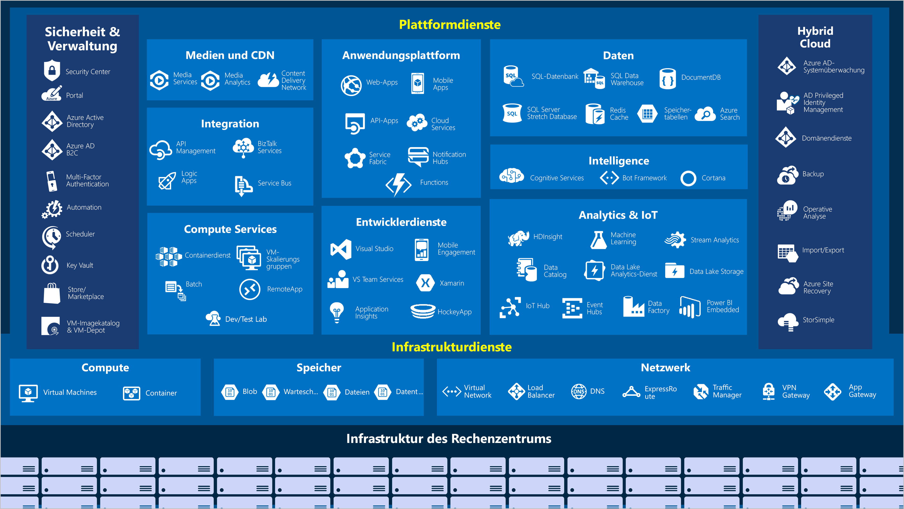
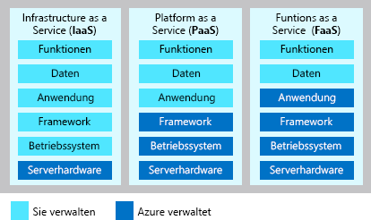

Microsoft Azure ist ein Portfolio mit Clouddiensten, das kontinuierlich erweitert wird und Ihre Organisation dabei unterstützt, aktuelle und zukünftige geschäftliche Herausforderungen zu bewältigen.Microsoft Azure is a continually expanding set of cloud services that help your organization meet your current and future business challenges. Mit Azure können Sie Anwendungen in einem umfassenden globalen Netzwerk mit Ihren bevorzugten Tools und Frameworks erstellen, verwalten und bereitstellen.Azure gives you the freedom to build, manage, and deploy applications on a massive global network using your favorite tools and frameworks. Verschaffen wir uns nun einen Überblick über die allgemeinen Dienste, die Azure bereitstellt.Let's take a quick tour of the high-level services Azure offers.

#### Azure: ÜbersichtAzure: the big picture

> [!VIDEO https://www.microsoft.com/videoplayer/embed/RE2yuas]

## Azure-DiensteAzure services

Azure bietet eine große Bandbreite cloudbasierter Dienste, denen jeden Monat neue und erweiterte Features hinzugefügt werden.Azure provides a vast range of cloud-based services, with features added and enhanced every month. 

Sehen wir uns einige häufig verwendete Features genauer an:Let's take a closer look at a few of the more commonly-used features: 

- ComputeCompute
- NetzwerkNetworking
- SpeicherStorage
- MobileMobile
- DatenbankenDatabases
- WebWeb

### ComputeCompute

Computedienste sind einer der Hauptgründe, aus denen Unternehmen auf die Azure-Plattform umsteigen.Compute services are one of the primary reasons why companies move to the Azure platform. Azure bietet eine Vielzahl von Optionen zum Hosten von Anwendungen und Diensten:Azure provides a range of options for hosting applications and services including:

Hier sind einige Beispiele für IaaS, PaaS und FaaS in Azure.Here are some examples of IaaS, PaaS, and FaaS in Azure.

|  TypType  |  DienstnameService name             | Funktion des DienstsService function                                                         |
|--------|---------------------------|--------------------------------------------------------------------------|
| IaaSIaaS   | Azure Virtual MachinesAzure Virtual Machines    | In Azure gehostete Windows- oder Linux-VMsWindows or Linux virtual machines (VMs) hosted in Azure                  | 
| IaaSIaaS   | Azure Kubernetes ServiceAzure Kubernetes Service  | Ermöglicht die Verwaltung eines Clusters aus VMs, die Dienste in Containern ausführenEnables management of a cluster of VMs that run containerized services   |
| PaaSPaaS   | Azure Service FabricAzure Service Fabric      | Plattform für verteilte Systeme.Distributed systems platform. Wird in Azure oder lokal ausgeführt.Runs in Azure or on-premises               |
| PaaSPaaS   | Azure BatchAzure Batch               | Verwalteter Dienst für parallele und hochleistungsfähige Computinganwendungen.Managed service for parallel and high-performance computing applications |
| PaaSPaaS   | Azure Cloud ServicesAzure Cloud Services      | Verwalteter Dienst zum Ausführen von CloudanwendungenManaged service for running cloud applications                           |
| FaaSFaaS   | Azure Container InstancesAzure Container Instances | Stellt Container bereit, ohne VMs oder höherwertige Dienste zu erfordernProvides containers without requiring VM provision or higher services    |
| FaaSFaaS   | Azure FunctionsAzure Functions           | Verwalteter FaaS-DienstManaged FaaS service                                                     |

### NetzwerkNetworking

Das Verknüpfen von Computeressourcen und Ermöglichen des Zugriffs auf Anwendungen sind die Hauptfunktionen von Azure-Netzwerken.Linking compute resources and providing access to applications is the key function of Azure networking. Die Netzwerkfunktionen in Azure umfassen eine Reihe von Optionen, um die Außenwelt mit Diensten und Features in den globalen Microsoft Azure-Rechenzentren zu verbinden.Networking functionality in Azure includes a range of options to connect the outside world to services and features in the global Microsoft Azure datacenters.

Die Azure-Netzwerkfunktionen bieten folgende Features:Azure networking facilities have the following features:

|  DienstnameService name             | Funktion des DienstsService function                                                                     |
| -------------             | -------------                                                                        |
| Azure Virtual NetworkAzure Virtual Network     | Verknüpfen von VMs mit eingehenden VPN-Verbindungen (virtuelles privates Netzwerk)Connects VMs to incoming Virtual Private Network (VPN) connections                   |
| Azure Load BalancerAzure Load Balancer       | Gleichmäßige Verteilung ein- und ausgehender Verbindungen auf Anwendungen oder DienstendpunkteBalances inbound and outbound connections to applications or service endpoints       |
| Azure Application GatewayAzure Application Gateway | Optimieren der Bereitstellung von App-Serverfarmen und gleichzeitiges Erhöhen der AnwendungssicherheitOptimizes app server farm delivery while increasing application security             |
| Azure VPN GatewayAzure VPN Gateway         | Zugriff auf Azure Virtual Networks über hochleistungsfähige VPN-GatewaysAccesses Azure Virtual Networks through high-performance VPN gateways                |
| Azure DNSAzure DNS                 | Bereitstellen von ultraschnellen DNS-Antworten und ultrahoher DomänenverfügbarkeitProvides ultra-fast DNS responses and ultra-high domain availability                 |
| Azure Content Delivery NetworkAzure Content Delivery Network  | Inhaltsbereitstellung mit hoher Bandbreite für Kunden auf der ganzen WeltDelivers high-bandwidth content to customers globally                          |
| Azure DDoS ProtectionAzure DDoS Protection     | Schützen von in Azure gehosteten Anwendungen vor DDoS-Angriffen (Distributed Denial of Service)Protects Azure-hosted applications from distributed denial of service (DDOS) attacks |
| Azure Traffic ManagerAzure Traffic Manager     | Verteilen des Netzwerkdatenverkehrs über Azure-Regionen weltweitDistributes network traffic across Azure regions worldwide                           |
| Azure ExpressRouteAzure ExpressRoute        | Dedizierte sichere Verbindungen mit Azure mit hoher BandbreiteConnects to Azure over high-bandwidth dedicated secure connections                   |
| Azure Network WatcherAzure Network Watcher     | Überwachen und Diagnostizieren von Netzwerkproblemen mithilfe von szenariobasierten AnalysenMonitors and diagnoses network issues using scenario-based analysis                  |
| Azure FirewallAzure Firewall            | Implementieren einer Firewall mit hoher Sicherheit und Verfügbarkeit sowie unbegrenzter SkalierbarkeitImplements high-security, high-availability firewall with unlimited scalability      |
| Azure Virtual WANAzure Virtual WAN         | Erstellen eines einheitlichen WAN, über das lokale und Remotestandorte verbunden werdenCreates a unified wide area network (WAN), connecting local and remote sites         |

### SpeicherStorage

Azure bietet vier wesentliche Arten von Speicherdiensten.Azure provides four main types of storage services. Folgende Dienste stehen zur Verfügung:These services are:

- **Azure Blob Storage** bietet Speicher für sehr große Objekte wie Videodateien oder Bitmaps.**Azure Blob storage** - provides storage for very large objects, such as video files or bitmaps
- **Azure File Storage** erstellt Dateifreigaben, deren Verwaltung und Zugriff genauso wie bei einem Dateiserver funktioniert.**Azure File storage** - creates file shares that you can access and manage like a file server
- **Azure Queue Storage** implementiert einen Speicher für Warteschlangen und die zuverlässige Übermittlung von Nachrichten zwischen Anwendungen.**Azure Queue storage** - implements a store for queuing and reliably delivering messages between applications
- **Azure Table Storage** besteht aus einem NoSQL-Speicher, der unstrukturierte Daten unabhängig von einem Schema hostet.**Azure Table storage** - consists of a NoSQL store that hosts unstructured data independent of any schema

All diese Dienste weisen die folgenden gemeinsamen Merkmale auf:Each of these services shares common characteristics, which are:

- Dauerhaft und hochverfügbar durch Redundanz- und Replikationsfunktionen.Durable and highly available with redundancy and replication.
- Sicher dank automatischer Verschlüsselung und rollenbasierter Zugriffssteuerung.Secure through automatic encryption and role-based access control.
- Skalierbar dank praktisch unbegrenzter Speichermenge.Scalable with virtually unlimited storage.
- Verwaltung sowie und Behandlung aller kritischen Probleme werden für Sie übernommen.Managed, handling maintenance and any critical problems for you.
- Zugriff von jedem Ort der Welt über HTTP oder HTTPS möglich.Accessible from anywhere in the world over HTTP or HTTPS.

### MobileMobile

Azure ermöglicht Entwicklern, mit einer Vielzahl von Sprachen und in der Entwicklungsumgebung ihrer Wahl schnell und einfach ansprechende iOS-, Android- und Windows-Apps zu erstellen.Azure enables developers to create engaging iOS, Android, and Windows apps quickly and easily in a wide range of languages using their choice of development environment. Features, die bisher viel Zeit kosteten und das Projektrisiko erhöhten, z.B. das Hinzufügen von Unternehmensanmeldungen und Herstellen von Verbindungen mit lokalen Ressourcen wie SAP, Oracle, SQL Server und SharePoint, lassen sich jetzt ganz einfach integrieren.Features that used to take time and increase project risks, such as adding corporate sign-in and then connecting to on-premises resources such as SAP, Oracle, SQL Server, and SharePoint, are now simple to include.

Dieser Dienst bietet zudem folgende Features:Other features of this service include:

- Offlinedatensynchronisierung.Offline data synchronization.
- Konnektivität zu lokalen Daten.Connectivity to on-premises data.
- Übertragen von Pushbenachrichtigungen.Broadcasting push notifications.
- Automatische Skalierung zum Erfüllen sich verändernder Geschäftsanforderungen.Autoscaling to match business needs.

### DatenbankenDatabases

Azure bietet mehrere Datenbankdienste, um eine Vielzahl von Datentypen und Datenvolumen zu speichern.Azure provides multiple database services to store a wide variety of data types and volumes. Und dank der globalen Konnektivität sind diese Daten für Benutzer sofort verfügbar.And with global connectivity, this data is available to users instantly.

|  DienstnameService name              | Funktion des DienstsService function                                                                                |
| -------------              | -------------                                                                                   |
| Azure Cosmos DBAzure Cosmos DB            | Global verteilte Datenbank, die NoSQL-Optionen unterstützt.Globally distributed database that supports NoSQL options                                       |
| Azure SQL-DatenbankAzure SQL Database         | Vollständig verwaltete relationale Datenbank mit automatischer Skalierung, integrierten intelligenten Funktionen und stabiler Sicherheit.Fully managed relational database with auto-scale, integral intelligence, and robust security    |
| Azure Database for MySQLAzure Database for MySQL   | Vollständig verwaltete und skalierbare relationale MySQL-Datenbank mit hoher Verfügbarkeit und SicherheitFully managed and scalable MySQL relational database with high availability and security        |
| Azure Database for PostgreSQLAzure Database for PostgreSQL   | Vollständig verwaltete und skalierbare relationale PostgreSQL-Datenbank mit hoher Verfügbarkeit und SicherheitFully managed and scalable PostgreSQL relational database with high availability and security   |
| SQL Server auf virtuellen ComputernSQL Server on VMs          | Hosten von SQL Server-Unternehmens-Apps in der CloudHost enterprise SQL Server apps in the cloud                                                    |
| Azure SQL Data WarehouseAzure SQL Data Warehouse   | Vollständig verwaltetes Data Warehouse mit integrierter Sicherheit in jeder Größenordnung ohne ZusatzkostenFully managed data warehouse with integral security at every level of scale at no extra cost    |
| Azure Database Migration ServiceAzure Database Migration Service    | Migrieren Ihrer Datenbanken in die Cloud, ohne Änderungen am Anwendungscode vorzunehmenMigrates your databases to the cloud with no application code changes                  |
| Azure Redis CacheAzure Redis Cache          | Zwischenspeichern von häufig verwendeten und statischen Daten, um die Latenz für Daten und Anwendungen zu reduzierenCaches frequently used and static data to reduce data and application latency                   |
| Azure Database for MariaDBAzure Database for MariaDB | Vollständig verwaltete und skalierbare relationale MySQL-Datenbank mit hoher Verfügbarkeit und SicherheitFully managed and scalable MySQL relational database with high availability and security        |

### WebWeb

Webdienste in Azure umfassen die folgenden Funktionen:Web services in Azure include the following facilities:

| Name des DienstsService Name | BeschreibungDescription |
|--------------|-------------|
| Azure App ServiceAzure App Service | Schnelle Erstellung von leistungsstarken Cloud-Apps für Web- und MobilgeräteQuickly create powerful cloud apps for web and mobile. |
| Azure Notification HubsAzure Notification Hubs |Senden von Pushbenachrichtigungen an jede Plattform und von jedem Back-End ausSend push notifications to any platform from any back end. |
| Azure API ManagementAzure API Management | Sicheres Veröffentlichen von APIs für Entwickler, Partner und Mitarbeiter im erforderlichen UmfangPublish APIs to developers, partners, and employees securely and at scale. |
| Azure SearchAzure Search | Vollständig verwaltete SaaS-Lösung (Search-as-a-Service)Fully managed search as a service. |
| Web-Apps-Funktion von Azure App ServiceWeb Apps feature of Azure App Service | Erstellen und Bereitstellen von unternehmenskritischen Web-Apps nach MaßCreate and deploy mission-critical web apps at scale. |
| Azure SignalR ServiceAzure SignalR Service | Einfaches Hinzufügen von Echtzeit-WebfunktionenAdd real-time web functionalities easily. |

Nachdem wir einige Bereiche entdeckt haben, die für ein Unternehmen, das zu Azure wechseln möchte, von Interesse sein können, sehen wir uns an, welche Voraussetzungen zur Verwendung der Dienste und Funktionen erfüllt sein müssen.Now that we've identified some of the areas that might interest a company looking to migrate to Azure let's look at what it takes to use the services and features.
