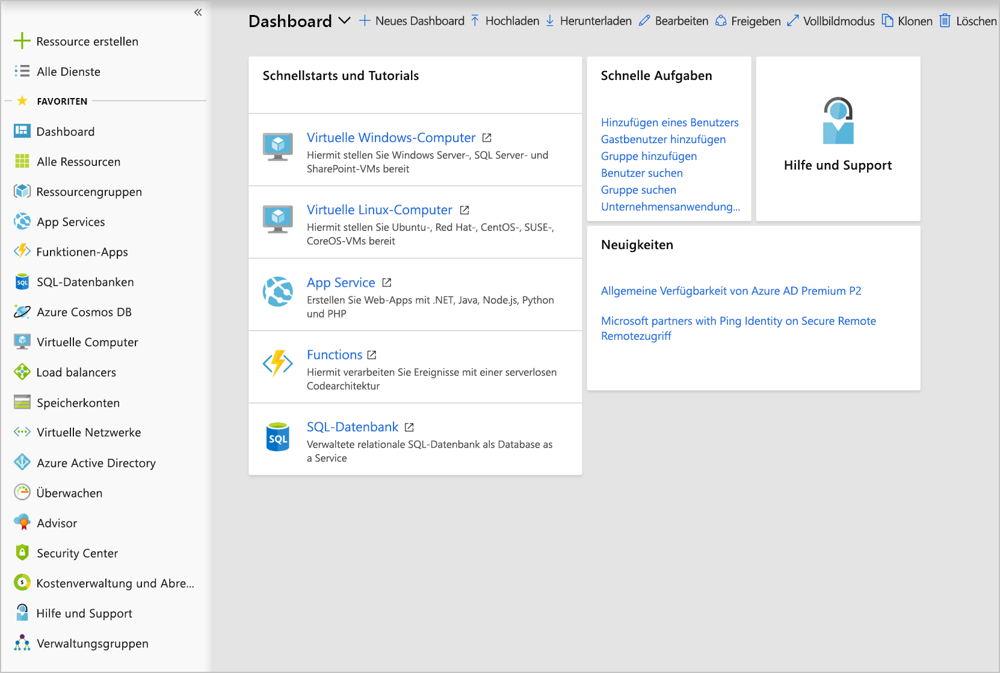
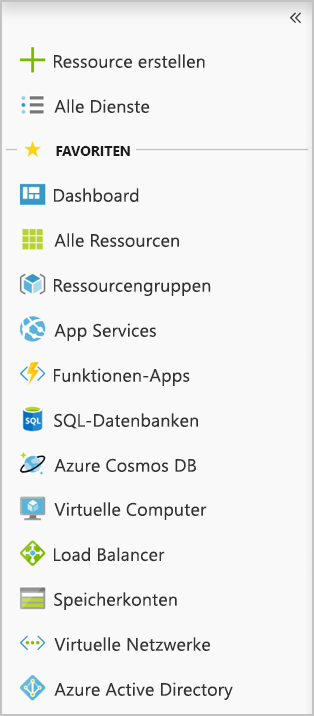
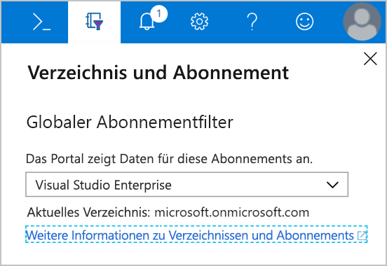

Nachdem wir nun über ein Konto verfügen, können wir uns beim **Azure-Portal** anmelden. Das Portal ist eine webbasierte Verwaltungswebsite, über die Sie mit allen Abonnements und Ressourcen interagieren können, die Sie erstellt haben. Über diese Webschnittstelle können Sie nahezu alle Aktionen für Azure ausführen.

## Layout des Azure-Portals

Das Azure-Portal ist die primäre grafische Benutzeroberfläche für die Steuerung von Microsoft Azure. Sie können einen Großteil der Verwaltungsaktionen im Portal ausführen. Das Portal ist in der Regel auch der beste Ort zur Durchführung einzelner Aufgaben oder zur Anzeige detaillierter Konfigurationsoptionen.

:::row:::
    :::column:::
    
    :::column-end:::
    :::column span="3":::
    **Ressourcenbereich**
    
    Auf der linken Randleiste des Portals befindet sich der Ressourcenbereich, in dem die wichtigsten Ressourcentypen aufgeführt werden. Beachten Sie, dass Azure über mehr Ressourcentypen verfügt als in dieser Liste angezeigt werden. Die aufgelisteten Ressourcen sind Teil Ihrer _Favoriten_. 

    Sie können diese Liste mit den bestimmten Ressourcentypen anpassen, die Sie am öftesten erstellen oder verwalten. 

    Sie können diesen Bereich auch mit dem Caretzeichen **<<** zuklappen. Dadurch wird der Bereich nur auf die Symbole minimiert. Dies ist praktisch, wenn Sie den gesamten verfügbaren Platz auf dem Bildschirm nutzen.
    :::column-end:::
:::row-end:::

Die restliche Portalansicht ist für die jeweiligen Elemente bestimmt, mit denen Sie arbeiten. Die Standardseite (Hauptseite) ist das _Dashboard_. Darauf gehen wir später noch näher ein. Aber soviel schon jetzt: Es stellt eine anpassbare Übersicht über Ihre Ressourcen dar. Sie können es verwenden, um zu bestimmten Ressourcen zu gelangen, die Sie verwalten möchten, oder um mit dem Eintrag **Alle Ressourcen** im Ressourcenbereich nach Ressourcen zu suchen. Wenn Sie eine Ressource (etwa einen virtuellen Computer oder eine Web-App) verwalten möchten, arbeiten Sie mit einem _Blatt_, auf dem spezifische Informationen zu der Ressource angezeigt werden.

## Was ist ein Blatt?

Die Navigation im Azure-Portal basiert auf Blättern. Ein _Blatt_ ist ein einblendbarer Bereich, der die Benutzeroberfläche für eine einzelne Ebene in einer Navigationssequenz enthält. Beispielsweise wird jedes der Elemente in der folgenden Sequenz durch ein Blatt repräsentiert: **Virtuelle Computer** > **Compute** > **Ubuntu Server**.

Jedes Blatt enthält Informationen und konfigurierbare Optionen. Einige dieser Optionen generieren ein weiteres Blatt, das rechts neben bereits vorhandenen Blättern angezeigt wird. Auch auf dem neuen Blatt erzeugen konfigurierbare Optionen ein weiteres Blatt usw. So ist möglicherweise bereits nach kurzer Zeit eine Vielzahl verschiedener Blätter geöffnet. Sie können Blätter auch maximieren, sodass sie den gesamten Bildschirm ausfüllen.

Da neue Blätter immer rechts neben dem Besitzer hinzugefügt werden, können Sie mithilfe der Scrollleiste am unteren Fensterrand zurückgehen, um nachzuvollziehen, wie Sie zum jeweiligen Teil der Konfiguration gelangt sind. Alternativ können Sie Blätter einzeln schließen, indem Sie auf die Schaltfläche `X` in der oberen Ecke des Blatts klicken. Wenn Sie Änderungen vorgenommen, aber noch nicht gespeichert haben, werden Sie von Azure darüber informiert, dass die Änderungen verloren gehen, wenn Sie den Vorgang fortsetzen.

## Konfigurieren von Einstellungen im Azure-Portal

Im Azure-Portal wird eine Reihe von Konfigurationsoptionen angezeigt – die meisten davon auf der Statusleiste im rechten oberen Bildschirmbereich.

### Benachrichtigungen

Durch Klicken auf das Glockensymbol wird der **Benachrichtigungsbereich** angezeigt. In diesem Bereich werden die letzten ausgeführten Aktionen mit dem dazugehörigen Status aufgelistet.

### Cloud Shell

Wenn Sie auf das Symbol **Cloud Shell** (>_) klicken, wird eine neue Azure Cloud Shell-Sitzung erstellt. Azure Cloud Shell ist eine interaktive, über den Browser zugängliche Shell für die Verwaltung von Azure-Ressourcen. Mit Azure Cloud Shell können Sie flexibel die Shell-Umgebung auswählen, die für Ihre Arbeitsweise am besten geeignet ist. Linux-Benutzer können eine Bash-Umgebung verwenden, während Windows-Benutzer PowerShell nutzen können. Mit diesem browserbasierten Terminal können Sie Ihre Azure-Ressourcen im aktuellen Abonnement über eine in das Portal integrierte Befehlszeilenschnittstelle steuern und verwalten.

### Einstellungen

Klicken Sie auf das **Zahnradsymbol**, um die Einstellungen des Azure-Portals zu ändern. Diese umfassen Folgendes:

- Uhrzeit der Abmeldung
- Farb- und Kontrastschemas
- Popupbenachrichtigungen (auf einem mobilen Gerät)
- Sprache und regionales Format

Wenn Sie die Einstellungen geändert haben, klicken Sie auf **Übernehmen**, um die Änderungen zu übernehmen.

### Das Blatt „Feedback“

Klicken Sie auf das **Smiley-Symbol**, um das Blatt **Senden Sie uns Feedback** zu öffnen. Hier können Sie Feedback zu Azure an Microsoft zu senden. Sie können angeben, ob Microsoft per E-Mail auf Ihr Feedback antworten darf.

### Das Blatt „Hilfe“

Klicken Sie auf das **Fragezeichensymbol**, um das Blatt **Hilfe** anzuzeigen. Hier stehen verschiedene Optionen zur Auswahl, darunter folgende:

- Neuigkeiten
- Azure-Roadmap
- Interaktive Tour starten
- Tastenkombinationen
- Diagnose anzeigen
- Datenschutz und Nutzungsbedingungen

### Verzeichnis und Abonnement

Klicken Sie auf das Symbol **Book and Filter** (Buchen und Filtern), um das Blatt **Directory + subscription** (Verzeichnis und Abonnement) anzuzeigen.

In Azure können Sie mehrere Abonnements mit einem einzigen Verzeichnis verknüpfen. Auf dem Blatt **Verzeichnis und Abonnement** können Sie zwischen den Abonnements wechseln. Hier können Sie das Abonnement ändern oder zu einem anderen Verzeichnis wechseln.

### Profileinstellungen

Wenn Sie auf den Namen in der oberen rechten Ecke klicken, wird ein Menü mit einigen Optionen geöffnet:

- Anmelden mit einem anderen Konto oder vollständige Abmeldung
- Anzeigen Ihres Kontoprofils, wo Sie das Kennwort ändern können
- Überprüfen Ihrer Berechtigungen
- Anzeigen Ihrer Rechnung (klicken Sie auf der rechten Seite auf die Auslassungspunkte „...“)
- Aktualisieren Ihrer Kontaktdaten (klicken Sie auf der rechten Seite auf die Auslassungspunkte „...“)

Wenn Sie auf die Auslassungspunkte (...) und dann auf **Meine Rechnung anzeigen** klicken, leitet Azure Sie zur Seite **Kostenverwaltung und Abrechnung – Rechnungen** weiter, auf der Sie analysieren können, wofür Azure-Kosten anfallen.

Aus der Benutzeroberfläche des Azure-Portals wird ersichtlich, dass Azure ein umfangreiches Produkt ist. Dank des Konzepts der verschiebbaren Blätter können Sie in den verschiedenen Verwaltungsaufgaben mühelos vor und zurück navigieren. Experimentieren Sie mit dieser Benutzeroberfläche, um ein wenig Übung zu bekommen.
