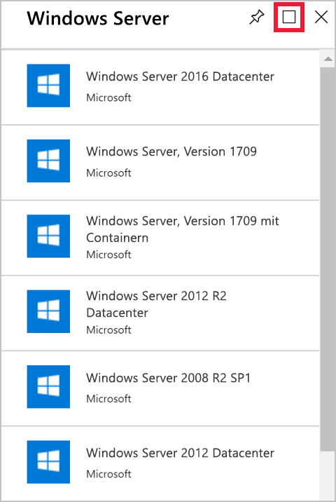
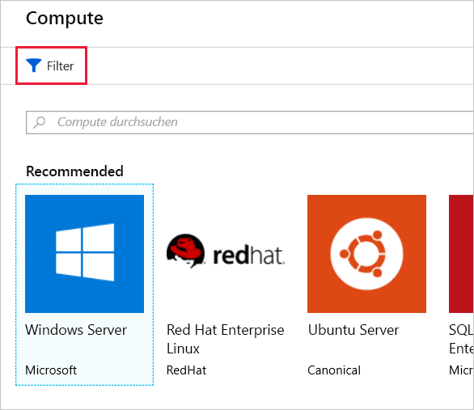

In dieser Einheit lernen Sie, wie Sie auf der Benutzeroberfläche des Azure-Portals mit Blättern arbeiten.In this unit, you will learn how to work with blades in the Azure portal user interface (UI). Sie können entweder ein eigenes Konto verwenden (falls Sie bereits ein Konto haben oder eines erstellt haben) oder die kostenlose Azure-Sandbox verwenden.You can either use your own account (if you have one, or created one), or use the free Azure sandbox.

Wenn Sie bereits ein Konto haben (oder eines erstellt haben), melden Sie sich beim [Azure-Portal](https://portal.azure.com?azure-portal=true) mit den Anmeldeinformationen Ihres Kontos an.If you have an account (or created one), then Sign into the [Azure portal](https://portal.azure.com?azure-portal=true) using your account credentials

Andernfalls aktivieren Sie die oben aufgeführte **Azure-Sandbox**, und melden Sie sich im [Azure-Portal für die Sandbox](https://portal.azure.com/learn.docs.microsoft.com?azure-portal=true) mit demselben Konto an, mit dem Sie die Sandbox aktiviert haben.Otherwise, **activate the Azure sandbox above** and sign into the [Azure portal for sandbox](https://portal.azure.com/learn.docs.microsoft.com?azure-portal=true) using the same account you activated the sandbox with.

## Arbeiten mit BlätternWorking with blades

Nachdem Sie sich beim Azure-Portal angemeldet sind, können wir uns die verschiedenen Möglichkeiten anschauen.Once you are logged into the Azure portal, we can start exploring things.

1. Beschäftigen wir uns zunächst mit dem Erstellen einer Ressource.Let's start by touring how to create a resource. Klicken Sie im linken Bereich auf **Ressource erstellen**.In the left-hand pane, click **Create a resource**.

1. Das Blatt **Neu** zeigt links eine Liste mit Kategorien von Elementen an, in der die Option **Erste Schritte** ausgewählt ist.The **New** blade displays a list of categories of items to create on the left-hand side, with the **Get started** option selected. Die Benutzeroberfläche ähnelt dem Menü „Favoriten“ und stellt einige der am häufigsten verwendeten Optionen bereit.This is like the "Favorites" menu, with some of the most common options visible. Unter **Erste Schritte** haben Sie die Möglichkeit, Ressourcen wie eine Windows Server 2016-VM, eine Ubuntu Server-VM, eine Web-App, eine SQL-Datenbank usw. zu erstellen.Under **Get started**, you have the option to create resources such as a Windows Server 2016 VM, an Ubuntu Server VM, a web app, a SQL database, and so on. Jedes dieser Elemente umfasst ein Schnellstarttutorial.Each of these items includes a quickstart tutorial.

1. Klicken Sie unter „Windows Server 2016 VM“ (Virtueller Windows Server 2016-Computer) auf **Schnellstarttutorial**.Click **Quickstart tutorial** under Windows Server 2016 VM. Damit werden die Tutorials zu Windows-VMs aufgeführt.This lists the Windows VM tutorials. Schließen Sie diese neue Registerkarte, um zum Azure-Portal zurückzukehren.Close this new tab to return to the Azure portal.

## Anzeigen von RessourcenViewing resources

1. Klicken Sie unter „Azure Marketplace“ auf **Compute**, um weitere Computeoptionen wie z.B. Red Hat Enterprise, reservierte VM-Instanzen und Web-Apps für Container anzuzeigen.Under Azure Marketplace, click **Compute** to show more compute options, such as Red Hat Enterprise, Reserved VM instances, Web app for Containers, and so on. Diese Liste zeigt jedoch nur einen Teil aller insgesamt verfügbaren Computeressourcen.This list is a subset of the entire range of computing resources available.

2. Klicken Sie rechts neben **Empfohlen** auf **Alle anzeigen**, um alle verfügbaren Ressourcen anzuzeigen.To the right of **Featured**, click **See all** to see the full range of available resources. Die vollständige Liste mit virtuellen Computern wird angezeigt.The full list of VMs now appears.

3. Klicken Sie unter **Empfohlen** auf **Windows Server**.Under **Recommended**, click **Windows Server**. Das Blatt **Windows Server** wird angezeigt.The **Windows Server** blade appears.

4. Klicken Sie jetzt neben dem **Nadelsymbol** auf das **Symbol zum Maximieren**.To the right of the **Pin** icon, click the **Maximize** icon. Das Blatt „Windows Server“ nimmt jetzt bis auf den linken Navigationsbereich den gesamten Bildschirm ein.The Windows Server blade now fills the screen, except for the left-hand pane. Scrollen Sie in der Liste nach unten, um weitere verfügbare Windows Server-Images anzuzeigen.Scroll down the list to see the other Windows Server images available.

    

5. Klicken Sie rechts oben auf das **X**, um das Blatt **Windows Server** zu schließen.Click the **X** at the top right-hand corner to close the **Windows Server** blade.

## Filtern von ErgebnissenFiltering results

1. Klicken Sie auf dem Blatt **Compute** auf **Filter**, um diese Liste anzupassen.To refine this list further, on the **Compute** blade, click **Filter**. Das Blatt **Filter** wird angezeigt.The **Filter** blade now appears.

    

2. Aktivieren Sie die Filteroption für **VM-Images**, und klicken Sie anschließend auf **Fertig**.Select the filter option for **Virtual Machine Images**, and then click **Done**.

3. Klicken Sie rechts oben auf dem Blatt **Filter** auf das **X**.Click the **X** in the top right-hand corner of the **Filter** blade.

1. Sehen Sie sich auf dem Blatt **Compute** die Liste der verfügbaren VM-Images an, und klicken Sie dann unten auf **Weitere laden**.On the **Compute** blade, look down the list of available VM images and then, at the bottom, click **Load More**.

1. Klicken Sie noch mehrere Male auf **Weitere laden**, um sich einen Überblick darüber zu verschaffen, wie viele verschiedene Arten von virtuellen Computern von Azure bereitgestellt werden.Continue to click **Load More** a few times to appreciate just how many types of VMs Azure provides.

1. Klicken Sie rechts oben auf das **X**, um das Blatt **Compute** zu schließen.Click the **X** at the top right-hand corner to close the **Compute** blade.

1. Klicken Sie rechts oben auf das **X**, um das Blatt **Marketplace** zu schließen.Click the **X** at the top right-hand corner to close the **Marketplace** blade.

1. Klicken Sie rechts oben auf das **X**, um das Blatt **Neu** zu schließen.Click the **X** at the top right-hand corner to close the **New** blade.

Jetzt wird das Standarddashboard angezeigt.The default dashboard now appears.

## ZusammenfassungSummary

In dieser Übung haben Sie eine Verbindung mit dem Azure-Portal hergestellt und dann erfahren, wie Blätter funktionieren, um Informationen auf der Benutzeroberfläche anzuzeigen.In this unit, you connected to the Azure portal, signed in, and then discovered how blades work to present UI information. In der nächsten Übung zeigen Sie zusätzliche Einstellungen in Azure an und konfigurieren sie.In the next exercise, you will view and configure additional settings in Azure.
