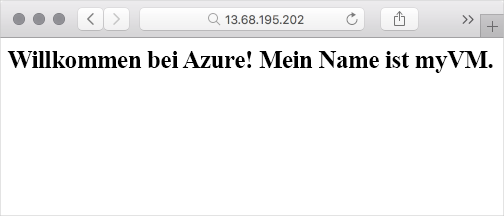

<span data-ttu-id="f8470-101">Nachdem Ihr virtueller Computer nun betriebsbereit ist und ausgeführt wird, kann er Aufgaben übernehmen.</span><span class="sxs-lookup"><span data-stu-id="f8470-101">Now that your VM is up and running, let's do something with it.</span></span> <span data-ttu-id="f8470-102">Hier installieren Sie einen Webserver und stellen eine einfache Webseite bereit, die den Hostnamen des virtuellen Computers angezeigt.</span><span class="sxs-lookup"><span data-stu-id="f8470-102">Here you'll install a web server and serve up a basic web page that displays the VM's hostname.</span></span>

<span data-ttu-id="f8470-103">Zum Konfigurieren eines virtuellen Computers sind mehrere Optionen verfügbar.</span><span class="sxs-lookup"><span data-stu-id="f8470-103">To configure a VM, you have several choices.</span></span> <span data-ttu-id="f8470-104">Sie können eine direkte Verbindung herstellen und Ihr System interaktiv konfigurieren.</span><span class="sxs-lookup"><span data-stu-id="f8470-104">You can connect directly and interactively configure your system.</span></span> <span data-ttu-id="f8470-105">Auf Windows-Systemen können Sie z.B. eine Remotedesktopsitzung erstellen, um mit der Benutzeroberfläche des Windows-Remotecomputers eine Verbindung herzustellen, als ob Sie davor säßen.</span><span class="sxs-lookup"><span data-stu-id="f8470-105">For example, on Windows systems you can create a Remote Desktop session to connect to the UI of your remote Windows computer as if you were seated at it.</span></span> <span data-ttu-id="f8470-106">Bei Linux-Systemen können Sie eine SSH-Verbindung erstellen, um sicher mit Ihrem Linux-Remotesystem über das Terminal zu arbeiten.</span><span class="sxs-lookup"><span data-stu-id="f8470-106">On Linux systems, you can create an SSH connection to securely work with your remote Linux system from the terminal.</span></span>

<span data-ttu-id="f8470-107">Manuelle Konfiguration ist ein guter Anfang, aber wenn Sie Systeme hinzufügen, können Sie Ihre Bereitstellungen auch automatisieren.</span><span class="sxs-lookup"><span data-stu-id="f8470-107">Manual configuration is a good start, but as you add systems, you can automate your deployments.</span></span> <span data-ttu-id="f8470-108">Automatisierung beinhaltet die Ausführung wiederholbarer Prozesse (z.B. Programme und Skripts), die Arbeiten für Sie erledigen.</span><span class="sxs-lookup"><span data-stu-id="f8470-108">Automation involves running repeatable processes such as programs and scripts that take care of the heavy lifting for you.</span></span>

<span data-ttu-id="f8470-109">::: zone pivot="windows-cloud"</span><span class="sxs-lookup"><span data-stu-id="f8470-109">::: zone pivot="windows-cloud"</span></span>

<span data-ttu-id="f8470-110">Hier konfigurieren Sie IIS remote aus Ihrer Cloud Shell-Sitzung mithilfe eines Features von Windows-basierten virtuellen Azure-Computern, das als benutzerdefinierte Skripterweiterung bezeichnet wird.</span><span class="sxs-lookup"><span data-stu-id="f8470-110">Here, you'll configure IIS remotely from your Cloud Shell session using a feature of Windows-based Azure virtual machines called the Custom Script Extension.</span></span>

<span data-ttu-id="f8470-111">::: zone-end</span><span class="sxs-lookup"><span data-stu-id="f8470-111">::: zone-end</span></span>

<span data-ttu-id="f8470-112">::: zone pivot="linux-cloud"</span><span class="sxs-lookup"><span data-stu-id="f8470-112">::: zone pivot="linux-cloud"</span></span>

<span data-ttu-id="f8470-113">Hier konfigurieren Sie Nginx remote aus Ihrer Cloud Shell-Sitzung mithilfe eines Features von Linux-basierten virtuellen Azure-Computern, das als benutzerdefinierte Skripterweiterung bezeichnet wird.</span><span class="sxs-lookup"><span data-stu-id="f8470-113">Here, you'll configure Nginx remotely from your Cloud Shell session using a feature of Linux-based Azure virtual machines called the Custom Script Extension.</span></span>

<span data-ttu-id="f8470-114">::: zone-end</span><span class="sxs-lookup"><span data-stu-id="f8470-114">::: zone-end</span></span>

<span data-ttu-id="f8470-115">::: zone pivot="windows-cloud"</span><span class="sxs-lookup"><span data-stu-id="f8470-115">::: zone pivot="windows-cloud"</span></span>

## <a name="what-is-iis"></a><span data-ttu-id="f8470-116">Was ist IIS?</span><span class="sxs-lookup"><span data-stu-id="f8470-116">What is IIS?</span></span>

<span data-ttu-id="f8470-117">Internetinformationsdienste (Internet Information Services, IIS) ist ein Webserver, der unter Windows ausgeführt wird.</span><span class="sxs-lookup"><span data-stu-id="f8470-117">Internet Information Services, or IIS, is a web server that runs on Windows.</span></span> <span data-ttu-id="f8470-118">Sie können IIS verwenden, um Standardwebinhalte (HTML, CSS und JavaScript) bereitzustellen oder ASP.NET und andere Arten von Webanwendungen auszuführen.</span><span class="sxs-lookup"><span data-stu-id="f8470-118">You can use IIS to serve standard web content (HTML, CSS, and JavaScript) or run ASP.NET and other kinds of web applications.</span></span> <span data-ttu-id="f8470-119">IIS ist im Lieferumfang von Windows Server enthalten, muss jedoch aktiviert werden, damit Webseiten bereitgestellt werden können.</span><span class="sxs-lookup"><span data-stu-id="f8470-119">IIS comes with Windows Server, but you need to activate it to start serving web pages.</span></span>

## <a name="whats-the-custom-script-extension"></a><span data-ttu-id="f8470-120">Was ist die benutzerdefinierte Skripterweiterung?</span><span class="sxs-lookup"><span data-stu-id="f8470-120">What's the Custom Script Extension?</span></span>

<span data-ttu-id="f8470-121">Die benutzerdefinierte Skripterweiterung ist eine einfache Möglichkeit zum Herunterladen und Ausführen von Skripts auf Ihren virtuellen Azure-Computern.</span><span class="sxs-lookup"><span data-stu-id="f8470-121">The Custom Script Extension is an easy way to download and run scripts on your Azure VMs.</span></span> <span data-ttu-id="f8470-122">Sie ist nur eine von vielen Möglichkeiten zum Konfigurieren des Systems, wenn Ihr virtueller Computer betriebsbereit ist und ausgeführt wird.</span><span class="sxs-lookup"><span data-stu-id="f8470-122">It's just one of the many ways you can configure the system once your VM is up and running.</span></span>

<span data-ttu-id="f8470-123">Sie können Ihre Skripts in Azure Storage oder an einem öffentlichen Speicherort wie z.B. GitHub speichern.</span><span class="sxs-lookup"><span data-stu-id="f8470-123">You can store your scripts in Azure storage or in a public location such as GitHub.</span></span> <span data-ttu-id="f8470-124">Sie können Skripts manuell oder als Teil einer automatisierten Bereitstellung ausführen.</span><span class="sxs-lookup"><span data-stu-id="f8470-124">You can run scripts manually or as part of a more automated deployment.</span></span> <span data-ttu-id="f8470-125">Hier führen Sie einen Azure CLI-Befehl zum Herunterladen eines PowerShell-Skripts von GitHub aus und führen dieses dann auf Ihrem virtuellen Computer aus.</span><span class="sxs-lookup"><span data-stu-id="f8470-125">Here, you'll run an Azure CLI command to download a PowerShell script from GitHub and execute it on your VM.</span></span> <span data-ttu-id="f8470-126">Das Skript konfiguriert IIS.</span><span class="sxs-lookup"><span data-stu-id="f8470-126">The script configures IIS.</span></span>

## <a name="configure-iis"></a><span data-ttu-id="f8470-127">Konfigurieren von IIS</span><span class="sxs-lookup"><span data-stu-id="f8470-127">Configure IIS</span></span>

<!-- TODO: https://github.com/MicrosoftDocs/learn-pr/issues/1864 -->

<span data-ttu-id="f8470-128">Hier verwenden Sie die benutzerdefinierte Skripterweiterung, um IIS remote auf Ihrem virtuellen Computer über Cloud Shell zu konfigurieren.</span><span class="sxs-lookup"><span data-stu-id="f8470-128">Here you'll use the Custom Script Extension to configure IIS remotely on your VM from Cloud Shell.</span></span> <span data-ttu-id="f8470-129">Sie konfigurieren außerdem die Firewall für eingehenden Netzwerkzugriff an Port 80 (HTTP).</span><span class="sxs-lookup"><span data-stu-id="f8470-129">You'll also configure the firewall to allow inbound network access on port 80 (HTTP).</span></span>

1. <span data-ttu-id="f8470-130">Führen Sie den Befehl `az vm extension set` in Cloud Shell zum Herunterladen und Ausführen eines PowerShell-Skripts aus, das IIS installiert und eine einfache Startseite konfiguriert.</span><span class="sxs-lookup"><span data-stu-id="f8470-130">From Cloud Shell, run this `az vm extension set` command to download and execute a PowerShell script that installs IIS and configures a basic home page.</span></span>

    ```azurecli
    az vm extension set \
      --resource-group <rgn>[Sandbox resource group name]</rgn> \
      --vm-name myVM \
      --name CustomScriptExtension \
      --publisher Microsoft.Compute \
      --settings '{"fileUris":["https://gist.githubusercontent.com/tpetchel/26f9dab2628a80bf87a33caeed1b6ded/raw/69e5d9250b9dcd7e7eece4b0ea3c3a8cd1b4fcd7/configure-iis.ps1"]}' \
      --protected-settings '{"commandToExecute": "powershell -ExecutionPolicy Unrestricted -File configure-iis.ps1"}'
    ```

    <span data-ttu-id="f8470-131">Der Vorgang zum Konfigurieren von Nginx, Festlegen von Inhalten auf der Startseite und Starten des Diensts dauert einige Minuten.</span><span class="sxs-lookup"><span data-stu-id="f8470-131">The process to configure Nginx, set the contents of the homepage, and start the service takes a couple minutes to complete.</span></span>

    <span data-ttu-id="f8470-132">Wenn Sie möchten, können Sie sich in der Zwischenzeit auf einer separaten Browserregisterkarte [das PowerShell-Skript ansehen](https://gist.githubusercontent.com/tpetchel/26f9dab2628a80bf87a33caeed1b6ded/raw/69e5d9250b9dcd7e7eece4b0ea3c3a8cd1b4fcd7/configure-iis.ps1?azure-portal=true).</span><span class="sxs-lookup"><span data-stu-id="f8470-132">In the meantime, you can [examine the PowerShell script](https://gist.githubusercontent.com/tpetchel/26f9dab2628a80bf87a33caeed1b6ded/raw/69e5d9250b9dcd7e7eece4b0ea3c3a8cd1b4fcd7/configure-iis.ps1?azure-portal=true) from a separate browser tab if you'd like.</span></span> <span data-ttu-id="f8470-133">Das Skript installiert IIS und konfiguriert die Startseite so, dass sie eine Begrüßungsnachricht zusammen mit dem Computernamen des virtuellen Computers „myVM“ anzeigt.</span><span class="sxs-lookup"><span data-stu-id="f8470-133">The script installs IIS and configures the home page to display a welcome message along with the VM's computer name, "myVM".</span></span>

1. <span data-ttu-id="f8470-134">Führen Sie den Befehl `az vm open-port` zum Öffnen von Port 80 (HTTP) über die Firewall aus.</span><span class="sxs-lookup"><span data-stu-id="f8470-134">Run this `az vm open-port` command to open port 80 (HTTP) through the firewall.</span></span>

    ```azurecli
    az vm open-port \
      --name myVM \
      --resource-group <rgn>[Sandbox resource group name]</rgn> \
      --port 80
    ```

## <a name="verify-the-configuration"></a><span data-ttu-id="f8470-135">Überprüfen der Konfiguration</span><span class="sxs-lookup"><span data-stu-id="f8470-135">Verify the configuration</span></span>

<span data-ttu-id="f8470-136">Da IIS nun eingerichtet ist, können wir die Ausführung überprüfen.</span><span class="sxs-lookup"><span data-stu-id="f8470-136">Now that IIS is set up, let's verify that it's running.</span></span>

1. <span data-ttu-id="f8470-137">Führen Sie den Befehl `az vm list-ip-addresses` zum Auflisten der öffentlichen IP-Adressen Ihres virtuellen Computers aus.</span><span class="sxs-lookup"><span data-stu-id="f8470-137">Run this `az vm list-ip-addresses` command to list your VM's public IP addresses.</span></span>

    ```azurecli
    az vm list-ip-addresses \
      --name myVM \
      --resource-group <rgn>[Sandbox resource group name]</rgn> \
      --query "[].virtualMachine.network.publicIpAddresses[0].ipAddress" \
      --output tsv
    ```

    > [!NOTE]
    > <span data-ttu-id="f8470-138">Aufgrund des `--query`-Arguments ist dieser Befehl nicht ganz leicht nachzuvollziehen.</span><span class="sxs-lookup"><span data-stu-id="f8470-138">This `--query` argument makes this command a bit complex.</span></span> <span data-ttu-id="f8470-139">Aber Sie werden schon bald ein Profi sein, wenn Sie sich einarbeiten und Azure kennenlernen.</span><span class="sxs-lookup"><span data-stu-id="f8470-139">But you'll be a pro at this as you dig in and explore Azure.</span></span>

    <span data-ttu-id="f8470-140">Die öffentliche IP-Adresse Ihres virtuellen Computers wird angezeigt.</span><span class="sxs-lookup"><span data-stu-id="f8470-140">You see your VM's public IP address.</span></span> <span data-ttu-id="f8470-141">Hier sehen Sie ein Beispiel.</span><span class="sxs-lookup"><span data-stu-id="f8470-141">Here's an example.</span></span>

    ```output
    104.211.9.245
    ```

1. <span data-ttu-id="f8470-142">Navigieren Sie auf einer neuen Browserregisterkarte zur IP-Adresse Ihres virtuellen Computers.</span><span class="sxs-lookup"><span data-stu-id="f8470-142">In a new browser tab, navigate to your VM's IP address.</span></span> <span data-ttu-id="f8470-143">Eine Begrüßungsnachricht und der Name Ihres virtuellen Computers werden angezeigt.</span><span class="sxs-lookup"><span data-stu-id="f8470-143">You see your welcome message and your VM's name.</span></span>

    

<span data-ttu-id="f8470-144">::: zone-end</span><span class="sxs-lookup"><span data-stu-id="f8470-144">::: zone-end</span></span>

<span data-ttu-id="f8470-145">::: zone pivot="linux-cloud"</span><span class="sxs-lookup"><span data-stu-id="f8470-145">::: zone pivot="linux-cloud"</span></span>

## <a name="what-is-nginx"></a><span data-ttu-id="f8470-146">Was ist Nginx?</span><span class="sxs-lookup"><span data-stu-id="f8470-146">What is Nginx?</span></span>

<span data-ttu-id="f8470-147">Nginx (ausgesprochen „Engine-x“) ist ein beliebter, kostenloser Open-Source-Webserver, der unter Unix, Linux, macOS und Windows ausgeführt werden kann.</span><span class="sxs-lookup"><span data-stu-id="f8470-147">Nginx (pronounced "engine-x") is a popular, free, open-source web server that runs on Unix, Linux, macOS, and Windows.</span></span> <span data-ttu-id="f8470-148">Hier verwenden Sie Nginx, um eine einfache Webseite bereitzustellen.</span><span class="sxs-lookup"><span data-stu-id="f8470-148">Here you'll use Nginx to serve a basic web page.</span></span>

## <a name="whats-the-custom-script-extension"></a><span data-ttu-id="f8470-149">Was ist die benutzerdefinierte Skripterweiterung?</span><span class="sxs-lookup"><span data-stu-id="f8470-149">What's the Custom Script Extension?</span></span>

<span data-ttu-id="f8470-150">Die benutzerdefinierte Skripterweiterung ist eine einfache Möglichkeit zum Herunterladen und Ausführen von Skripts auf Ihren virtuellen Azure-Computern.</span><span class="sxs-lookup"><span data-stu-id="f8470-150">The Custom Script Extension is an easy way to download and run scripts on your Azure VMs.</span></span> <span data-ttu-id="f8470-151">Sie ist nur eine von vielen Möglichkeiten zum Konfigurieren des Systems, wenn Ihr virtueller Computer betriebsbereit ist und ausgeführt wird.</span><span class="sxs-lookup"><span data-stu-id="f8470-151">It's just one of the many ways you can configure the system once your VM is up and running.</span></span>

<span data-ttu-id="f8470-152">Sie können Ihre Skripts in Azure Storage oder an einem öffentlichen Speicherort wie z.B. GitHub speichern.</span><span class="sxs-lookup"><span data-stu-id="f8470-152">You can store your scripts in Azure storage or in a public location such as GitHub.</span></span> <span data-ttu-id="f8470-153">Sie können Skripts manuell oder als Teil einer automatisierten Bereitstellung ausführen.</span><span class="sxs-lookup"><span data-stu-id="f8470-153">You can run scripts manually or as part of a more automated deployment.</span></span> <span data-ttu-id="f8470-154">Hier führen Sie einen Azure CLI-Befehl zum Herunterladen eines Bash-Skripts von GitHub aus und führen dieses dann auf Ihrem virtuellen Computer aus.</span><span class="sxs-lookup"><span data-stu-id="f8470-154">Here, you'll run an Azure CLI command to download a Bash script from GitHub and execute it on your VM.</span></span> <span data-ttu-id="f8470-155">Das Skript konfiguriert Nginx.</span><span class="sxs-lookup"><span data-stu-id="f8470-155">The script configures Nginx.</span></span>

## <a name="configure-nginx"></a><span data-ttu-id="f8470-156">Konfigurieren von Nginx</span><span class="sxs-lookup"><span data-stu-id="f8470-156">Configure Nginx</span></span>

<!-- TODO: https://github.com/MicrosoftDocs/learn-pr/issues/1864 -->

<span data-ttu-id="f8470-157">Hier verwenden Sie die benutzerdefinierte Skripterweiterung, um Nginx remote auf Ihrem virtuellen Computer über Cloud Shell zu konfigurieren.</span><span class="sxs-lookup"><span data-stu-id="f8470-157">Here you'll use the Custom Script Extension to configure Nginx remotely on your VM from Cloud Shell.</span></span> <span data-ttu-id="f8470-158">Sie konfigurieren außerdem die Firewall für eingehenden Netzwerkzugriff an Port 80 (HTTP).</span><span class="sxs-lookup"><span data-stu-id="f8470-158">You'll also configure the firewall to allow inbound network access on port 80 (HTTP).</span></span>

1. <span data-ttu-id="f8470-159">Führen Sie den Befehl `az vm extension set` in Cloud Shell zum Herunterladen und Ausführen eines Bash-Skripts aus, das Nginx installiert und eine einfache Startseite konfiguriert.</span><span class="sxs-lookup"><span data-stu-id="f8470-159">From Cloud Shell, run this `az vm extension set` command to download and execute a Bash script that installs Nginx and configures a basic home page.</span></span>

    ```azurecli
    az vm extension set \
      --resource-group <rgn>[Sandbox resource group name]</rgn> \
      --vm-name myVM \
      --name customScript \
      --publisher Microsoft.Azure.Extensions \
      --settings '{"fileUris":["https://gist.githubusercontent.com/tpetchel/26f9dab2628a80bf87a33caeed1b6ded/raw/69e5d9250b9dcd7e7eece4b0ea3c3a8cd1b4fcd7/configure-nginx.sh"]}' \
      --protected-settings '{"commandToExecute": "./configure-nginx.sh"}'
    ```

    <span data-ttu-id="f8470-160">Der Vorgang zum Konfigurieren von IIS, Festlegen von Inhalten auf der Startseite und Starten des Diensts dauert einige Minuten.</span><span class="sxs-lookup"><span data-stu-id="f8470-160">The process to configure IIS, set the contents of the homepage, and start the service takes a couple minutes to complete.</span></span>

    <span data-ttu-id="f8470-161">Wenn Sie möchten, können Sie sich in der Zwischenzeit auf einer separaten Browserregisterkarte [das Bash-Skript ansehen](https://gist.githubusercontent.com/tpetchel/26f9dab2628a80bf87a33caeed1b6ded/raw/69e5d9250b9dcd7e7eece4b0ea3c3a8cd1b4fcd7/configure-nginx.sh?azure-portal=true).</span><span class="sxs-lookup"><span data-stu-id="f8470-161">In the meantime, you can [examine the Bash script](https://gist.githubusercontent.com/tpetchel/26f9dab2628a80bf87a33caeed1b6ded/raw/69e5d9250b9dcd7e7eece4b0ea3c3a8cd1b4fcd7/configure-nginx.sh?azure-portal=true) from a separate browser tab if you'd like.</span></span> <span data-ttu-id="f8470-162">Das Skript installiert Nginx und konfiguriert die Startseite so, dass sie eine Begrüßungsnachricht zusammen mit dem Computernamen des virtuellen Computers „myVM“ anzeigt.</span><span class="sxs-lookup"><span data-stu-id="f8470-162">The script installs Nginx and configures the home page to display a welcome message along with the VM's computer name, "myVM".</span></span>

1. <span data-ttu-id="f8470-163">Führen Sie den Befehl `az vm open-port` zum Öffnen von Port 80 (HTTP) über die Firewall aus.</span><span class="sxs-lookup"><span data-stu-id="f8470-163">Run this `az vm open-port` command to open port 80 (HTTP) through the firewall.</span></span>

    ```azurecli
    az vm open-port \
      --name myVM \
      --resource-group <rgn>[Sandbox resource group name]</rgn> \
      --port 80
    ```

## <a name="verify-the-configuration"></a><span data-ttu-id="f8470-164">Überprüfen der Konfiguration</span><span class="sxs-lookup"><span data-stu-id="f8470-164">Verify the configuration</span></span>

<span data-ttu-id="f8470-165">Da Nginx nun eingerichtet ist, können wir die Ausführung überprüfen.</span><span class="sxs-lookup"><span data-stu-id="f8470-165">Now that Nginx is set up, let's verify that it's running.</span></span>

1. <span data-ttu-id="f8470-166">Führen Sie den Befehl `az vm list-ip-addresses` zum Auflisten der öffentlichen IP-Adressen Ihres virtuellen Computers aus.</span><span class="sxs-lookup"><span data-stu-id="f8470-166">Run this `az vm list-ip-addresses` command to list your VM's public IP addresses.</span></span>

    ```azurecli
    az vm list-ip-addresses \
      --name myVM \
      --resource-group <rgn>[Sandbox resource group name]</rgn> \
      --query "[].virtualMachine.network.publicIpAddresses[0].ipAddress" \
      --output tsv
    ```

    > [!NOTE]
    > <span data-ttu-id="f8470-167">Aufgrund des `--query`-Arguments ist dieser Befehl nicht ganz leicht nachzuvollziehen.</span><span class="sxs-lookup"><span data-stu-id="f8470-167">This `--query` argument makes this command a bit complex.</span></span> <span data-ttu-id="f8470-168">Aber Sie werden schon bald ein Profi sein, wenn Sie sich einarbeiten und Azure kennenlernen.</span><span class="sxs-lookup"><span data-stu-id="f8470-168">But you'll be a pro at this as you dig in and explore Azure.</span></span>

    <span data-ttu-id="f8470-169">Die öffentliche IP-Adresse Ihres virtuellen Computers wird angezeigt.</span><span class="sxs-lookup"><span data-stu-id="f8470-169">You see your VM's public IP address.</span></span> <span data-ttu-id="f8470-170">Hier sehen Sie ein Beispiel.</span><span class="sxs-lookup"><span data-stu-id="f8470-170">Here's an example.</span></span>

    ```output
    137.135.110.210
    ```

1. <span data-ttu-id="f8470-171">Navigieren Sie auf einer neuen Browserregisterkarte zur IP-Adresse Ihres virtuellen Computers.</span><span class="sxs-lookup"><span data-stu-id="f8470-171">In a new browser tab, navigate to your VM's IP address.</span></span> <span data-ttu-id="f8470-172">Eine Begrüßungsnachricht und der Name Ihres virtuellen Computers werden angezeigt.</span><span class="sxs-lookup"><span data-stu-id="f8470-172">You see your welcome message and your VM's name.</span></span>

    

<span data-ttu-id="f8470-173">::: zone-end</span><span class="sxs-lookup"><span data-stu-id="f8470-173">::: zone-end</span></span>

## <a name="summary"></a><span data-ttu-id="f8470-174">Zusammenfassung</span><span class="sxs-lookup"><span data-stu-id="f8470-174">Summary</span></span>

<span data-ttu-id="f8470-175">Ihr virtueller Computer wird ausgeführt und kann nun Webseiten bereitstellen. Aber was bedeutet das für Sie?</span><span class="sxs-lookup"><span data-stu-id="f8470-175">Your VM is running and can now serve up web pages, but what does that mean for you?</span></span>

<span data-ttu-id="f8470-176">Denken Sie daran, jede Reise beginnt mit den Grundlagen, und fast jede große Innovation, die in der Cloud geboren wurde (von großen und kleinen Unternehmen), begann mit einem ähnlichen Setup wie bei Ihnen.</span><span class="sxs-lookup"><span data-stu-id="f8470-176">Remember, every journey starts with the basics, and almost any great innovation born in the cloud, from companies big and small, started with a similar setup to yours.</span></span> <span data-ttu-id="f8470-177">Wenn sich Ihre Idee weiterentwickelt, beginnt sie sich positiv auf Ihr Unternehmen und Ihre Benutzer auszuwirken.</span><span class="sxs-lookup"><span data-stu-id="f8470-177">As your idea evolves, it begins making a positive impact on your business and your users.</span></span>