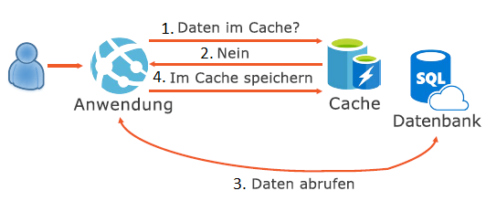
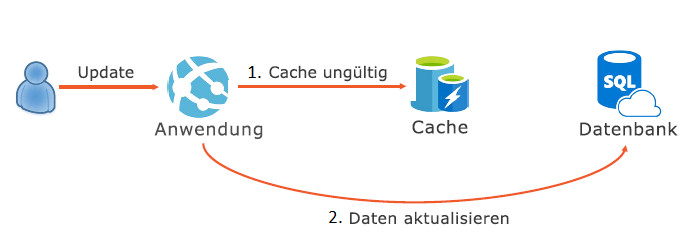

Beim einer Anwendung spielt die Benutzerfreundlichkeit eine entscheidende Rolle. Hierzu gehören auch schnelle Datenabrufe.When building an application, you want to provide a great user experience, and a part of that is quick data retrieval. Üblicherweise ist das Abrufen von Daten aus einer Datenbank ein langsamer Prozess. Bei häufigen Lesezugriffen kann dies die Benutzerfreundlichkeit beeinträchtigen.Retrieving data from a database is typically a slow process, and if this data is read often, this could provide a poor user experience. Das cachefremde Muster (Cache-Aside Pattern) wird angewendet, um einen Cache zusammen mit einer Datenbank so zu implementieren, dass Daten, auf die besonders häufig zugegriffen wird, möglichst schnell zurückgegeben werden.The cache-aside pattern describes how you can implement a cache in conjunction with a database, to return the most commonly accessed data as quickly as possible.

Hier erfahren Sie, wie Sie mithilfe dieses Musters wichtige Daten schnell abfragen können.Here, you'll learn how the cache-aside pattern can be used to ensure your important data is quickly accessible.

## Was wird unter dem cachefremden Muster verstanden?What is the cache-aside pattern?

Das cachefremde Muster gibt vor, dass beim Abrufen von Daten aus einer Datenquelle (beispielsweise aus einer relationalen Datenbank) zunächst die Daten im Cache überprüft werden sollten.The cache-aside pattern dictates that when you need to retrieve data from a data source, like a relational database, you should first check for the data in your cache. Wenn sich die Daten im Cache befinden, nutzen Sie sie.If the data is in your cache, use it. Falls nicht, fragen Sie die Datenbank ab, und fügen Sie die Daten dem Cache hinzu, wenn diese an den Benutzer zurückgeben werden.If the data is not in your cache, then query the database, and when you're returning the data back to the user, add it to your cache. Dadurch können Sie auf die Daten im Cache zugreifen, wenn diese das nächste Mal benötigt werden.This will then allow you to access the data from your cache the next time it's needed.

## In welchen Fällen sollte das cachefremde Muster implementiert werden?When to implement the cache-aside pattern?

Datenbankabfragen sind in der Regel langsam.Reading data from a database is usually a slow process. Das liegt daran, dass komplexe Abfragen durchgeführt werden und ein Abfrageausführungsplan vorbereit wird. Anschließend muss die Abfrage ausgeführt und das Ergebnis vorbereit werden.It involves compilation of a complex query, preparation of a query execution plan, execution of the query, and then preparation of the result. In einigen Fällen werden bei diesem Vorgang möglicherweise auch Daten vom Datenträger gelesen.In some cases, this process may read data from the disk as well. Zwar lassen sich auf Datenbankebene Optimierungen vornehmen, bei denen beispielsweise Abfragen vorkompiliert und einige Daten in den Arbeitsspeicher geladen werden.There are optimizations that can be done on the database level, like pre-compiling the queries, and loading some of the data in memory. Die Ausführung der Abfrage und die Vorbereitung der Ergebnisse finden jedoch immer erst beim Abruf von Daten aus der Datenbank statt.However, execution of the query and preparation of the result will always happen when retrieving data from a database.

Dieses Problem lässt sich mithilfe des cachefremden Musters lösen.We can solve this problem by using the cache-aside pattern. Dieses sieht auch weiterhin eine Anwendung und eine Datenbank vor. Zusätzlich ist jedoch auch ein Cache vorhanden.In the cache-aside pattern, we still have the application and the database, but now we also have a cache. Dieser speichert Daten im Speicher, damit ein Zugriff auf das Dateisystem vermieden wird.A cache stores its data in memory, so it doesn't have to interact with the file system. Caches speichern Daten in sehr einfachen Datenstrukturen wie z.B. Schlüssel-Wert-Paaren. Dadurch wird verhindert, dass komplexen Abfragen ausgeführt werden, um Daten zu sammeln oder Indizes beim Schreiben von Daten zu verwalten.Caches also store data in very simple data structures, like key value pairs, so they don't have to execute complex queries to gather data or maintain indexes when writing data. Ein Cache ist daher üblicherweise leistungsfähiger als eine Datenbank.Because of this, a cache is typically more performant than a database. Wenn Sie eine Anwendung verwenden, versucht diese zunächst, Daten aus dem Cache zu lesen.When you use an application, it will try to read data from the cache first. Wenn sich die angeforderten Daten nicht im Cache befinden, ruft die Anwendung diese wie üblich aus der Datenbank ab.If the requested data is not in the cache, the application will retrieve it from the database, like it always has done. Die Daten werden anschließend allerdings im Cache gespeichert, damit sie für die nachfolgenden Anforderungen bereitstehen.However, then it stores the data in the cache for subsequent requests. Wenn ein Benutzer die Daten das nächste Mal anfordert, werden diese direkt aus dem Cache zurückgegeben.Next time when any user requests the data, it will return it from the cache directly.

### Verwalten von DatenaktualisierungenHow to manage updating data

Bei der Implementierung des cachefremden Musters stoßen Sie auf ein Problem.When you implement the cache-aside pattern, you introduce a small problem. Da Ihre Daten nun in einem Cache und in einem Datenspeicher gespeichert werden, können Probleme auftreten, wenn Sie versuchen, eine Aktualisierung vorzunehmen.Since your data is now stored in a cache and a data store, you can run into problems when you try to make an update. Wenn Sie beispielsweise Ihre Daten aktualisieren möchten, müssen Sie diesen Vorgang sowohl für den Cache als auch für den Datenspeicher ausführen.For example, to update your data, you would need to update both the cache and the data store.

Die Lösung dieses Problems besteht innerhalb des cachefremden Musters darin, die Gültigkeit der Daten im Cache aufzuheben.The solution to this problem in the cache-aside pattern is to invalidate the data in the cache. Bei der Aktualisierung von Daten in Ihrer Anwendung sollten Sie zuerst die Daten im Cache löschen und anschließend Änderungen direkt an der Datenquelle vornehmen.When you update data in your application, you should first delete the data in the cache and then make the changes to the data source directly. Dadurch sind die Daten bei der nächsten Anforderung nicht mehr im Cache, und der Vorgang wiederholt sich.By doing this, next time the data is requested, it won't be present in the cache, and the process will repeat. 

## Überlegungen zur Verwendung des cachefremden MustersConsiderations for using the cache-aside pattern

Sie sollten genau überlegen, welche Daten im Cache gespeichert werden.Carefully consider which data to put in the cache. Nicht alle Daten eignen sich hierfür.Not all data is suitable to be cached.

- **Lebensdauer:** Stellen Sie sicher, dass die Ablaufrichtlinie auf die Häufigkeit des Datenzugriffs abgestimmt ist. Nur so kann das cachefremde Muster wirksam eingesetzt werden.**Lifetime**: For cache-aside to be effective, make sure that the expiration policy matches the access frequency of the data. Wenn der festgelegte Ablaufzeitraum zu kurz ist, kann dies dazu führen, dass Anwendungen Daten kontinuierlich aus dem Datenspeicher abrufen und dem Cache hinzufügen.Making the expiration period too short can cause applications to continually retrieve data from the data store and add it to the cache.

- **Entfernen von Daten:** Caches weisen im Vergleich zu üblichen Datenspeichern nur eine eingeschränkte Größe auf. Daten müssen daher ggf. entfernt werden.**Evicting**: Caches have a limited size compared to typical data stores, and they'll evict data if necessary. Achten Sie deshalb darauf, eine geeignete Entfernungsrichtlinie für Ihre Daten zu verwenden.Make sure you choose an appropriate eviction policy for your data.

- **Auffüllen des Caches im Vorfeld:** Zur effektiven Nutzung des cachefremden Musters füllen viele Lösungen den Cache vorab mit Daten auf, die voraussichtlich häufig abgefragt werden.**Priming**: To make the cache-aside pattern effective, many solutions will prepopulate the cache with data that they think will be accessed often.

- **Konsistenz:** Durch die Implementierung des cachefremden Musters ist die Konsistenz zwischen dem Datenspeicher und dem Cache nicht garantiert.**Consistency**: Implementing the cache-aside pattern doesn't guarantee consistency between the data store and the cache. Daten in einem Datenspeicher können ohne Benachrichtigung des Caches geändert werden.Data in a data store can be changed without notifying the cache. Dies kann zu schwerwiegenden Synchronisierungsproblemen führen.This can lead to serious synchronization issues.

Das cachefremde Muster ist nützlich, wenn Sie häufig Daten aus einer Datenquelle abfragen müssen, die auf einen Datenträger zurückgreift.The cache-aside pattern is useful when you're required to access data frequently from a data source that uses a disk. Durch die Umsetzung dieses Musters speichern Sie wichtige Daten in einem Cache, um diese schneller abrufen zu können.Using the cache-aside pattern, you'll store important data in a cache to help increase the speed of retrieving it. 